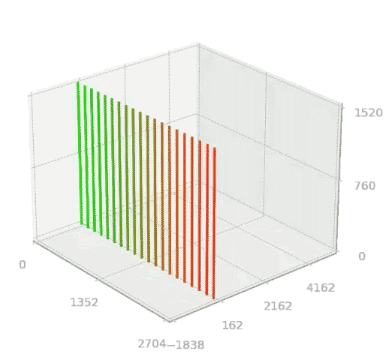

# imgtrans

A programming tool for manipulating time and space in video data. It's primarily a Python library centered around the `drawManeuver` class.

## Table of Contents

- [Project Overview](#project-overview)
- [Background](#background)
- [Installation](#installation)
- [Usage Flow](#usage-flow)
  - [1. Library Import](#1-library-import)
  - [2. Initialization of drawManeuver Class](#2-initialization-of-drawmaneuver-class)
    - [Direction of the Slit](#direction-of-the-slit)
  - [3. Maneuver Design](#3-maneuver-design)
    - [1. Main Methods to Add Spatiotemporal Movement](#1-main-methods-to-add-spatiotemporal-movement)
    - [2. Main Methods to Adapt Flow of Time](#2-main-methods-adapting-the-flow-of-time)
    - [Examples of Combinations](#examples-of-combinations)
    - [Saving and Loading Maneuver Data](#saving-and-loading-maneuver-data)
  - [4. Visualization](#4-visualization)
    - [Slit color](#slit-color)
    - [2D Plot](#2d-plot)
    - [3D Plot](#3d-plot)
  - [5. Rendering](#5-rendering)
    - [Structure of data](#structure-of-data)
    - [Video Rendering](#video-rendering)
    - [Audio Rendering](#audio-rendering)
        - [4 CSV of Maneuver Data](#4-csv-data-of-maneuver)
        - [4 SCD Files](#4-scd-files)
        - [Running the scd File](#running-the-scd-file)
          - [1. Audio Settings and Data Loading](#1-audio-settings-and-data-loading)
          - [2. Playing `Synth` and Recording](#2-playing-synth-and-recording)
    - [Combining Audio and Video](#combining-audio-and-video)
- [drawManeuver Class](#drawmaneuver-class)
  - [Class Variables](#class-variables)
  - [initialization](#initialization)
  - [List of All Class Methods](#list-of-all-class-methods)
  - [addTrans](#addtrans)
  - [addBlowupTrans](#addblowuptrans)
  - [addInterpolation](#addinterpolation)
  - [addCycleTrans](#addcycletrans)
  - [addcustomCycleTrans](#addcustomcycletrans)
  - [transprocess](#transprocess)
  - [animationout](#animationout)
- [Contribute](#contribute)
- [License](#license)

## Project Overview
By interpreting the time dimension of the image as depth axis of three dimentions, the image data becomes a cube composed of voxels.  
This video data cube stores color information over the entire space and has the plasticity to be retrieved as an image with an array of colors, even when cut from various angles and directions.  
By manipulating the cross-sectional behavior of the video data cube, one can create images ordered in a new time and space, different from the captured time and space.  
In addition, working with this tool will provide new insights into "movement" as defined by time and space, and will encourage us to think about our perception and awareness of time and space.
<div style="text-align:center;">

</div><br>

## Background
This tool began its development in 2020 for the production of works by the video artist Ryu Furusawa, and several works were produced.
<ul><li><a href="https://ryufurusawa.com/post/711685011289554944/mid-tide-ryu-furusawa-multi-channel-video">Mid Tide,2023 </a></li>
<li><a href="https://ryufurusawa.com/post/661228499174113280/wavesetude">Waves Etude,2020-2022</a></li>
</ul>

## Installation
Before installing this library, please install the following external libraries:
```bash
pip install opencv-python numpy psutil easing-functions matplotlib librosa
```
### To install this library:
```bash
pip install git+https://github.com/ryufurusawa/imgtrans.git
```

## Usage Flow
### 1. Library Import
First, import the module.
```
python
import imgtrans
```

### 2. Initialization of drawManeuver Class
Specify the path of the input video and the direction of the slit that will be the basis for calculations to create an instance of the drawManeuver class.
```
# Path of the input video
videopath= '/Users/Movies/20230917_RFS3108_mod-HD720p.mov'

# Create an instance of the drawManeuver class.
# The second variable specifies whether the slit is horizontal or vertical. 0 indicates horizontal slit and 1 indicates vertical slit.
your_maneuver=imgtrans.drawManeuver(videopath,1)
```

#### Slit Direction  
In this tool, the slit direction is limited to vertical and horizontal, and it's specified initially.  
The results from future maneuver operations will vary greatly depending on the direction of the slit.


### 3. Maneuver Design
Design the maneuver of the playback section by combining several class methods.  
Class methods can be broadly divided into **1. Functions that add spatiotemporal movements** and **2. Functions that adapt the flow of time**.  
By running these, the maneuver data is stored in the instance variable `data`.  
Each function internally performs operations on the instance variable `data`, such as adding a new array or multiplying some value to the entire data.
The maneuver data being edited here describes which slit (spatial position, time position) of the output video corresponds to the input video in terms of coordinate transformation.  
For more details, please refer to the structure of [`data`](#structure-of-data).

#### 1. Main Methods to Add Spatiotemporal Movement
- [`addTrans`](#addtrans): Simple replacement of spatial and temporal dimensions.
- [`addBlowupTrans`](#addblowuptrans): Inherits addTrans while operating on the scaling of the temporal dimension.
- [`addInterpolation`](#addinterpolation): Transition of spatiotemporal dimensions.
- [`addCycleTrans`](#addcycletrans): Rotating the playback section around the center line of the screen.
- [`addWaveTrans`](#addwavetrans): Creating a playback section using dynamic wave shapes.
- [`addEventHorizonTrans`](#addeventhorizontrans): The progression speed of time varies between the center and periphery of the screen.


#### 2. Main Methods Adapting the Flow of Time
- [`applyTimeForward`](#applytimeforward): Provides forward flow of time to the entire array.
- [`applyTimeOblique`](#applytimeoblique): Shifts time slightly for each slit.
- [`applyTimeForwordAutoSlow`](#applytimeforwordautoslow): Playback starts at rate 1, slows down, and then returns to rate 1.
- [`applyTimeLoop`](#applytimeloop): Imparts a seamless loop structure.
- [`applyTimeClip`](#applytimeclip): Fixes the flow of time for a specified slit to a specified time.
- [`applyTimeBlur`](#applytimebluR): Applies a temporal blur.


#### Examples of Combinations
```python
# Maneuver design
bm.rootingA_interporation(270)
bm.applyTimeLoop(1)
```


#### Saving and Loading Maneuver Data
There are times when you might want to save just the maneuver data to edit in another software, to render the video later on, or to render multiple videos using the same maneuver data.

##### Saving Maneuver Data
It will be saved in the designated output directory.
```python
your_maneuver.data_save()
```

##### Loading Maneuver Data
If initializing.
```python
import numpy as np
your_maneuver=imgtrans.drawManeuver(videopath="path/to/video.mp4", sd=1,datapath="path/to/data.npy" )
# Checking the maneuver data
print(your_maneuver.data.shape)
```
For only replacing the `data`.
```python
import numpy as np
your_maneuver.data=np.read("path/to/data.npy" )
```
In either case, the loaded video data must be within a coordinate range defined by the size and frame count of the video. For example, if the input video has a resolution of Full HD (1920x1080), and the reference vertical slit's horizontal position is 2000, an error will occur.

### 4. Visualization
This function provides a visual representation of the instance variable `data` for easier understanding.
The `data` is  described the movement of slits for the resolution of the output video. For example, the number of vertical slits at 4k resolution is 3840, but in the graph it is reduced to 20 for better clarity.
The data can be visualized in two ways: a 2D plot and a 3D plot.  
The 3D graph provides an intuitive view of the overall movement of the trajectory. On the other hand, the details of time flow can be more clearly understood by looking at a 2D graph.  
By combining these two methods, it is possible to design detailed time movements, for example, time moves backward on the left side of the screen and time moves forward on the right side.  
The image data of the visualization is stored in an export directory generated on the same path as the input video.

#### Slit Color
In some cases, the spatial direction of the video image may be inverted, and the slits in the visualization are drawn using a green-red gradient to clearly indicate the direction of such spatial dimension.
1. For vertical slits, green corresponds to the leftmost (0px) and red to the rightmost (3839px for 4k) output position.
1. In case of horizontal slit, green corresponds to the top (0px) and red corresponds to the bottom (2159px for 4k).
! [slit-direction illustration](images/slit-direction.png)

#### 2D Plot
The 2D maneuver graph is output sequentially every time a maneuver design operation is performed.
This graph displays the following three elements in a single figure, with the output video's time on the x-axis.
1. Movement in the spatial direction
2. Movement in the time direction
3. Playback rate of movement in the time direction

```python
your_maneuver.maneuver_2dplot()
```
By default, 20 slits are generated. By changing the first argument, thread_num, of the maneuver_2dplot method, you can adjust the number of slits displayed.
```python
# Drawing 50 slits
your_maneuver.maneuver_2dplot(50)
```

Combining the maneuver design code and the 2D plot of that maneuver data.
```python
# 1. Sequentially connecting the modules for spatiotemporal movement design.
# Add 100 frames of normal state
your_maneuver.addFlat(100)
# Rotate 90 degrees around the left edge of the video frame from the normal state.
your_maneuver.addInterpolation(100,0,1)
# Add 100 frames of a maneuver that swaps time and space.
your_maneuver.addTrans(100)

# 2. Combine modules related to time behavior.
# Move the entire maneuver forward one frame at a time.
your_maneuver.applyTimeForward(1)
# Apply blur to the entire maneuver's movement in the time direction to smooth the transition.
your_maneuver.applyTimeblur(50)

#### Outputting the 2D plot
your_maneuver.maneuver_2dplot()
```

+Freeze30+Transposition300+CycleTrans_addExtend_TimeForward1_TimeBlur30_TimeBlur100_SpaceBlur100_20thread.png)

If you don't need sequential output, please change the class variable's setting.
```python
your_maneuver.auto_visualize_out = False
```
#### 3D Plot
To output an animation of the maneuver plot to a 3D graph, you need to specify explicitly.
```python
your_maneuver.maneuver_3dplot()
```

+Freeze30+Transposition300+CycleTrans_addExtend_TimeForward1_TimeBlur30_TimeBlur100_SpaceBlur100_3dPlot.gif)


### 5. Rendering
This section will demonstrate how to reconfigure the spatiotemporal layout of the input video data based on the instance variable `data`, and then render the video.

#### Structure of `data`
The instance variable `data` stores the maneuver data. This section describes the structure of this `data`.  
In this module, we first define whether the slit direction is horizontal or vertical, and access the video data not by pixel but by slit.  
By doing this, access to each slit, which is the smallest unit of the video data, is possible by specifying the two-dimensional coordinates (one-dimensional position (horizontal for vertical slits) and time).  
The maneuver data stored in `data` indicates from which coordinates (one-dimensional position, time position) of the input video's slits each slit of the output video is taken, and it's a map of coordinate conversion.  
Therefore, the color data of each pixel is not stored. It only describes the correspondence of coordinate conversion.  
The data is stored as a three-dimensional NUMPY array that has two channels for each data in the two dimensions of the number of frames of the output video and the number of slits that make up the output video.
1. Slit position of the referenced input video
2. Time position of the input video

Here are some samples to examine `data`:
```python
print("Number of frames in the output video", your_maneuver.data.shape[0])
print("Scan count, in the case of vertical slits, pixel width of the output video", your_maneuver.data.shape[1])
print("From what time of the input video was the slit on the far right of the first frame of the output video referenced?", your_maneuver.data[0,-1,1])
print("Maximum time position to reference from the input video", np.max(your_maneuver.data[:,:,1]))

# Plotting the output position transition of the first slit.
plt.plot(your_maneuver.data[:,0,0])
# Plotting the input time position transition of the first slit.
plt.plot(your_maneuver.data[:,0,2])
```

#### Video Rendering
The rendered video data is stored in the export directory created in the same path as the input video.
```python
your_maneuver.transprocess()
```
If you want to export high-resolution and longer videos, you can handle it by splitting the export. Please set it according to your terminal specs. 
Intermediate files temporarily create a tmp directory and save the numpy array data (two-dimensional image data) there.
```python
your_maneuver.transprocess(10) # Split and export in 10 parts.
```
You can also set up methods for splitting rendering as an option.  
There must be a tmp directory in the export directory, and the intermediate data must be stored there. Otherwise, an error will occur in the final data integration process.  
In the example below, rendering is performed from the 5th step of 10 steps.
```python
your_maneuver.transprocess(10, sep_start_num=5, sep_end_num=10)
```
By specifying with the out_type variable, you can also export as a series of still images.
```python
your_maneuver.transprocess(out_type=0) #0=still, 1=video, 2=both 
```
For details, refer to [`transprocess`](#transprocess-method).

#### Audio Rendering
Audio processing itself is done in SuperCollider.  
First, output the code to be loaded in SuperCollider from the class method `scd_out`.  
In `scd_out`, the data of the slit movement described in the instance variable `data` is output after reducing the number of slits for voice output.   
The audio file name can be specified with the instance variable `sc_FNAME`. By default, it is set as [input video file name.aiff]. Please make sure it is saved in the same directory as the input video.  

The simultaneous utterance count can be specified as the first argument to 'scd_out'. The default is set to 7.  
If you increase the number too much, the volume may drop drastically due to frequency cancellation caused by a slight time difference. Please specify an appropriate number based on the maneuver editing content and the acoustic characteristics of the source sound.

```python
bm.sc_FNAME="GX010230-t-AIFF.aiff"
bm.scd_out(7)
```
Upon running the above, four CSV data and four SuperCollider program .scd files will be output.

##### 4 CSV Data of Maneuver
1. *_7threads.csv : Time position of the slit.
1. *_Rate_7threads.csv : Playback rate of the slit.
1. *_inPanMap_7threads.csv : Spatial position of the slit.
1. *_nowDepth_7threads.csv : Time offset within a single frame.

##### 4 SCD files
1. *_SC_Play-7voices.scd : Multi-play, pitch changes according to the playback rate.
1. *_SC_Grain-7voices.scd : Multi-play using granular synthesis. The pitch does not change regardless of the playback rate.
1. *_SC_Rev_Play-7voices.scd : Multi-play. Apply reverb according to the time offset.
1. *_SC_Rev_Grain-7voices.scd : In addition to multi-play using granular synthesis, add reverb according to the time offset.

Please check the sample video file to refer to its effects and characteristics.

##### Running the scd file
Load one of the scd files into SuperCollider.  
All of them perform sound processing in real-time and save it as an audio file on a virtual server. 
The saved audio file will be stored in the same directory as the video rendering data.  
Since it takes time to read the audio data and CSV data, we avoid running them all at once and divide them into two processes.  
Please execute the contents enclosed in `()` in order.


 
###### 1. Audio Settings and Data Loading
Set up the audio, define the synth with `SynthDef`, load the audio data, and load the CSV data.  
Please customize the audio output device setting according to your environment.  
By default, it is set as follows:

```supercollier
Server.default.options.outDevice_("MacBook Pro's speaker");
```
By running the below, a list of available devices will be output to the console window.
```supercollier
ServerOptions.devices; 
```

###### 2. Playing `Synth` and Recording
Perform real-time playback of the defined `Synth` with loop processing and record.  
At the same time as recording, play the rendering video file in QuickTime Player with a Unix command. 
There will be a slight time gap, but you can play the video and audio in a pseudo-synchronized state. 
This can only be executed on a Mac with QuickTime Player, so if you are in a different environment, please comment out this part and adapt accordingly.
```unixcmd
"open -a 'QuickTime Player' '/Users/Movies/sample-raw-mov/sample_Vslit.mp4' ".unixCmd;
```
#### Combining Voice and Video
There is no specific program prepared for this.
Please synchronize the video and audio in a video editing software and then re-export.

## drawManeuver Class

This class is the main component of the Imgtrans library.

### Class Variables:
- `imgtype`: Format of the still image in rendering (default is ".jpg")
- `img_size_type`: Setting for the output image size. Given the height as h and width as w of the input video, `0`:h,w `1`:w,w*2 `2`: Total number of frames `3`: square (default is `0`)
- `outfps`: Frame rate for the output (default is 30)
- `auto_visualize_out`: Setting for automatic visualization (default is True)
- `default_debugmode`: Default debug mode setting (default is False)
- `audio_form_out`: Setting for audio format output (default is False)
- `embedHistory_intoName`: Setting for embedding history into the name (default is True)

### initialization
The class initialization method takes the attributes of the video path, scan direction, data, and folder name as arguments. This method initializes the instance variables below, creates an output directory at the same level as the video path, and moves to that directory. All output files will be saved within this directory.

#### Parameters
- `videopath` (str): Path to the video file.
- `sd` (bool): Direction of the slit. `True` for vertical slit, `False` for horizontal slit.
- `datapath` (str, optional): Optional path to previously saved maneuver data, saved as a multi-dimensional array in npy format.
- `foldername_attr` (str, optional): Optionally appends the specified name to the output directory's name.

#### Instance Variables
1. **data**: Maneuver data of the playback section with the slit as the minimum unit. Defaults to an empty list.
1. **width**: Width of the video. Reflects the video information read from `videopath`.
1. **height**: Height of the video.
7. **count**: Total number of video frames.
8. **recfps**: Frame rate (fps) of the video. The output frame rate is set in the [Class Variables](#class-variables).
10. **scan_direction**: Defines the slit orientation and scan direction. The `sd` argument from the initialization method is applied directly.
11. **scan_nums**: Number of scans. 3840 for vertical slit at 4k resolution.
12. **slit_length**: Number of pixels in one slit. 2160 for vertical slit at 4k resolution.
15. **out_name_attr**: The `foldername_attr` argument from the initialization method is applied directly.
1. **out_videopath**: Holds the path of the output video. Initially empty. Called in [animationout](#animationout).
18. **sc_FNAME**: Initially set to automatically accept the input video's filename with ".AIFF" added. Used when outputting code for audio processing in super collider.
13. **sc_resetPositionMap**, **sc_rateMap**, **sc_inPanMap**, **sc_now_depth**: Arrays optimized for audio processing by reducing the number of slit divisions from the maneuver array.

#### Example
```python
your_maneuver=imgtrans.drawManeuver(videopath="path/to/video.mp4", sd=1)
```
To inherit previously saved maneuver data, refer to the example below:
```python
import numpy as np
your_maneuver=imgtrans.drawManeuver(videopath="path/to/video.mp4", sd=1, datapath="path/to/data.npy")
# Check the maneuver data
print(your_maneuver.data.shape)
```


### List of All Class Methods:
- [`__init__`](#__init__): Initializes by receiving the video path.
- [`append`](#append): Appends the maneuver data created separately to the end of the maneuver data held as an instance variable.
- [`prepend`](#prepend): Adds a maneuver to the beginning of the maneuver data held as an instance variable, which was created separately.

- **Classes related to maneuver design**
    - **Functions that add space-time integrated motion**
        - [`addFlat`](#addflat): Adds a flat array.
        - [`addFreeze`](#addfreeze): Creates and adds an array of the final row for both the time and space axes for the number of frames specified by "frame_nums".
        - [`addSlicePlane`](#addsliceplane): Adds a cross-sectional frame sliced along the time axis at the specified spatial position for the specified number of frames.
        - **Transposition of space and time dimensions**
            - [`addTrans`](#addtrans): Simple transposition of space and time dimensions. For vertical slits, X-axis and T-axis are transposed. For horizontal slits, Y-axis and T-axis are transposed.
            - [`addKeepSpeedTrans`](#addkeepspeedtrans): Creates and adds a new frame while maintaining the speed of existing frame data. Repeated until a specific spatial area is reached.
            - [`insertKeepSpeedTrans`](#insertkeepspeedtrans): Advanced version of `addKeepSpeedTrans`. Smoothly interpolates between the arrays received by `after_array` for `self.data`.
            - [`addWideKeyframeTrans`](#addwidekeyframetrans): Advanced version of `addKeyframeTrans`. Used when outputting at a size larger than the input image, like `midtide`.
            - [`addBlowupTrans`](#addblowuptrans): A method to control blowup motion in more detail with keyframes. This method attempts to gradually change the resolution of the time axis, and basically has a movement similar to XYT Trans. The key parameters for detailed control of the time axis keyframes are `timevalues` and `timepoints`.
       - **Transition of space-time dimensions**
            - [`addInterpolation`](#addinterpolation): Interpolates based on the given parameters and adds the results to the data.
            - [`rootingA_interporation`](#rootinga_interporation): Combines multiple addInterpolations. Zigzag motion.
            - [`rootingB_interporation`](#rootingb_interporation): Combines multiple addInterpolations. Motion like dominos rolling down a slope.
            - [`addCycleTrans`](#addcycletrans): Transitionally substitutes XYT. Rotates the playback cross-section around the centerline of the screen.
            - [`addCustomCycleTrans`](#addcustomcycletrans): Able to move the center axis of rotation in addCycleTrans.
        - **Wavy playback cross-section**
            - [`addWaveTrans`](#addwavetrans): Creates a playback cross-section with a dynamic wave shape for the pixel matrix of time and space. It's also possible to toggle fixing the spatial axis.
            - [`addEventHorizonTrans`](#addeventhorizontrans): No change in spatial area. The progression speed of time changes between the center and periphery of the screen. Cancels the optical flow of video captured by a camera that moves forward and backward.
    - **Time-focused maneuver**
        - [`applyTimeForward`](#applytimeforward): Apply forward time flow (in slide_time units) to the entire array.
        - [`applyTimeOblique`](#applytimeoblique): Apply oblique time effect.
        - [`applyTimeForwordAutoSlow`](#applytimeforwordautoslow): Primarily used when the current state is slow-motion. Adds normal playback frames during intro and outro, smoothly connecting them with ease processing.
        - [`applyTimeFlowKeepingExtend`](#applytimeflowkeepingextend): Prepends or appends extended frames to the given maneuver array. Extends XY frames with the same data as the final and initial frames. Maintains the final change rate for Z (out time). Use the `fade` argument to ease to speed 0 when True.
        - [`applyTimeLoop`](#applytimeloop): Time loop for the entire maneuver array, including front, forward, back, reverse, and then forward again, creating a seamless loop with no time gap between the beginning and end. Currently only supports a default frequency of 2Hz.
        - [`applyTimeClip`](#applytimeclip): Fix the time flow of specified slits to a specific time.
        - [`applyTimeSlide`](#applytimeslide): Set the reference time of the central slit in the first frame to the specified time. Adjust the entire array accordingly.
        - [`applyInOutGapFix`](#applyinoutgapfix): An auxiliary function for creating seamless loops. Calculates the difference between the first and last frames and adjusts frames as needed.
        - [`applyTimebySpace`](#applytimebyspace):Depending on the spatial position of the slit, the number of frames specified by `v` is shifted in the time direction as the maximum value.
        - [`applySpaceBlur`](#applyspaceblur): Apply spatial blur.
        - [`applyTimeBlur`](#applytimeblur): Apply temporal blur.
        - [`applyCustomeBlur`](#applycustomeblur): Apply custom range blur.
    - **Other maneuver functions**
        - [`addFreeze`](#addfreeze): Generate and add frames specified by "frame_nums" to both the time and spatial axes based on the final column's array.
        - [`preExtend`](#preextend): Extend the first frame of the given maneuver array forward.
        - [`addExtend`](#addextend): Extend the final frame of the given maneuver array. Z-rate becomes 0.
        - [`zCenterArrange`](#zcenterarrange): Match the number of frames in the maneuver array with the input video's temporal center.
- **Methods for maneuver data output**
    - [`dataCheck`](#datacheck): Output information about `data` to the console.
    - [`info_setting`](#info_setting): Configure data based on the number of threads, calculate playback rates and pans.
    - [`maneuver_CSV_out`](#maneuver_csv_out): Output maneuver array data to a CSV file for visualization in external software (e.g., Excel).
    - [`scd_out`](#scd_out): Output SuperCollider sound processing code to load and save related data in CSV.
    - [`data_save`](#data_save): Save maneuver data as a numpy file.
- **Methods for maneuver visualization file output**
    - [`maneuver_2dplot`](#maneuver_2dplot): Create a 2D plot and save related data as an image.
    - [`maneuver_3dplot`](#maneuver_3dplot): Generate a 3D plot and save images or videos.
- **Methods for video rendering**
    - [`transprocess`](#transprocess): Transprocess the video. This method handles video rendering, separate rendering, and other options.
    - [`transprocess_typeB`](#transprocess_typeb): Method for video rendering. Divides the input time dimension instead of the output time dimension for separate processing. Use this method when there are maneuvers that widen the time axis direction significantly for faster rendering.
    - [`pretransprocess`](#pretransprocess): Video rendering at high speed by thinning out the number of frames. It is for preview purposes only.
    - [`animationout`](#animationout): Reference the rendered video data, plot pixel colors from images onto a 3D graph, and output the result as an animation. Can only be executed after video rendering.


## `addTrans`

The `addTrans` method is a function to add a new trans maneuver trace to `wr_array` and return it. This method performs the transformation considering cyclic angle changes over a specific number of frames.

### Parameters
- `frame_nums`(int): Number of frames to add.
- `end_line`(float, optional, default: `1`): Transformation's end line.
- `start_line`(float, optional, default: `0`): Transformation's starting line.
- `speed_round`(bool, optional, default: `True`): Specifies whether the speed is smooth or not.
- `zd`(bool, optional, default: `True`): Direction setting.

### Usage Example
```python
your_object.addTrans(100, end_line=1, start_line=0, speed_round=True, zd=True)
```


## `addBlowupTrans`

`addBlowupTrans` method behaves similarly to `addTrans`, but allows the resolution of the time axis to be transitioned using the provided keyframes.

### Parameters
- `frame_nums`(int): Number of frames to add.
- `deg`(int, optional, default:360):set scan direction movement `360` for round trip. One way at `180`.
- `speed_round`(bool, optional, default: `True`): whether the transition in the scan direction is smooth or not.
- `connect_round`(int, optional, default: `1`): whether to smooth the movement between keyframes.
- `timevalues`(list, optional): list of keyframe values. The time range is specified in frames.
- `timepoints`(list, optional):list of keyframe times for `frame_nums`, specified as a ratio of 0~1.
- `timecenter`(list, optional):a list of center points for the keyframe time range transition. If not provided, it defaults to 0.5 for each keyframe.

### Usage Example
```python
your_object.addBlowupTrans(frame_nums=100, deg=360, speed_round=True, connect_round=1,timevalues=[your_object.count,your_object.scan_nums,1,0], timepoints=[0,0.7,0.95,1], timecenter=[0.5,0.5,0.5,0.5])
```


## `addInterpolation` 

The `interpolation` method is based on the specified maneuver data to perform interpolation and to generate new frames. This function is designed to apply complex transformations over a specific number of frames.

### Parameters
- `frame_nums`(int): Number of frames to add.
- `interporation_direction`(int): Direction of interpolation.
- `z_direction`(int): Direction of interpolation in the Z axis.
- `axis_position`(int): Central position for rotation and interpolation.
- `reversal`(int, optional, default: `0`): Controls the reversal of motion.
- `cycle_degree`(int, optional, default: `90`): Angle per cycle.
- `extra_degree`(int, optional, default: `0`): Specifies the sectional angle at the initial stage of transformation.
- `zslide`(int, optional, default: `0`): Amount of slide in the Z direction.
- `speed_round`(bool, optional, default: `True`): Specifies if the speed is smooth.
- `rrange`(list of int, optional, default: `[0,1]`): List specifying the range of transformation.

### Usage
```python
your_object.addInterpolation(100, 0, 0, 0,reversal=False)
```
_3dPlot.gif)
```python
your_object.addInterpolation(100, 0, 1, 1,reversal=True)
```
_3dPlot.gif)

## `addCycleTrans` Method

The `addCycleTrans` method is used to add cyclical transformations (trans) to the data. It performs transformations considering cyclical angle changes over a specific number of frames.

### Parameters
- `frame_nums`(int): Number of frames to add.
- `cycle_degree`(int, optional, default: `360`): Angle per cycle.
- `zscaling`(bool, optional, default: `False`): Whether to enable scaling in the Z axis.
- `zslide`(int, optional, default: `0`): Initial value of time position.
- `extra_degree`(int, optional, default: `0`): Specifies the sectional angle at the initial stage of transformation.
- `speed_round`(bool, optional, default: `True`): Specifies if the speed is smooth.

### Usage
```python            
your_object.addCycleTrans(100, cycle_degree=360, zscaling=True, zslide=10, extra_degree=5, speed_round=False)
```


## `addCustomCycleTrans`

The `addCustomCycleTrans` class function allows you to freely move the central axis in `addCycleTrans`. It linearly changes from the position specified in the `start_center` argument to the position specified in the `end_center` argument.

### Parameters
- `frame_nums`(int): Number of frames to add.
- `cycle_degree`(int): Angle per cycle.
- `start_center`(float, optional, default: `1/2`): Position of the starting central axis. Specify as a ratio to the scan direction length in the range of (0~1). For vertical slits, 0 is the left end, and 1 is the right end.
- `end_center`(float, optional, default: `1/2`): Position of the ending central axis.
- `zscaling`(bool, optional, default: `False`): Whether to enable scaling in the Z axis.
- `extra_degree`(int, optional, default: `0`): Specifies the sectional angle at the initial stage of transformation.
- `speed_round`(bool, optional, default: `True`): Specifies if the speed is smooth.
- `zslide`(int, optional, default: `0`): Initial value of time position.
- `auto_zslide`(bool, optional, default: `True`): Flag to switch the automatic adjustment of Z slide on/off.
- `zscaling_v`(float, optional, default: `0.9`): Coefficient of Z scaling.

### Usage
```python
your_object.addCustomCycleTrans(100, cycle_degree=360, start_center=0.2, end_center=0.7)
```


## `transprocess`
This method performs video rendering.

### Parameters
- `separate_num` (int, optional, default: `1`): Specifies how many divisions to perform the rendering.
- `sep_start_num` (int, optional, default: `0`): Specifies from which division to start when rendering in divisions.
- `sep_end_num` (int or None, optional, default: `None`): Specifies up to which division to render.
- `out_type` (int, optional, default: `1`): Specifies the output format. `1` is video, `0` is a still image, and `2` is both video and still image.
- `XY_TransOut` (bool, optional, default: `False`): If True, saves the output video rotated by 90 degrees.
- `render_mode` (int, doptional, default: `0`): Rendering mode. `0` outputs all frames of the maneuver data integrated. `1` outputs only from `sep_start_num` to `sep_end_num`.

### Usage
```python
# Create an instance
your_maneuver = imgtrans.drawManeuver("mov/samplevideo.mp4",sd=1)

# Write maneuver data
your_maneuver.addTrans(100)
your_maneuver.applyTimeForward(1)

# Rendering
your_maneuver.transprocess()
```
## `animationout`

The `animationout` function plots the pixel color of the image on a 3D graph with reference to the output video data and outputs the result as an animation. It allows you to visualize the trajectory of the playback cross section based on spatio-temporal manipulations on the spatio-temporal cube. Unlike 'maveuver_2dplot' and 'maveuver_3dplot', this visualization is more intuitive in its correspondence with the input video data by mapping pixel colors.  
 Therefore, it can only be executed after rendering the video. If there is already video data to be exported, it is necessary to call the information in the instance variable 'out_videopath'.
 
 ```python
 your_maneuver.out_videopath = "mov/sample.mp4"
 your_maneucer.animationout()
 ```

 ### argument 
- `outFrame_nums` (`int`, default: `100`): Number of frames to output.
- `drawLineNum` (`int`, default: `250`): Number of lines to draw.(resolution)
- `dpi` (`int`, default: `200`):  DPI of the output image.
- `out_fps` (`int`, default: `10`): Output Video Frame Rate.

### Examples of Use 
_CustomeBlur300_CustomeBlur300_TimeLoop_timeSlide_zCenterArranged_img_3d-pixelMap.gif)

## Contribute
Contributions to this project are welcome.  
If you have any questions or feedback, please feel free to contact us at ryu.furusawa(a)gmail.com.  

## License 
This project is licensed under the MIT License, see the LICENSE.txt file for details
