  # imgtrans

映像データの時間と空間を操作するためのプログラミングツールです。
drawManeuverクラスをメインとしたpythonライブラリです。  

## 目次

- [プロジェクトの概要](#プロジェクトの概要)
    <!-- - [1. 軌道のデザイン](#1-軌道のデザイン)  
    - [2. 映像のレンダリング](#2-映像のレンダリング) -->
- [背景](#背景)
- [インストール方法](#インストール方法)
- [使い方の流れ](#使い方の流れ)
  - [1. ライブラリのインポート](#1-ライブラリのインポート)
  - [2. drawManeuverクラスの初期化](#2-drawmaneuverクラスの初期化)
    - [スリットの方向](#スリットの方向)
  - [3. 軌道のデザイン](#3-軌道のデザイン)
    -　[1. 主な時空間統合的な動きを加える関数](#1-主な時空間統合的な動きを加える関数)
    -　[2. 主な時間の流れを適応させる関数](#2-主な時間の流れを適応させる関数)
    - [実際の組み合わせの例](#実際の組み合わせの例)
    - [実際の組み合わせの例](#実際の組み合わせの例)
    - [軌道データの保存と読み込み](#軌道データの保存と読み込み)
  - [4. ヴィジュアライズ](#4-ヴィジュアライズ)
    - [スリットの色](#スリットの色)
    - [2dプロット](#2dプロット)
    - [3dプロット](#3dプロット)
  - [5. レンダリング](#5-レンダリング)
    - [`data`の構造](#dataの構造)
    - [映像のレンダリング](#映像のレンダリング)
    - [カラーパイプライン](#カラーパイプライン映像レンダリング時の色変換)
      - [RGB パイプライン（従来方式）](#rgb-パイプライン従来方式)
      - [YUV-native パイプライン（RGB ラウンドトリップ回避）](#yuv-native-パイプラインrgb-ラウンドトリップ回避)
    - [音声のレンダリング](#音声のレンダリング)
        - [音声入力の解決順序](#音声入力の解決順序)
        - [Python内で完結する音声レンダリング audio_render](#python内で完結する音声レンダリング-audio_render)
        - [音声つき映像の統合出力 audio_video_out](#音声つき映像の統合出力-audio_video_out)
        - [SuperCollider改良版出力 scd_out_v2](#supercollider改良版出力-scd_out_v2)
        - [フーリエ成分としての書き出し maneuver_fourier_out](#フーリエ成分としての書き出し-maneuver_fourier_out)
        - [旧版 scd_out（従来方式）](#旧版-scd_out従来方式)
        - [4つの軌道データのCSV](#4つの軌道データのcsv)
        - [4つのscdファイル](#4つのscdファイル)
        - [scdファイルの実行](#scdファイルの実行)
    - [音声と映像の結合](#音声と映像の結合)
- [drawManeuver クラス](#drawmaneuver-クラス)
  - [クラス変数](#クラス変数)
  - [初期化](#初期化)
  - [全クラスメソッドのリスト](#全クラスメソッドのリスト)
    - [addTrans](#addtrans)
    - [addblowuptrans](#addblowuptrans)
    - [addInterpolation](#addinterpolation)
    - [addCycleTrans](#addcycletrans)
    - [addcustomCycleTrans](#addcustomcycletrans)
    - [addWaveTrans](#addwavetrans)
    - [transprocess](#transprocess)
    - [animationout](#animationout)
    - [コントリビュート](#コントリビュート)
    - [ライセンス](#ライセンス)

## プロジェクトの概要
映像の時間次元を三次元の奥行き軸として解釈することにより、映像データはボクセルで構成されるキューブとなります。  
この映像データキューブには、空間全体にわたる色情報が蓄積され、さまざまな角度や方向からカットしても、色の配列を持つイメージとして取り出すことができる可塑性があります。  
そして映像データキューブの断面の振る舞いを操作することで、キャプチャされた時間と空間とは異なる、新たな時間と空間に秩序だてられた映像を作り出せます。  
さらにこのツールを扱うことで時間空間に規定される“動き“に関する新たな洞察を得たり、時空間の知覚や認識について考えるきっかけとなることでしょう
<div style="text-align:center;">

</div><br>

## 背景
本ツールは2020年より映像作家の古澤龍の作品制作と同時並行的に開発が進められてきたものです。
<ul><li><a href="https://ryufurusawa.com/post/711685011289554944/mid-tide-ryu-furusawa-multi-channel-video">Mid Tide,2023 </a></li>
<li><a href="https://ryufurusawa.com/post/661228499174113280/wavesetude">Waves Etude,2020-2022</a></li>
</ul>

## インストール方法
このライブラリをインストールする前に、以下の外部ライブラリをインストールしてください
```bash
pip install opencv-python numpy scipy psutil matplotlib av numba
```
- `scipy`: 軌道の補間 (interpolate) と音声出力の WAV 書き出し (io.wavfile) に使用。
- `av` (PyAV): HDR / 10bit以上の入力映像のデコード、および YUV-native エンコードパスに必要。
- `numba`: 任意（推奨）。YUV-native スリットスキャンのカーネルを JIT で高速化します。無い場合は純 NumPy のフォールバックが使われます。

加えて、**FFmpeg**（`ffmpeg` と `ffprobe` の両方）をインストールし、`PATH` から利用できるようにしてください。入力の色メタデータ検出（`ffprobe`）と出力映像のエンコード（`ffmpeg`）に使用します。macOS の場合: `brew install ffmpeg`。任意の Ultra HDR 静止画出力にはさらに `ultrahdr_app` バイナリが必要です（macOS: `brew install libultrahdr`）。

このライブラリをインストールする
```bash
pip install git+https://github.com/ryufurusawa/imgtrans.git
```

## 使い方の流れ
### 1. ライブラリのインポート
まず、モジュールをインポートします。
```python
import imgtrans
```

### 2. drawManeuverクラスの初期化
入力のビデオパスと、計算の基準となるスリットの方向を指定してdrawManeuverクラスのインスタンスを作成します。
```python
#入力映像のパス
videopath= '/Users/Movies/20230917_RFS3108_mod-HD720p.mov'

#drawManeuverクラスのインスタンスを作成する。
#２つ目の変数はスリットが縦か横かを指定する。0=横スリット、1=縦スリットを示す。
bm=imgtrans.drawManeuver(videopath,1)
```
#### スリットの方向  
本ツールでは、スリットの方向を縦スリットと横スリットに限定し、最初に指定します。  
スリットの方向の違いによって、今後の軌道の操作による結果は大きく変わります。
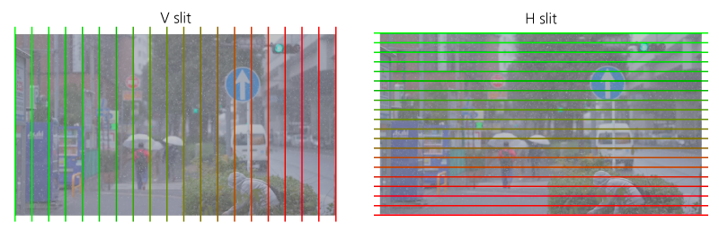
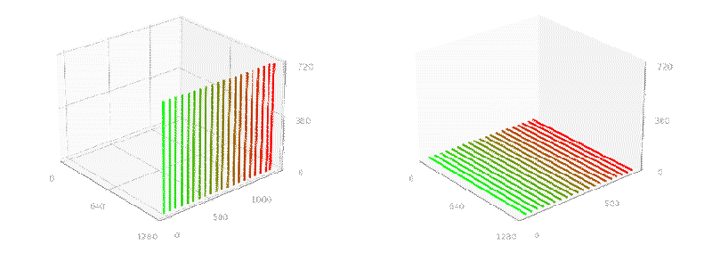


### 3. 軌道のデザイン
いくつかのクラスメソッドを組み合わせて再生断面の軌道をデザインします。  
クラスメソッドは**1. 時空間統合的な動きを加える関数**と**2. 時間の流れを適応させる関数**の二つに大きく分けられます。  
これらを実行することで、インスタンス変数の`data`に軌道データが格納されます。 
各関数は、内部でインスタンス変数の`data`に新たな配列を加えたり、全体のデータへなんらかの数値を掛け合わせたり、といった処理を行っています。
ここで編集される軌道データの内実は、出力映像が入力映像のどこのスリット（空間位置、時間位置）と対応しているか、座標変換として記述されています。  
詳しくは、[`data`の構造](#dataの構造)をご確認ください。

#### 1. 主な時空間統合的な動きを加える関数
- [`addTrans`](#addtrans): 空間次元と時間次元のシンプルな置き換え。
- [`addBlowupTrans`](#addblowuptrans): addTransを継承しつつ時間次元のスケールの拡大縮小の操作
- [`addInterpolation`](#addinterpolation): 時空間次元の遷移
- [`addCycleTrans`](#addcycletrans): 画面の中心線を軸に、再生断面を回転させていく。
- [`addWaveTrans`](#addwavetrans): 動的な波の形状による再生断面を作成。
- [`addEventHorizonTrans`](#addeventhorizontrans): 画面の中心と周辺で時間の進行速度が変わる。


#### 2. 主な時間の流れを適応させる関数
- [`applyTimeForward`](#applytimeforward): 配列全体に時間の順方向の流れを付与
- [`applyTimeOblique`](#applytimeoblique): 時間のずれをスリットのごとに一定数づつ時間をずらす
- [`applyTimeForwardAutoSlow`](#applytimeforwardautoslow): 再生レート１からスロー再生になり最後に再生レート１に戻る
- [`applyTimeLoop`](#applytimeloop): シームレスなループ構造を付与。
- [`applyTimeClip`](#applytimeclip): 指定したスリットの時間の流れを指定した時間に固定する。
- [`applyTimeBlur`](#applytimeblur): 時間的なぼかしを適用


#### 実際の組み合わせの例
```python
# 軌道デザイン
bm.rootingA_interporation(270)
bm.applyTimeLoop(1)
```
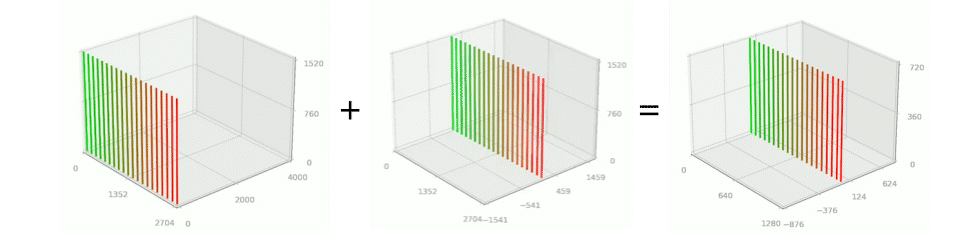

#### 軌道データの保存と読み込み
別のソフトウェアで編集したり、レンダリング自体は後に行う場合や、同じ軌道データを用いて複数の映像データをレンダリングする場合などに、軌道データのみを保存、読み込みする場合があります。

##### 軌道データの保存
書き出し用ディレクトリ内に保存されます。
```python
bm.data_save()
```
##### 軌道データの読み込み
初期化する場合。
```python
import numpy as np
bm=imgtrans.drawManeuver(videopath="path/to/video.mp4", sd=1,datapath="path/to/data.npy" )
#軌道データを確認する
print(bm.data.shape)
```
`data`だけ置き換えする場合。
```python
import numpy as np
bm.data=np.read("path/to/data.npy" )
```
いずれも、読み込ませる映像データのサイズやフレーム数で示せる座標の範囲内に治っている必要があります。例えば、入力映像の解像度がフルハイビジョン(1920x1080)
であるのに、参照する縦スリットの横位置が2000であった場合、エラーとなります。


### 4. ヴィジュアライズ
この機能は、インスタンス変数の`data`を視覚的に表現し、理解しやすくするためのものです。
`data`には出力映像の解像度分のスリットの動きが記述されてています。例えば4k解像度の縦スリットの場合は3840本の数になりますが、グラフでは20本に間引いてい表現しています。
2Dプロットと3Dプロットの２つの方法でデータを可視化できます。  
3Dグラフでは、軌道の全体的な動きを直感的に把握することができます。一方、時間の流れの詳細は2Dグラフを見ることでより明確に理解することができます。  
この2つの方法を組み合わせることで、たとえば画面の左側では時間が逆行し、右側では時間が順行するといった、時間の動きの細かな設計も行うことができます。  
ヴィジュアライズのイメージデータは、入力映像と同じパスに生成された書き出し用ディレクトリ内に保存されます。

#### スリットの色
映像の空間方向が反転する場合もあり、そのような空間次元の方向を明示する意味で、ヴィジュアライズのスリットの描画は緑-赤のグラデーションにより表現されます。
1. 縦スリットの場合は、緑が左端(0px)、赤が右端(4kの場合3839px)の出力位置に対応します。
1. 横スリットの場合は、緑が上端(0px)、赤が下端(4kの場合2159px)の出力位置に対応します。


#### 2dプロット
2次元の軌道グラフは、軌道デザインに関する操作が行われるたびに逐次書き出されます。  
このグラフは、出力映像の時間を横軸として、以下の3つの要素を一つの図として表示します。
1. 空間方向動き
2. 時間方向の動き
3. 時間方向の動きの再生レート

```python
bm.maneuver_2dplot()
```
デフォルト設定では、スリットは20本で生成されます。maneuver_2dplotメソッドの第一引数thread_numを変更することで、表示するスリットの本数を調整できます。
```python
# 50本のスリットを描画
bm.maneuver_2dplot(50)
```

軌道デザインのコードとその軌道データの2Dプロット。  
```python
#1 時空間統合的な動きのデザインのモジュールを連結していく。
#ノーマルな状態を100フレーム分追加する
bm.addFlat(100)
#ノーマルな状態から映像フレームの左端を軸に90度回転させます。
bm.addInterpolation(100,0,1)
#100フレーム分、時間と空間を交換した軌道を加えます。
bm.addTrans(100)

#2 時間の振る舞いに関するモジュールを組み合わせる。
#軌道全体を時間方向への１フレームづつ送ります。
bm.applyTimeForward(1)
#軌道全体を時間方向の動きに対してブラーを加え滑らかに変化させる。
bm.applyTimeblur(50)

#2Dプロット出力
bm.maneuver_2dplot()
```

+Freeze30+Transposition300+CycleTrans_addExtend_TimeForward1_TimeBlur30_TimeBlur100_SpaceBlur100_20thread.png)

逐次書き出しが不要の場合は、クラス変数の設定を変更してください。　　
```python
bm.auto_visualize_out = False
```
#### 3Dプロット
三次元グラフへの軌道プロットアニメーションを出力する場合は、明示的に書く必要があります。
```python
bm.maneuver_3dplot()
```

+Freeze30+Transposition300+CycleTrans_addExtend_TimeForward1_TimeBlur30_TimeBlur100_SpaceBlur100_3dPlot.gif)
### 5. レンダリング
入力の映像データを、インスタンス変数に`data`をもとに、時空間を組み直し、映像のレンダリングを行います。

#### `data`の構造
インスタンス変数`data`には軌道データが格納されています。その`data`の構造について解説します。  
本モジュールでは、スリットの方向を最初に横か、縦かを定義し、映像データへのアクセスをピクセル単位ではなくスリット単位としています。  
こうすることで、各映像データの最小単位であるスリットへのアクセスは二次元の座標（一次元位置（縦スリットであれば横）、時間）を指定することでアクセス可能となります。
`data`に保存される軌道データとは出力映像を構成する各スリットが入力映像を構成するスリットのどの座標（一次元位置、時間位置）から持ってこられたものかを示す、座標変換のマップです。
そのため、各ピクセルの色彩のデータは保存されていません。あくまで座標変換の対応が記述されているだけです。
データは、出力映像のフレーム数と、出力映像を構成するスリット数、この2次元の各データに2つのチャンネルを持たせた三次元のNUMPY配列として保存されています。
<!-- 1. 出力する映像のスリット位置
2. 参照される入力映像のスリット位置
3. 入力映像の時間位置 -->
1. 参照される入力映像のスリット位置
2. 入力映像の時間位置

以下のコードは、`data`を調べるいくつかのサンプルです。
```python
print("出力する映像のフレーム数",bm.data.shape[0])
print("スキャンする数、縦スリットの場合、出力する映像の横幅のピクセル数",bm.data.shape[1])
print("出力映像の最初のフレームの右端のスリットが、入力映像のどの時間から参照されたか？",bm.data[0,-1,1])
print("入力映像から参照する時間位置の最大値",np.max(bm.data[:,:,1]))

#一つ目のスリットの出力位置の推移を描画する。
plt.plot(bm.data[:,0,0])
#一つ目のスリットの入力の時間位置の推移を描画する。
plt.plot(bm.data[:,0,2])
```
#### 映像のレンダリング
レンダリング映像データは、入力映像と同じパスに生成された書き出し用のディレクトリ内に保存されます。
```python
bm.transprocess()
```
高解像度かつ、長めの映像の書き出しを行う場合には、分割して書き出すことで対応できます。端末のスペックに応じて設定して下さい。
中間ファイルはtmpディレクトリを一時的に作成して、そこにnumpyの配列データ（二次元イメージデータ）として保存します。
```python
bm.transprocess(10)#10回に分けて書き出す。
```
途中からの書き出しなど、分割したレンダリングの手法もオプションとして設置できます。  
書き出し用のディレクトリ内にtmpディレクトリがあり、そこに中間データが保存されている必要があります。もし無いと最終的にデータ統合する段階でエラーとなります。
以下の例では10段階の５段階目からレンダリングを行っています。
```python
bm.transprocess(10,sep_start_num=5,sep_end_num=10)
```
`out_type` 変数は、静止画/動画の切り替えではなく**出力コーデック/フォーマット**を選択します。`0` は静止画連番を書き出し、それ以外の値は動画エンコーダを選びます。

```python
bm.transprocess(out_type=0)   # 静止画連番
bm.transprocess(out_type=1)   # H.264 SDR 8bit .mp4（デフォルト）
bm.transprocess(out_type=3)   # ProRes 422 HQ 10bit .mov（HDRアーカイブ推奨）
```

| `out_type` | 定数 | 出力 |
|---|---|---|
| `0` | `OUT_STILL` | 静止画連番（`imgtype` で形式指定） |
| `1` | `OUT_H264` | H.264 SDR 8bit `.mp4`（**デフォルト**） |
| `2` | `OUT_H265` | H.265/HEVC HDR10 10bit `.mp4` |
| `3` | `OUT_PRORES_422` | ProRes 422 HQ 10bit `.mov` |
| `4` | `OUT_PRORES_4444` | ProRes 4444 10bit `.mov` |
| `5` | `OUT_H265_SDR` | H.265 SDR 10bit `.mp4` |
| `6` | `OUT_PRORES_422_SDR` | ProRes 422 SDR 10bit `.mov` |
| `7` | `OUT_H265_HW` | HEVC ハードウェアエンコード（VideoToolbox）、HDR10 10bit `.mp4` |

> 注: HDR/10bit以上の入力に対して `out_type=1`（H.264）を指定した場合、ビット深度を保持するため自動的に `out_type=2`（H.265）へ昇格されます。

詳細は [`transprocess`](#transprocess)こちらを参照ください。

#### カラーパイプライン（映像レンダリング時の色変換）

映像レンダリングにおける色変換パイプラインの全体像です。HDR（PQ/HLG）コンテンツの BT.2020 色空間における色精度の維持に関わる重要な仕組みです。

レンダリングパイプラインには **RGB パイプライン**（従来方式、H.265 や HDR トランスファー変換時に使用）と **YUV-native パイプライン**（ProRes 10bit+ のデフォルト、RGB ラウンドトリップを回避し色精度を最大化）の2つのモードがあります。

##### RGB パイプライン（従来方式）

```
ソース動画 (YUV 4:2:2 10bit)
    │
    ▼  [PyAV デコード]
    │  frame.to_ndarray(format="rgb48le")
    │  ソース動画の色行列を使って YUV → RGB 変換
    ▼
RGB 48bit バッファ (numpy uint16 配列)
    │
    ▼  [スリットスキャン処理]
    │  マヌーバデータ（z座標→ソースフレーム）に基づくピクセル再配置
    │  ここでは色空間変換なし — RGB値をそのままコピー
    ▼
合成済み RGB フレーム
    │
    ▼  [オプション: HDR トランスファー変換]
    │  force_hdr_mode が入力と異なる場合 HLG→PQ または PQ→HLG
    │  同一の場合: パススルー（変換なし）
    ▼
FFmpeg stdin (rawvideo rgb48le)
    │
    ▼  [FFmpeg エンコード]
    │  指定された色行列で RGB → YUV 変換
    │  ProRes / H.265 等にエンコード
    ▼
出力動画ファイル
```

##### ソースフレーム読み込み（YUV → RGB）

HDR/10bit以上のコンテンツは **PyAV**（OpenCVではなく）で読み込みます:

```python
# PyAV デコードパス
pyav_fmt = "rgb48le"  # チャネルあたり16bit RGB
img = frame.to_ndarray(format=pyav_fmt)
```

PyAV は内部で libswscale を使用して YUV→RGB 変換を行います。変換行列はソース動画に埋め込まれた色メタデータ（`color_primaries`, `color_trc`, `colorspace`）によって決定されます。

SDR/8bit コンテンツの場合は OpenCV を使用:
```python
# OpenCV デコードパス
self.cap.set(cv2.CAP_PROP_POS_FRAMES, int(minz))
ret, img = self.cap.read()  # BGR uint8 を返す
```

##### FFmpeg 出力（RGB → YUV エンコード）

合成済み RGB フレームを `rawvideo rgb48le` として FFmpeg の stdin にパイプします。FFmpeg が最終的な RGB→YUV 変換を行い、ターゲットコーデックにエンコードします。

**重要: 入力側に色空間メタデータの宣言が必須です。** rawvideo 入力に色メタデータを指定しないと、FFmpeg はデフォルトの BT.709 行列を使用し、BT.2020 コンテンツで不正な色（特に緑）が出力されます。

`_build_ffmpeg_cmd` メソッドは**入力側と出力側の両方**に色メタデータを付与した FFmpeg コマンドを構築します:

```
ffmpeg -y
  # --- 入力側（RGB データの色空間を宣言）---
  -f rawvideo
  -pix_fmt rgb48le
  -color_primaries bt2020        ← RGB が BT.2020 であることを FFmpeg に伝達
  -color_trc smpte2084           ← トランスファー関数（PQ or HLG）
  -colorspace bt2020nc           ← 使用する YUV 変換行列
  -s:v {width}x{height}
  -r {fps}
  -i -
  # --- 出力側（コーデック + メタデータタグ）---
  -c:v prores_ks
  -pix_fmt yuv422p10le
  -profile:v 3                   ← 422 HQ
  -vendor apl0
  -color_primaries bt2020        ← 出力メタデータタグ
  -color_trc smpte2084           ← 出力メタデータタグ
  -colorspace bt2020nc
  -color_range tv
  output.mov
```

##### 色メタデータの自動検出

初期化時に `drawManeuver` はソース動画の色メタデータを `ffprobe` 経由で自動検出します:

```python
self.input_color_primaries  # 例: "bt2020"
self.input_transfer         # 例: "smpte2084" (PQ) or "arib-std-b67" (HLG)
self.input_colorspace       # 例: "bt2020nc"
```

これらの値は以下を決定します:
1. トランスファー関数変換に使用する EOTF/OETF
2. 出力エンコード時に FFmpeg に渡す色メタデータフラグ
3. 静止画出力（PNG/TIFF）に埋め込む ICC プロファイル

##### 出力タイプ一覧

| `out_type` | コーデック | ピクセル形式 | 色深度 | クロマ | HDR メタデータ |
|------------|-----------|-------------|--------|--------|---------------|
| `OUT_H264` (1) | libx264 | yuv420p | 8bit | 4:2:0 | なし (SDR) |
| `OUT_H265` (2) | libx265 | yuv420p10le | 10bit | 4:2:0 | x265-params (PQ/HLG) |
| `OUT_PRORES_422` (3) | prores_ks | yuv422p10le | 10bit | 4:2:2 | colr atom (PQ/HLG) |
| `OUT_PRORES_4444` (4) | prores_ks | yuv444p10le | 10bit | 4:4:4 | colr atom (PQ/HLG) |
| `OUT_H265_SDR` (5) | libx265 | yuv422p10le | 10bit | 4:2:2 | BT.709 (SDR) |
| `OUT_PRORES_422_SDR` (6) | prores_ks | yuv422p10le | 10bit | 4:2:2 | BT.709 (SDR) |
| `OUT_H265_HW` (7) | hevc_videotoolbox | p010le | 10bit | 4:2:0 | PQ/HLG |

##### 色精度に関する注意事項

- **ProRes 422 (`OUT_PRORES_422`)** は 4:2:2 クロマサブサンプリングを保持し、一般的な HDR カメラソースと一致するため、HDR アーカイブレンダリングに推奨されます。
- **H.265 (`OUT_H265`)** は 4:2:0 クロマサブサンプリングを使用し、4:2:2 と比較してクロマ解像度が半分になります。飽和した緑や赤で微妙な色差が生じる場合があります。
- **SDR 8bit (`OUT_H264`)** 入力は PyAV ではなく OpenCV（BGR uint8）を経由します。
- ソースと出力が同一のトランスファー関数（例: 両方 PQ）の場合、**EOTF/OETF 変換は適用されず** 16bit RGB 値がそのまま渡され、最大精度が保持されます。

##### YUV-native パイプライン（RGB ラウンドトリップ回避）

従来の RGB パイプラインでは、ソース動画の YUV フレームを PyAV で RGB に変換し、スリットスキャン処理後に FFmpeg で再度 YUV にエンコードしていました。この YUV→RGB→YUV ラウンドトリップにおいて、libswscale の BT.2020nc 色行列変換に**系統的な Cr チャネルバイアス（10bit で約 -1.0）** が存在し、出力映像の緑色が不自然に鮮やかになる問題がありました。

YUV-native パイプラインでは、この RGB 変換を完全にスキップします:

```
ソース動画 (YUV 4:2:2 10bit)
    │
    ▼  [PyAV デコード — プレーン直接取得]
    │  frame.planes[0] → Y  (フル幅)
    │  frame.planes[1] → Cb (半幅, 4:2:2)
    │  frame.planes[2] → Cr (半幅, 4:2:2)
    │  ※ RGB変換なし — YUVデータをそのまま取得
    ▼
Y / Cb / Cr バッファ (numpy uint16 配列, 各プレーン独立)
    │
    ▼  [YUV 空間でのスリットスキャン処理]
    │  Y: フル解像度でスリット合成
    │  Cb/Cr: 半幅でスリット合成（column_index // 2）
    │  Numba JIT で高速化
    ▼
合成済み Y / Cb / Cr フレーム
    │
    ▼  [FFmpeg エンコード — YUV 直接入力]
    │  planar yuv422p10le として stdin にパイプ
    │  ※ FFmpeg 側の RGB→YUV 変換も不要
    ▼
出力動画ファイル (ProRes 422/4444)
```

**有効条件（自動判定）:**
- 入力が 10bit 以上（`is_morethan_8bit == True`）
- 出力が ProRes 422 または ProRes 4444
- トランスファー関数の変換が不要（入力と出力が同一、または `force_hdr_mode` 未指定）
- PyAV コンテナが利用可能

```python
# 判定ロジック（new_transprocess 内）
use_yuv_native = (
    self.is_morethan_8bit
    and out_type in (self.OUT_PRORES_422, self.OUT_PRORES_4444)
    and _hdr_mode_matches
    and self.container is not None
)
```

**改善効果:**

| 指標 | RGB パス (従来) | YUV-native パス |
|------|----------------|-----------------|
| Cr bias (10bit) | -1.0 (系統的) | -0.05 (無視可能) |
| 緑色シフト | 目視で明確 | 検出不能 |
| 処理速度 | 基準 | 約10-20%高速 |

**制限事項:**
- `force_hdr_mode` で HLG↔PQ 変換を行う場合、EOTF/OETF 処理に RGB 空間が必要なため、従来の RGB パイプラインにフォールバックします。
- H.265 出力（`OUT_H265`）は現在 RGB パスのみ対応です。H.265 では入力側の色メタデータ指定で正しい色行列が使用されるため、実用上の色精度は十分です。
- SDR 8bit 入力（OpenCV パス）には適用されません。

**関連メソッド:**
- `_process_frame_yuv()` — YUV空間でのスリットスキャン処理
- `_process_frame_vertical_yuv_jit()` / `_process_frame_horizontal_yuv_jit()` — Numba JIT 高速化カーネル
- `_render_images_to_sink_yuv()` — YUV バッファの動画出力
- `_build_ffmpeg_cmd(use_yuv_native=True)` — yuv422p10le 入力の FFmpeg コマンド構築
- `_write_video_frame(use_yuv_native=True)` — Y/Cb/Cr プレーンの書き出し

#### 音声のレンダリング
映像と同じ軌道データ（`data`）を音に適用する方法は2系統あります。

1. **Python内で完結する方法（推奨）** — `audio_render()` で音声をレンダリングし、`audio_video_out()` で音声つき映像として統合出力する。SuperCollider は不要。
2. **SuperColliderでリアルタイム処理する方法** — `scd_out_v2()`（改良版・推奨）または `scd_out()`（旧版）で .scd ファイルを書き出し、SuperCollider(https://supercollider.github.io) で実行する。

いずれもスリットの本数を `thread_num`（デフォルト20）まで間引いた「ボイス」ごとに、時間軌跡を滑らかに補間した再生位置で音源を多重再生する方式です。  
ボイス数をあまり増やしすぎると、わずかな時間差により周波数の打ち消しが発生し、音量が極端に下がったりします。軌道の編集内容や、素材となる音の音響的な特徴を元に適切な数を指定してください。

##### 音声入力の解決順序
入力音声は以下の順で自動解決されます。
1. `audio_path` 引数で明示指定されたファイル
2. 入力映像と同名の音声ファイル（`映像名.AIFF` / `.aiff` / `.aif` / `.wav`、旧来の規約）
3. **入力映像ファイル自体の音声トラック**（mp4/mov のままでOK。別途 AIFF を用意する必要はありません）

##### Python内で完結する音声レンダリング audio_render
軌跡をオーディオレートまで滑らかに補間（デフォルトはフーリエ変換による帯域制限補間＝周波数成分の重ね合わせとしての再構成）し、その再生位置で直接音源を読み出してステレオWAVを書き出します。位置駆動方式のためクリックノイズが出ず、CycleTrans 等の周期軌道は周期終端で厳密に再同期します。

```python
bm.audio_render(thread_num=20, mode="play")   # 可変速再生（再生レートに準じてピッチが変化）
bm.audio_render(thread_num=20, mode="grain")  # グラニュラー合成（ピッチ保存）
```

主なパラメータ:
- `mode`: `"play"`（可変速再生）/ `"grain"`（グラニュラー合成、ピッチ保存）
- `smooth`: `"fourier"`（帯域制限補間、デフォルト）/ `"spline"`（キュービックスプライン）
- `n_harmonics`: fourier 時に残す上位周波数成分数。指定すると軌跡がより滑らかに平滑化される（None=全成分）
- `inpan_mode`: スリットの空間座標（読み取り位置）の音への反映方法
  - `"balance"`（デフォルト）: 読み取り位置が左端ならソースLチャンネル、右端ならRチャンネルが大きくなるステレオバランス
  - `"gain"`: 旧SCコード互換（空間座標を共通ゲインとして適用）
  - `"none"`: ボイス位置の固定パンのみ
- `grain_dur` / `grain_rate`: grain モードの粒の長さ[秒]とトリガレート[Hz]
- `jump_thresh_sec`: 軌跡の不連続ジャンプ検出しきい値[秒]。超えた箇所はセグメント分割しクロスフェードでクリックを防ぐ

##### 音声つき映像の統合出力 audio_video_out
`transprocess` 等で映像をレンダリングした後に呼ぶと、音声レンダリングと映像への結合（mux）までを一括で行い、**音声つき映像**を書き出します。映像ストリームは再エンコードせずコピーするため画質劣化はありません（音声は .mov には PCM 24bit、.mp4 には AAC 320k）。

```python
bm.transprocess()                                  # 映像のレンダリング
bm.audio_video_out(thread_num=20, mode="grain")    # 音声レンダリング + 結合まで一括
# → 直近の映像出力と同名の *_wAudio.mp4 (.mov) が生成される
```

- `videopath`: 結合する映像を明示指定（デフォルトは直近にレンダリングした `out_videopath`）
- `rendered_audio`: レンダリング済みWAVを再利用する場合に指定（Noneなら内部で `audio_render` を実行）
- その他の引数はそのまま `audio_render` に渡されます

##### SuperCollider改良版出力 scd_out_v2
リアルタイム処理・ライブ用途には SuperCollider 用の改良版出力を使います。旧 `scd_out` の CSV + 30Hz 制御ループの代わりに、補間済みの再生位置とバランス情報を多チャンネル float32 WAV（コントロールトラック）として書き出し、SC側は `BufRd` による位置駆動で再生します。クリックノイズ・周期軌道の再同期ずれが解消されています。

```python
bm.scd_out_v2(thread_num=20)
# → *_SCv2ctl-20voices.wav (コントロールトラック)
#    *_SCv2_Play-20voices.scd / *_SCv2_Grain-20voices.scd
```

生成された .scd はどちらも1ブロック実行のみで再生+録音まで行います（旧版のような2段階実行は不要）。出力デバイスの設定が必要な場合はファイル冒頭のコメント行を書き換えてください。

##### フーリエ成分としての書き出し maneuver_fourier_out
各ボイスの時間軌跡を「トレンド直線 + 周波数成分（周波数・振幅・位相）の集合」としてCSV出力します。`pos(t) = trend + Σ amp·cos(2πft + φ)` で再構成でき、SuperCollider のオシレータバンクや Swift 等のネイティブアプリから軌跡データを利用する場合に使えます。

```python
bm.maneuver_fourier_out(thread_num=20, n_harmonics=64)
```

##### 旧版 scd_out（従来方式）
従来の `scd_out` も互換のためそのまま残していますが、以下の既知の問題があります。新規の用途では `audio_render` / `scd_out_v2` を推奨します。
- 30Hz の制御更新 + 区分線形補間のため補間の角で歪みが出る
- 再生位置をレート積分で追うためドリフトし、CycleTrans が周期終端で完全同期しない
- 定期的な再トリガによりクリックノイズが発生する
- 空間座標（inPan）が本来のステレオバランスではなく共通ゲインとして適用される

音声ファイル名はインスタンス変数`sc_FNAME`にて指定できます。デフォルトでは、[入力映像のファイル名.AIFF] としています。入力映像と同じディレクトリに保存されていることを確認して下さい。  
`scd_out`の第一引数にて、同時発話数（ボイス数）を指定可能です。省略時は20になります。

```python
bm.sc_FNAME="GX010230-t-AIFF.aiff"
bm.scd_out(7)
```
上記を実行すると、４つのCSVdataと、４種のSuperColliderのプログラム.scdファイルが出力されます。

##### 4つの軌道データのCSV
1. *_7threads.csv : スリットの時間位置。
1. *_Rate_7threads.csv : スリットの再生レート
1. *_inPanMap_7threads.csv : スリットの空間位置
1. *_nowDepth_7threads.csv : 一枚のフレーム内における時間のずれ幅

##### 4つのscdファイル
1. *_SC_Play-7voices.scd : マルチ再生、再生レートに準じてピッチが変化する
1. *_SC_Grain-7voices.scd : グラニュラーシンセシスを用いたマルチ再生。再生レートに関係なくピッチは変化しない。
1. *_SC_Rev_Play-7voices.scd : マルチ再生。時間のずれ幅に応じてリバーブの適応。
1. *_SC_Rev_Grain-7voices.scd : グラニュラーシンセシスを用いたマルチ再生に加え、時間のずれ幅に応じてリバーブを加える。

サンプルの映像ファイルを確認して、その効果と特徴を参考にしてください。

##### scdファイルの実行
scdファイルのうち、いずれかをSuperColliderに読み込ませます。　　
いずれも、リアルタイムに音響処理を実行し、それを仮想サーバーにてレコーディングし音声ファイルとして保存させます。
保存される音声ファイルは映像レンダリングデータと同じディレクトリに保存されます。  
音声データやCSVデータの読み込みに時間がかかるため、一括の実行を避け、2つの工程に分けています。  
`()`で括られている内容を、順に実行しください。

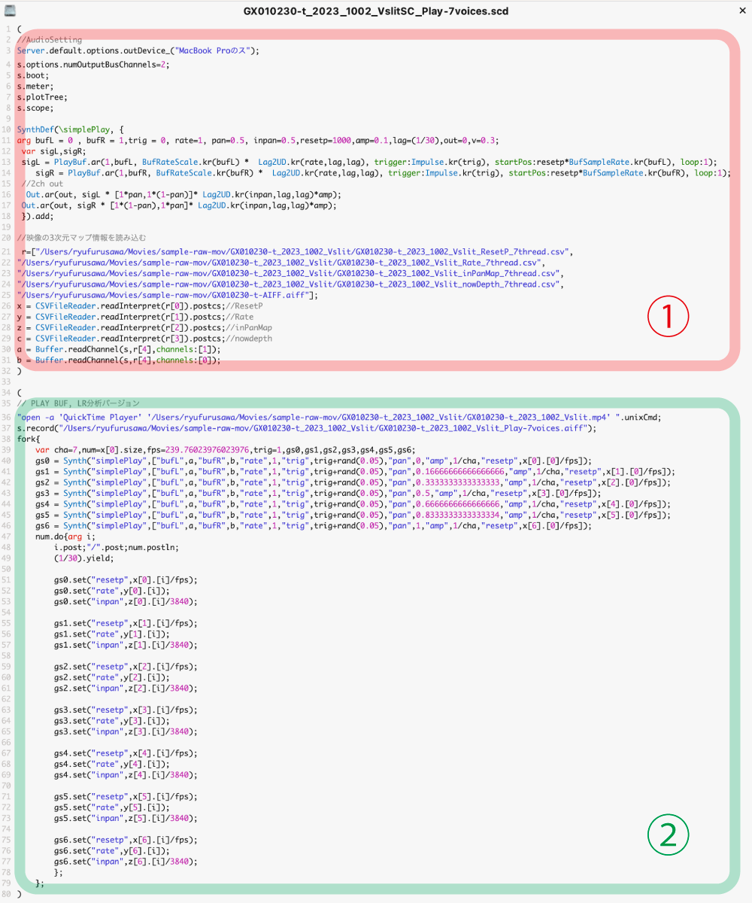
 
###### 1. AudioのSettingとデータの読み込み
AudioのSetting、`SynthDef`によるシンセの定義、音声データの読み込み、CSVdataの読み込みを行います。  
オーディオのアウトプットデバイスの設定は各自の環境に合せ書き換えてください。  
デフォルトでは以下のようになっています。

```supercollier
Server.default.options.outDevice_("MacBook Pro");
```
以下を実行することで、指定可能なデバイスリストがコンソールwindowに出力されます。
```supercollier
ServerOptions.devices; 
```
###### 2. `Synth`の再生とRecording
定義した `Synth`の再生をループ処理によりリアルタイムに再生を行い、Recordingを行います。  
Recordingと同時にUnix commandによりレンダリング映像ファイルをQuickTimePlayerにて再生させます。
やや時間のギャップは入りますが、映像と音声を擬似的に同期した状態で再生できます。
QuickTimePlayerのあるmacのみ実行可能ですので、それ以外の環境においてはこの部分をコメントアウトして対応してください。
```unixcmd
"open -a 'QuickTime Player' '/Users/Movies/sample-raw-mov/sample_Vslit.mp4' ".unixCmd;
```
#### 音声と映像の結合
Python内で完結する場合は [`audio_video_out`](#音声つき映像の統合出力-audio_video_out) が音声レンダリングから結合までを自動で行うため、手作業は不要です。

SuperCollider で録音した音声（.aiff）を使う場合は、映像編集ソフトでビデオと音声を時間同期させた上で再書き出しするか、レンダリング済みWAV/AIFFを `rendered_audio` に指定して `audio_video_out` を呼んでください。

```python
bm.audio_video_out(rendered_audio="rec_from_supercollider.aiff")
```

## drawManeuver クラス

このクラスはImgtransライブラリのメインとなるものです。

### クラス変数:
- `imgtype`: レンダリングにおける静止画像のフォーマット。`.png`と`.tif`は16bit対応、`.jpg`は8bitのみ（デフォルトは `".png"`）
- `img_size_type`: 出力イメージのサイズの設定。入力の映像の高さをh,幅をwとすると、`0`:h,w `1`:w,w*2 `2`:総フレーム数分 `3`: square （デフォルトは `0`）
- `outfps`: 出力のフレームレート（デフォルトは `30`）
- `recfps`: 記録フレームレート。初期化時に入力映像のFPSで上書きされる（デフォルトは `120`）
- `progressbarsize`: コンソールのプログレスバーの文字数幅（デフォルトは `50`）
- `sepVideoOut`: セパレートレンダリングモード。`0`=rawのnpyテンポファイルをディスクに貯めてから一括レンダリング（100GB以上消費する場合あり）、非ゼロ=セグメントを直接レンダリング（デフォルトは `0`）
- `memory_percent`: 映像のレンダリングの際に、確保するメモリーの許容容量。単位は％。アクティブメモリに対しての比率となる（デフォルトは `60`％）
- `auto_visualize_out`: 自動可視化の設定（デフォルトは `True`）
- `default_debugmode`: デフォルトのデバッグモード設定（デフォルトは `False`）
- `audio_form_out`: オーディオ形式出力の設定（デフォルトは `False`）
- `embedHistory_intoName`: 名前への履歴埋め込みの設定（デフォルトは `True`）
- `some_recfps_array`: マルチFPSレンダリング用の記録FPS値のリスト。レンダリング前に外部から設定する（デフォルトは `[]`）
- `plot_w_inc`: 2Dプロットのグラフの横のインチサイズ（デフォルトは `5`）
- `plot_h_inc`: 2Dプロットのグラフの縦のインチサイズ（デフォルトは `9`）
- `xyt_boxel_scale`: 時空間キューブのアスペクト比率。zslideやzscaleは入力映像サイズに対して実数が計算されるため、低解像度テスト時にこの値で調整する（デフォルトは `1`）
- `OUT_STILL`, `OUT_H264`, `OUT_H265`, `OUT_PRORES_422`, `OUT_PRORES_4444`, `OUT_H265_SDR`, `OUT_PRORES_422_SDR`, `OUT_H265_HW`: 出力タイプ定数（`0`〜`7`）。レンダリングメソッドの`out_type`パラメータで使用。`OUT_H265_HW`(7) は macOS VideoToolbox のハードウェアHEVCエンコーダを使い、HDR10 出力を高速化します。

### 初期化
初期化は、ビデオのパス、スキャン方向、データ、およびフォルダ名の属性を引数として受け取る。このメソッドは、下記のインスタンス変数を初期化し、ビデオパスと同じレベルに出力用のディレクトリを作成し、そのディレクトリに移動する。最終的に出力されるあらゆるファイルはこのディレクトリ内に保存されます。

#### 引数
- `videopath` (str): 入力へのパス。**単一の動画ファイル**（ffmpeg/OpenCV が読める任意のコンテナ。`.mov`, `.mp4` 等）**または画像シーケンスの入ったディレクトリ**を指定できます。ディレクトリを渡すと、その中の `.png` / `.jpg` / `.jpeg` / `.tif` / `.bmp` / `.npy` ファイルをソート順で連続フレームとして読み込みます（フレーム数＝ファイル数。シーケンスはFPSメタデータを持たないため、FPSは `recfps`／クラスデフォルトが使われます）。
- `sd` (bool): スリットの方向。`True`で縦スリット`False`で横スリット
- `outdir` (str, optional): 出力フォルダのディレクトリの指示。デフォルトは入力の映像データのパスと同じ
- `datapath` (str, optional): 以前に保存していた軌道データを引き継ぐ場合に使用するオプション。Numpyの多次元配列として保存されたnpyデータのパス。
- `foldername_attr` (str, optional): オプションとして出力用のディレクトリの名称に、指定した名称を付け加えます。
- `another_fps_dir` (str, optional): FPSの異なる追加ソース動画のディレクトリ。マルチFPSレンダリングを有効化します（`some_recfps_array` を参照）。
- `recfps` (float, optional): 入力の**実際の**収録FPS。デフォルトは動画メタデータから読み取ったFPS（`cv2.CAP_PROP_FPS`）。メタデータFPSと実収録レートが異なる場合（例: 480fps収録だが30fpsで格納）や、画像シーケンス入力にFPSを与える場合に明示指定します。
- `outfps` (float, optional): 出力フレームレート。`None` の場合はクラスデフォルト（`30`）を維持します。

#### インスタンス変数
1. **data**: 最小単位をスリットとする再生断面の軌道データ。デフォルトは空のリスト。
1. **width**: ビデオの幅。`videopath` より読み込んだビデオ情報を反映する。
1. **height**: ビデオの高さ。
1. **count**: ビデオの総フレーム数。
1. **recfps**: ビデオのfps（フレームレート）。出力のフレームレートは[クラス変数](#クラス変数)にて設定する。
1. **inputmovfps**: 入力動画ファイルの元のFPS（`cv2.CAP_PROP_FPS`から取得）。
1. **scan_direction**: スリットの向きとスキャン方向の定義。初期化メソッドの引数`sd`がそのまま適応される。
1. **scan_nums**: スキャンする数。4k解像度で縦スリットの場合は3840。
1. **slit_length**: 1スリットの画素数。4k解像度で縦スリットの場合は2160。
1. **out_name_attr**: 初期化メソッドの引数`foldername_attr`がそのまま適応される。
1. **out_videopath**: 出力したビデオのパスを保持する。初期値は空。[animationout](#animationout)や[audio_video_out](#音声つき映像の統合出力-audio_video_out)にて参照される。
1. **sc_FNAME**: 入力のヴィデオのファイル名に ".AIFF" を追加したものを自動で受け取る。SuperCollider用のコード出力の際に使用。
1. **sc_resetPositionMap**, **sc_rateMap**, **sc_inPanMap**, **sc_now_depth**: 軌道配列を音声処理用にスリットの分割数を落とし最適化した配列。
1. **cycle_axis**: 回転中心軸の位置を格納する配列。`applyTimebySpace`（mode=1）で参照される。
1. **another_videos**: マルチFPSレンダリング用の追加映像パスのリスト。初期化時の`another_fps_dir`で設定。
1. **input_pix_fmt**: 入力動画のピクセルフォーマット（例: `yuv420p10le`）。自動検出。
1. **input_bit_depth**: 入力動画のビット深度（デフォルト: `8`）。
1. **input_primaries**: 入力動画のカラープライマリー（例: `bt2020`, `bt709`）。ffprobeで自動検出。
1. **input_transfer**: 入力動画の伝達特性（例: `smpte2084`=PQ, `arib-std-b67`=HLG）。自動検出。
1. **input_colorspace**: 入力動画のカラースペース/マトリクス（例: `bt2020nc`）。自動検出。
1. **is_morethan_8bit**: HDR/高ビット深度入力を示すフラグ（ビット深度8超、または PQ/HLG 伝達特性）。Trueの場合、レンダリング時間は約2.6倍。自動検出。
1. **is_sdr10bit**: SDR 10bit 入力を示すフラグ（BT.709 伝達特性かつビット深度8超）。自動検出。
1. **force_hdr_mode**: HDR出力モードの強制設定。`None`=入力に従う、`"hlg"`=HLG強制、`"pq"`=PQ強制。
1. **log**: 軌道操作ログ文字列。各メソッド呼び出しごとに蓄積され、出力ファイル名の生成に使用。
1. **infolog**: 情報ログ文字列。`info_setting`で使用。
1. **depth_to_sel_recfps**: 深度から選択記録FPSへのマッピング配列。マルチFPSレンダリングで使用。
1. **renderfps_scales**: FPSスケール比率の配列（`some_recfps_array / recfps`）。マルチFPSレンダリングで使用。

#### example
```python
bm=imgtrans.drawManeuver(videopath="path/to/video.mp4", sd=1)
```
以前に保存していた軌道データを引き継ぐ場合は以下の例を参照ください。
```python
import numpy as np
bm=imgtrans.drawManeuver(videopath="path/to/video.mp4", sd=1,datapath="path/to/data.npy" )
#軌道データを確認する
print(bm.data.shape)
```

### 全クラスメソッドのリスト:
- [`__init__`](#初期化): ビデオパスを受け取り初期化する。引数: `videopath`(str), `sd`(bool: スリット方向), `outdir`(str), `datapath`(str: npyパス), `foldername_attr`(str), `another_fps_dir`(str)。詳細は[初期化](#初期化)を参照。
- [`append`](#append): 別で作成していた軌道データを`data`の後ろに追加する。引数: `maneuver`(ndarray), `auto_zslide`(bool: 自動時間調整, デフォルトTrue), `zslide`(int: 手動オフセット)。
- [`prepend`](#prepend): 別で作成していた軌道データを`data`の先頭に追加する。引数: `maneuver`(ndarray)。
- [`arrayExtract`](#arrayextract): 指定範囲の配列を`data`から抽出して書き換える。引数: `start`(int), `end`(int)。
- [`arrayReflection`](#arrayreflection): `data`を時間反転したコピーを後ろに結合して鏡面反転させる。引数なし。
- [`wide_expandB`](#wide_expandb): エッジのスリットデータを外挿して空間次元を拡張する。引数: `add_size`(int, デフォルト3840), `sclip`(bool), `zclip`(bool), `spacedirection`(bool), `z_offset`(int: 追加スリットあたりの時間オフセット)。
- [`interpolation_append`](#interpolation_append): 現在の`data`と別の軌道配列を滑らかに接続する。引数: `maneuver`(ndarray), `connection_num`(int: 遷移フレーム数), `speed_round`(bool), `add_maneuver`(bool)。
- [`interpolation_append_byspeed`](#interpolation_append_byspeed): 指定した速度で別の軌道配列に接続し、自動ブラーを適用。引数: `maneuver`(ndarray), `frame_speed`(float), `speed_round`(bool), `add_maneuver`(bool), `sblur`(bool), `tblur`(bool), `blur_range`(int)。
- 軌道デザインに関わるクラス
    - 時空間統合的な動きを加える関数
        - [`addFlat`](#addflat): フラットな配列を追加。引数: `frame_nums`(int), `z_pos`(int), `z_autofit`(bool), `prepend`(bool), `flip`(bool)。
        - [`addFreeze`](#addfreeze): 最終列の配列を指定フレーム数分生成して加える。引数: `frame_nums`(int)。
        - [`addSlicePlane`](#addsliceplane): 指定した空間位置で断面フレームを追加。引数: `frame_nums`(int), `xypoint`(float: 空間位置0-1), `full_range`(bool), `z_start`(float), `z_end`(float)。
        - **3D幾何学曲面カット** — XYT空間を幾何学曲面で切り出し、始点と終点が一致するループ断面を1フレームとして追加する関数群。
            - [`addCylinderCut`](#addcylindercut): 円筒面カット — (空間, 時間)平面上に円/楕円を描くループ断面。引数: `center_time`(float: 中心の時間座標), `center_pos`(float: 空間中心0-1, デフォルト0.5), `time_scale`(float: 時間方向倍率, デフォルト1.0), `phase`(float: 開始角ラジアン, デフォルト0.0), `output_width`(int: 出力スリット数, None=自動)。
            - [`addBoxUnfoldCut`](#addboxunfoldcut): XYT直方体の4辺を展開したループ断面 — 通常フレーム→右端スリットスキャン→反転フレーム→左端スリットスキャン。引数: `center_time`(float), `center_pos`(float, デフォルト0.5), `time_scale`(float, デフォルト1.0), `output_width`(int, None=自動)。
        - Transposition 空間次元と時間次元の置き換え
            - [`addTrans`](#addtrans): 空間次元と時間次元のシンプルな置き換え。引数: `frame_nums`(int), `start_line`(float), `end_line`(float), `speed_round`(bool), `zd`(bool), `zscale`(float)。
            - [`addKeepSpeedTrans`](#addkeepspeedtrans): 既存の速度を維持して新フレームを生成。引数: `frame_nums`(int), `under_xyp`(float), `over_xyp`(float), `rendertype`(int)。
            - [`addInsertKeepSpeedTrans`](#addinsertkeepspeedtrans): `addKeepSpeedTrans`の発展版。引数: `frame_nums`(int), `under_xyp`(float), `over_xyp`(float), `after_array`(list), `rendertype`(int)。
            - [`addWideKeyframeTrans`](#addwidekeyframetrans): ワイド出力向け発展版。引数: `frame_nums`(int), `key_array`(list), `wide_scale`(int, デフォルト3), `start_frame`(list), `speed_round`(bool)。
            - [`addBlowupTrans`](#addblowuptrans): キーフレームによるblowup制御。引数: `frame_nums`(int), `deg`(int, デフォルト360), `speed_round`(bool), `connect_round`(list), `timevalues`(list), `timepoints`(list: 0-1比率), `timecenter`(list), `extra_degree`(int), `wave_type`(int), `zslide`(int)。
       - 時空間次元の遷移
            - [`addInterpolation`](#addinterpolation): パラメータに基づいて補間しデータに追加。引数: `frame_nums`(int), `i_direction`(bool), `z_direction`(bool), `axis_position`(bool), `s_reversal`(bool), `z_reversal`(bool), `cycle_degree`(int, デフォルト90), `extra_degree`(int), `zslide`(int), `speed_round`(bool), `rrange`(list), `zscale`(float)。
            - [`rootingA_interporation`](#rootinga_interporation): 複数のaddInterpolationを組み合わせたジグザグ動作。引数: `FRAME_NUMS`(int), `loop_num`(int, デフォルト2), `axis_first_p`(int), `speed_round`(bool), `interval_nums`(int: セグメント間のフリーズフレーム数), `loopinterval_nums`(int)。
            - [`rootingA_interporation_single`](#rootinga_interporation_single): rootingAの単一セグメント版。引数: `FRAME_NUMS`(int), `seg_type`(int: 0=順→逆, 1=逆→順), `speed_round`(bool), `interval_nums`(int), `panorama_nums`(int), `flip_axis`(bool), `junction_mode`(int: 0=通常, 1=滑らか), `blur_rate`(int, デフォルト90)。
            - [`rootingA_interporation_trans_single`](#rootinga_interporation_trans_single): 補間とトランスポジションの組み合わせ。引数: `FRAME_NUMS`(int), `seg_type`(int), `speed_round`(bool), `interval_nums`(int), `trans_nums`(int), `trans_end_line`(float), `flip_axis`(bool), `junction_mode`(int), `blur_rate`(int), `time_flip`(bool)。
            - [`rootingA_interporation_RANDOM`](#rootinga_interporation_random): rootingAのランダム版。引数: `FRAME_NUMS`(int), `loop_num`(int), `seed`(int)、各種範囲パラメータ。
            - [`rootingAA_interporation`](#rootingaa_interporation): 同じ空間始点・終点を維持する変形版。引数: `FRAME_NUMS`(int), `loop_num`(int), `axis_first_p`(int), `speed_round`(bool)。
            - [`rootingB_interporation`](#rootingb_interporation): ドミノが坂道を転がるような動き。引数: `FRAME_NUMS`(int), `loop_num`(int), `axis_fix_p`(int)。
            - [`rooting8_interporation`](#rooting8_interporation): 8の字パターンの補間。引数: `FRAME_NUMS`(int)。
            - [`rooting8B_interporation`](#rooting8b_interporation): rooting8の変形版。引数: `FRAME_NUMS`(int)。
            - [`rooting4C_interporation`](#rooting4c_interporation): 4Cパターンの補間。引数: `FRAME_NUMS`(int)。
            - [`rooting4D_interporation`](#rooting4d_interporation): 4Dパターンの補間。引数: `FRAME_NUMS`(int)。
            - [`addCycleTrans`](#addcycletrans): 画面の中心線を軸に再生断面を回転。引数: `frame_nums`(int), `cycle_degree`(int, デフォルト360), `t_auto_scaling`(bool), `zslide`(int), `extra_degree`(int), `speed_round`(bool), `spaceflow`(bool), `zscale`(float)。
            - [`addCustomCycleTrans`](#addcustomcycletrans): 回転の中心軸を移動可能。引数: `frame_nums`(int), `cycle_degree`(int), `start_center`(float, デフォルト0.5), `end_center`(float, デフォルト0.5), `t_auto_scaling`(bool), `extra_degree`(int), `speed_round`(bool), `zslide`(int), `auto_zslide`(bool), `t_auto_scaling_num`(float), `zscale`(float), `spaceflow`(bool)。
            - [`addWideCustomCycleTrans`](#addwidecustomcycletrans): ワイド出力版。引数: `frame_nums`(int), `cycle_degree`(int), `start_center`(float), `end_center`(float), `maxz_range`(int), `wide_scale`(int, デフォルト3), `t_auto_scaling`(bool), `extra_degree`(int), `speed_round`(bool)。
            - [`addFixWideCycleTrans`](#addfixwidecycletrans): 固定幅ワイドサイクルトランス。引数: `frame_nums`(int), `cycle_degree`(int), `wide_scale`(int, デフォルト3), `t_auto_scaling`(bool), `extra_degree`(int), `speed_round`(bool)。
        - 波打つ再生断面
            - [`addWaveTrans`](#addwavetrans): 動的な波の形状による再生断面を作成。引数: `frame_nums`(int), `cycle_degree`(float: 波長), `zdepth`(float: 波の振幅), `flow`(bool: 空間軸移動), `zslide`(float), `speed_round`(bool)。
            - [`addEventHorizonTrans`](#addeventhorizontrans): 画面の中心と周辺で時間の進行速度が変わる。引数: `frame_nums`(int), `zdepth`(float), `z_osc`(int), `cycle_degree`(int, デフォルト180), `flow`(bool), `zslide`(int)。

    - 時間に特化した軌道操作
        - [`applyTimeForward`](#applytimeforward): 配列全体に時間の順方向の流れを付与。引数: `slide_time`(int: 出力フレームあたりのフレーム数, デフォルト=recfps/outfps), `start_frame`(int, デフォルト0), `end_frame`(int)。
        - [`applyTimeOblique`](#applytimeoblique): 時間の斜め効果を適用。引数: `maxgap`(int: 最大時間シフト量)。
        - [`applyTimeForwardAutoSlow`](#applytimeforwardautoslow): イントロ、アウトロに通常再生速度を加え、イーズ処理で接続。引数: `slide_time`(int), `defaultAddTime`(int, デフォルト100), `addTimeEasing`(bool), `easeRatio`(float, デフォルト0.3)。
        - [`applyTimeFlowKeepingExtend`](#applytimeflowkeepingextend): 時間の変化率を維持したまま前後に延長。引数: `frame_nums`(int), `fade`(bool: スピード0へのイーズ), `intro`(bool), `outro`(bool), `fade_speed`(int), `fade_type`(str: “inout”), `space_apply`(bool)。
        - [`applyTimeFlowKeepingExtend_CoodinateBase_Intro`](#applytimeflowkeepingextend_coodinatebase_intro): 座標ベースのイントロ延長。累積誤差ゼロを保証。引数: `target_z`(float: 全スリット共通の目的地タイムコード), `num_frames`(int: 延長フレーム数)。スリットごとのステップ = `(data[0,slit,1] - target_z) / num_frames`。
        - [`applyTimeFlowKeepingExtend_CoodinateBase_Outtro`](#applytimeflowkeepingextend_coodinatebase_outtro): 座標ベースのアウトロ延長。累積誤差ゼロを保証。引数: `target_z`(float: 目的地タイムコード), `num_frames`(int)。スリットごとのステップ = `(target_z - data[-1,slit,1]) / num_frames`。
        - [`applyTimeLoop`](#applytimeloop): シームレスループ用。順方向→逆転→順方向。引数: `slide_time`(int), `freq`(int, デフォルト2), `stay_time`(int, デフォルト30), `intepolation_min`(int, デフォルト300), `stay_time_min`(int, デフォルト30)。
        - [`applyTimeLoopB`](#applytimeloopb): スリット単位のTimeLoop。引数: `slide_time`(int), `freq`(int), `stay_time`(int, デフォルト90), `intepolation_min`(int), `stay_time_min`(int)。
        - [`applyTimeChoppyLoop`](#applytimechoppyloop): 三角波による時間ループ。引数: `slide_time`(int), `frequency`(int), `phase_shift`(int), `rise`(float, デフォルト0.5), `fall`(float, デフォルト0.5)。
        - [`applyTimeChoppyLoopB`](#applytimechoppyloopb): 拡張版チョッピーループ。引数: `slide_time`(int), `frequency`(int), `phase_shift`(int), `rise`(float), `fall`(float), `wave_type`(str: 'triangle'|'sine'), `blur`(int)。
        - [`applyTimeClip`](#applytimeclip): 指定スリットの時間を固定。引数: `trackslit`(int: スリットインデックス), `cliptime`(float)。
        - [`applyTimebySpace`](#applytimebyspace): 空間位置に応じて時間方向にずらす。引数: `v`(int: 最大フレームシフト), `mode`(int: 0=線形, 1=cycle_axis参照, 2=平均)。
        - [`applyTimebyKeyframetoSpace`](#applytimebykeyframetospace): キーフレームで指定した時間方向シフト。引数: `keyframes`(list: シフト量[フレーム]の値リスト。空間全域に等間隔配置されスプライン補間される), `mode`(int)。
        - [`applyTimeSlide`](#applytimeslide): 先頭フレームの中心スリットの参照時間を設定。引数: `settime`(int: 目標時間フレーム数), `baseframe`(int, デフォルト0: -1で最終フレーム)。
        - [`applyInOutGapFix`](#applyinoutgapfix): シームレスループ用。先頭・最終フレーム差分を線形適用。引数なし。
        - [`applyInFix`](#applyinfix): 先頭フレームをターゲットに合わせ線形ブレンド。引数: `target_z_array`(ndarray: スリットごとの目標時間値)。
        - [`applyOutFix`](#applyoutfix): 最終フレームをターゲットに合わせイーズブレンド。引数: `target_z_array`(ndarray), `ease`(bool, デフォルトTrue)。
        - [`applyInPartFix`](#applyinpartfix): 部分修正（先頭側）。引数: `target_z`(float), `a_frame`(int: 目標フレーム), `b_frame`(int: ブレンド終了フレーム)。
        - [`applyOutPartFix`](#applyoutpartfix): 部分修正（末尾側）。引数: `target_z`(float), `a_frame`(int: ブレンド開始), `b_frame`(int: 目標フレーム), `b_frame_s_point`(int)。
        - [`applyOutPartFixB`](#applyoutpartfixb): 配列版 — スリット単位の調整。引数: `target_z_array`(ndarray), `a_frame`(int), `b_frame`(int), `base_z_array`(ndarray)。
        - [`applySpaceBlur`](#applyspaceblur): 空間的なぼかし。引数: `bl_time`(int: ブラーカーネルサイズ)。
        - [`applyTimeBlur`](#applytimeblur): 時間的なぼかし。引数: `bl_time`(int: ブラーカーネルサイズ)。
        - [`applyCustomeBlur`](#applycustomeblur): カスタム範囲ブラー。引数: `s_frame`(int: 開始), `e_frame`(int: 終了), `bl_time`(int: カーネルサイズ), `dim_num`(int: 1=時間, 0=空間)。
        - [`applyLoopBlur`](#applyloopblur): ループ連続性ブラー。引数: `sblur`(int: 空間ブラー), `tblur`(int: 時間ブラー)。
        - [`applyConnectLoopBlur`](#applyconnectloopblur): 接続点のみのループブラー。引数: `sblur`(int), `tblur`(int), `connect_frame`(int, デフォルト100: 接続部のブラー範囲)。
        - [`applyPointBlur`](#applypointblur): 特定フレーム中心のブラー。引数: `point_frame`(int), `sblur`(int), `tblur`(int), `range_frame`(int, デフォルト100)。
    - 空間操作
        - [`applySpaceFlip`](#applyspaceflip): `data`の空間次元を反転（ミラー反転）。引数なし。
        - [`applySpaceFlat`](#applyspaceflat): 空間成分を初期の連番（0〜scan_nums-1）にリセット。引数なし。
    - その他の軌道操作
        - [`addFreeze`](#addfreeze): 最終列のデータを指定フレーム数分延長。引数: `frame_nums`(int)。
        - [`preExtend`](#preextend): 軌道配列の1フレーム目を手前に延長。引数: `addframe`(int: 延長フレーム数)。
        - [`addExtend`](#addextend): 最終フレームを延長。Zレートは0。引数: `addframe`(int), `flip`(bool: 空間軸ミラー)。
        - [`zCenterArange`](#zcenterarange): 時間次元の中心を`count/2`に合わせてシフト。NaN安全。引数: `center_time_frame`(int, オプション: カスタム中心)。
        - [`zArange`](#zarange): 指定フレームの時間平均値が目標時間に来るよう全体をスライド。引数: `target_frame`(int: 基準フレーム), `center_time_frame`(float, None=count/2)。
        - [`zStartArange`](#zstartarange): 時間次元の最小値を0にシフト。引数なし。
        - [`zPointCheck`](#zpointcheck): 時間座標が有効範囲内かチェック。引数: `subtract_count`(int, デフォルト0: マージン)。
        - [`zPointCheckandReflect`](#zpointcheckandreflect): 範囲外の時間座標をリフレクト（反射）。引数: `subtract_count`(int, デフォルト0)。
        - [`spline_interpolate`](#spline_interpolate): キーフレームのスプライン/線形補間。引数: `x`(ndarray: 位置), `keyframes`(list: [(位置, 値),...]), `method`(str: 'spline'|'linear')。

- マニューバーの情報出力に関するメソッド
    - [`dataCheck`](#datacheck): `data`のshapeおよびmin/maxをコンソールに出力。引数なし。
    - [`info_setting`](#info_setting): データをスレッド数に応じて設定し、レートやパン、深度を計算。引数: `thread_num`(int, デフォルト20: スリット分割数), `raw`(bool: 生配列出力)。
    - [`maneuver_CSV_out`](#maneuver_csv_out): CSVに軌道データを出力。引数: `thread_num`(int), `time_map`(bool), `space_map`(bool), `time_rate_map`(bool), `now_depth_map`(bool), `space_rate_map`(bool), `movement_rate_map`(bool)。
    - [`scd_out`](#旧版-scd_out従来方式): SuperCollider用コードとCSVデータを出力（旧版）。引数: `thread_num`(int), `audio_path`(str)。詳細は[旧版 scd_out](#旧版-scd_out従来方式)を参照。
- 音声出力に関するメソッド（詳細は[音声のレンダリング](#音声のレンダリング)を参照）
    - [`audio_render`](#python内で完結する音声レンダリング-audio_render): Python内で音声をレンダリングしステレオWAVを出力。引数: `thread_num`(int), `audio_path`(str), `mode`(str: "play"|"grain"), `smooth`(str: "fourier"|"spline"), `n_harmonics`(int), `inpan_mode`(str: "balance"|"gain"|"none"), `grain_dur`(float), `grain_rate`(float), `jump_thresh_sec`(float), `normalize`(bool)。
    - [`audio_video_out`](#音声つき映像の統合出力-audio_video_out): 音声レンダリングとレンダリング済み映像への結合を一括実行し、音声つき映像を出力。引数: `thread_num`(int), `videopath`(str), `rendered_audio`(str), その他は`audio_render`に引き渡し。
    - [`scd_out_v2`](#supercollider改良版出力-scd_out_v2): 位置駆動方式のSuperColliderコード+コントロールトラックWAVを出力（改良版）。引数: `thread_num`(int), `audio_path`(str), `ctl_rate`(int), `smooth`(str), `n_harmonics`(int), `inpan_mode`(str), `grain_dur`(float), `amp`(float)。
    - [`maneuver_fourier_out`](#フーリエ成分としての書き出し-maneuver_fourier_out): 各ボイスの時間軌跡をフーリエ成分（周波数・振幅・位相）の集合としてCSV出力。引数: `thread_num`(int), `n_harmonics`(int)。
    - [`data_save`](#data_save): 軌道データをnpyとして保存。引数: `attr`(str: ファイル名サフィックス), `sep`(int: 分割数, 0=分割なし)。
    - [`split_3_npySave`](#split_3_npysave): データをL/C/Rの3分割でnpy保存。引数なし。
    - [`split_3_npysavereturn`](#split_3_npysavereturn): `split_3_npySave`と同じだがファイルパスを配列で返す。引数なし。
    - [`vsizeReturn`](#vsizereturn): 出力画像サイズ(width, height)を返す。引数なし。
- マニューバーの可視化ファイルの出力に関する
    - [`maneuver_2dplot`](#maneuver_2dplot): 2Dプロットとシークバー動画出力。引数: `thread_num`(int), `thread_through`(bool), `debugmode`(bool), `normal_line_draw`(bool), `w_inc`(float), `h_inc`(float), `video_out`(bool), `video_alpha`(bool)。
    - [`maneuver_3dplot`](#maneuver_3dplot): 3Dプロットアニメーション。引数: `thread_num`(int), `thread_through`(bool), `zRangeFix`(bool), `out_framenums`(int), `out_fps`(int), `colormode`(str), `line_width`(float), `aspect_ratio`(tuple), `elev`(float), `azim`(float), `dpi`(int), `xticks`(bool), `zticks`(bool), `yticks_normal`(bool), `only_seq_img`(bool), `lineplot`(bool), `vectorplot`(bool), `gridplot`(bool), `vector_def_frame`(int), `velocity`(float), `vector_color_amp`(float), `s_frame`(int), `zRangeMin`(float), `zRangeMax`(float)。
    - [`maneuver_3dplot_midtide`](#maneuver_3dplot_midtide): mid-tideスタイル3Dプロット。引数: `thread_num`(int), `thread_through`(bool), `zRangeFix`(bool), `out_framenums`(int), `out_fps`(int), `colormode`(str), `aspect_ratio`(tuple), `elev`(float), `azim`(float), `dpi`(int)。
    - [`maneuver_imgplot`](#maneuver_imgplot): 静止画プロット出力。引数: `plot_mode`(str: “space”|”time”|”rate”|”all”), `colormode`(str), `nticks_x`(int), `nticks_y`(int), `save_png`(bool), `time_axis`(str: 'auto'|'frame'|'sec')。
    - [`img_to_maneuver`](#img_to_maneuver): 空間・時間画像（16bit PNG）から`data`を復元。引数: `space_img_path`(str), `time_img_path`(str), `space_set`(float), `vrange`(float)。
    - [`img_to_maneuver_rate_based`](#img_to_maneuver_rate_based): レート画像からレートを積分して`data`を復元。引数: `time_rate_path`(str), `space_img_path`(str), `space_set`(float), `start_time`(float), `rate_range`(float), `rate_baseline`(float), `rate_startpoint`(float)。
- 映像renderingに関するメソッド
    - [`new_transprocess`](#new_transprocess): HDR対応の主要レンダリングメソッド。引数: `separate_num`(int), `sep_start_num`(int), `sep_end_num`(int), `out_type`(int: 0-7), `xy_trans_out`(bool), `render_mode`(int: 0-3), `title_atr`(str), `del_data`(bool), `render_clip_start`(int), `render_clip_end`(int), `slit_step`(int: スリット縮小), `scan_step`(int: スキャン縮小), `use_pyav`(bool)。
    - [`transprocess`](#transprocess): OpenCVベースのレガシーレンダリング。引数: `separate_num`(int), `sep_start_num`(int), `sep_end_num`(int), `out_type`(int), `XY_TransOut`(bool), `render_mode`(int), `seqrender`(bool), `title_atr`(str)。
    - [`pretransprocess`](#pretransprocess): 間引きプレビューレンダリング。引数: `outnums`(int, デフォルト100: 出力フレーム数), `xy_trans_out`(bool)。
- 解析
    - [`movement_intensity_analyze`](#movement_intensity_analyze): フレーム間の動き強度を分析しグラフ出力。引数なし。
- レンダリング後処理
    - [`overlay_tc_rate`](#overlay_tc_rate): レンダリング済み映像にタイムコードと再生レートを描画。引数: `output_suffix`(str, デフォルト”_tc”), `divisions`(int, デフォルト5: プローブポイント数)。レートの色: 黄(+1)、青(-1)、灰(0)。タイムコードは`{sec}sec---{frac}f`形式。
    - [`animationout`](#animationout): レンダリング映像を参照して3Dグラフにピクセルカラーをプロットしアニメーション出力。引数: `out_framenums`(int, デフォルト100), `drawLineNum`(int, デフォルト250), `dpi`(int, デフォルト200), `out_fps`(int, デフォルト10)。
    - [`animationout_custome`](#animationout_custome): animationoutのカスタマイズ版。引数: `zRangeFix`(bool), `out_framenums`(int), `drawLineNum`(int), `dpi`(int), `out_fps`(int), `aspect_ratio`(tuple), `elev`(float), `azim`(float), `colormode`(str), `transparent`(bool), `gridplot`(bool), `vectorplot`(bool), `vector_def_frame`(int), `velocity`(float), `vector_color_amp`(float), `s_frame`(int)。

### スタンドアロン関数（モジュールレベル）

クラスメソッドではなく、モジュールレベルで使用可能なスタンドアロン関数です。

- [`export_segments`](#export_segments): ソース映像からA/B群セグメントをフレーム番号付きで書き出す。A群は順再生、B群は水平反転＋逆再生。実時間速度補正対応。
- [`rendered_npys_to_mov`](#rendered_npys_to_mov): 分割レンダリングされたnpyファイルを1本の動画に結合する。全`out_type`フォーマット（H.264, H.265, ProRes 422, ProRes 4444等）に対応。
- [`rearrange_wide_video`](#rearrange_wide_video): ワイドパノラマ映像の左半分と右半分のカラムをインターリーブして再配置する。npyファイルまたは既存の映像ファイルから読み込み可能。
- [`rendered_mov_to_seq`](#rendered_mov_to_seq): レンダリング済み映像からフレームを抽出して連番画像として保存。引数: `video_path`(str), `divide_num`(int: サブフォルダ分割), `img_format`(str: `'jpg'`|`'png'`|`'ultrahdr'`|`'avif'`|`'npy'`), `frame_array`(array: 選択抽出), `color_mode`(str: `'source'`|`'sdr'`|`'hlg'`)。
- [`convert_npy_to_jpg`](#convert_npy_to_jpg): 単一のnpyファイル（保存されたフレーム配列）をJPEG画像に変換する。
- [`custom_blur`](#custom_blur): 指定フレーム範囲と次元に対してデータ配列に重み付き平均ブラーを適用する。`applyCustomeBlur`で内部使用。
- [`custom_onedimention_blur`](#custom_onedimention_blur): 指定フレーム範囲に対する1次元の重み付き平均ブラー。
- [`double_first_dimension_with_interpolation`](#double_first_dimension_with_interpolation): 3D配列の第1次元を、既存フレーム間に補間フレームを挿入して倍にする。

## `append`
別で作成しておいた軌道配列（maneuver）を`data`の末尾に連結します。デフォルトでは連結部の時間ギャップを自動補正し、時間が連続するように接続します。

### 引数
- `maneuver`(ndarray): 連結する軌道配列。shape=(フレーム数, スリット数, 2)。
- `auto_zslide`(bool, optional, default: `True`): `True`でmaneuver先頭と`data`末尾の時間差を自動的に打ち消して接続する。
- `zslide`(int, optional, default: `0`): 手動の時間オフセット。0以外を指定すると`auto_zslide`より優先される。

### 使用例
```python
array = bm.data.copy()   # 現在の軌道を複製
bm.append(array)         # 時間を連続させて2倍の長さに
```

## `prepend`
軌道配列を`data`の先頭に連結します。`append`と異なり時間ギャップの自動補正は行いません。

### 引数
- `maneuver`(ndarray): 連結する軌道配列。

### 使用例
```python
bm.prepend(intro_array)
```

## `arrayExtract`
`data`から指定フレーム範囲を切り出して`data`を置き換えます。ブラー処理を安定させるために前後へ余分に連結しておき、最後に中央部だけを取り出す、といった用途に使います。

### 引数
- `start`(int): 切り出し開始フレーム。
- `end`(int): 切り出し終了フレーム（この値は含まない）。

### 使用例
```python
array = bm.data
bm.append(array); bm.append(array)          # 3連結
bm.applyTimeBlur(100)                       # 境界を含めてブラー
bm.arrayExtract(array.shape[0], array.shape[0]*2)  # 中央だけ取り出す
```

## `arrayReflection`
`data`の時間反転コピーを末尾に連結し、行って戻ってくる往復（ミラー）構造を作ります。引数はありません。

### 使用例
```python
bm.addTrans(150)
bm.arrayReflection()   # 300フレームの往復軌道になる
```

## `wide_expandB`
左右（上下）エッジのスリットの変化量を外挿して、`data`の空間次元を左右に`add_size`ずつ拡張します。入力映像より広いワイド/パノラマ出力を作るための下準備に使います。

### 引数
- `add_size`(int, optional, default: `3840`): 片側に追加するスリット数。
- `sclip`(bool, optional, default: `True`): 空間座標を`0〜scan_nums-1`にクリップする。
- `zclip`(bool, optional, default: `True`): 時間座標を`1〜count-1`にクリップする。
- `spacedirection`(bool, optional, default: `True`): エッジで空間が範囲外に出た場合に、空間変化を時間変化に換算する際の方向。
- `z_offset`(int, optional, default: `0`): 1スリット進むごとに加算する時間差分。右端が未来・左端が過去のグラデーションを付与できる（右→左へ流れる車窓風景などに対応）。

### 使用例
```python
bm.addCycleTrans(300)
bm.wide_expandB(add_size=1920, z_offset=1)
```

## `interpolation_append`
`data`末尾と`maneuver`先頭の間を`connection_num`フレームで滑らかに補間してから連結します。

### 引数
- `maneuver`(ndarray): 接続する軌道配列。
- `connection_num`(int): 遷移に使うフレーム数。
- `speed_round`(bool, optional, default: `False`): `True`でコサインカーブによるイーズ移動。
- `add_maneuver`(bool, optional, default: `True`): `False`にすると接続部のみ追加し、`maneuver`本体は連結しない。

### 使用例
```python
bm.interpolation_append(next_array, connection_num=90, speed_round=True)
```

## `interpolation_append_byspeed`
接続フレーム数を指定速度から自動算出して`maneuver`と接続します。接続部には自動で時間/空間ブラーを適用し、折れ目を滑らかにします。

### 引数
- `maneuver`(ndarray): 接続する軌道配列。
- `frame_speed`(float): 遷移速度。出力1フレームあたりに進む時間フレーム数。接続フレーム数 = 時間ギャップ/frame_speed。
- `speed_round`(bool, optional, default: `False`): コサインイーズ。
- `add_maneuver`(bool, optional, default: `True`): `maneuver`本体も連結するか。
- `sblur`(bool, optional, default: `True`): 接続部に空間ブラーを適用。
- `tblur`(bool, optional, default: `True`): 接続部に時間ブラーを適用。
- `blur_range`(int, optional, default: `None`): ブラー範囲。Noneで全長の1/6を自動設定。

### 使用例
```python
bm.interpolation_append_byspeed(next_array, frame_speed=4)  # レート1相当(recfps120/outfps30)で接続
```

## `addFlat`
空間=連番（通常フレームの並び）、時間=固定値のフラットな断面（＝時間が静止した通常フレーム）を`frame_nums`分追加します。`data`が空の場合は新規作成します。

### 引数
- `frame_nums`(int): 追加するフレーム数。
- `z_pos`(int, optional, default: `0`): 参照する時間位置（フレーム番号）。
- `z_autofit`(bool, optional, default: `True`): 既存`data`がある場合、末尾（`prepend=True`時は先頭）の平均時間位置に自動で合わせる。
- `prepend`(bool, optional, default: `False`): `True`で先頭に追加する。
- `flip`(bool, optional, default: `False`): 空間の並びを反転する。

### 使用例
```python
bm.addFlat(60, z_pos=1200, z_autofit=False)  # 入力の1200フレーム目で1〜2秒静止
```

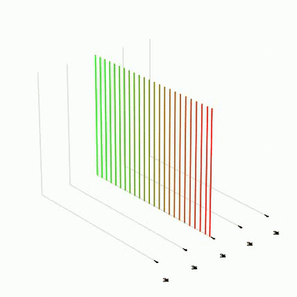

## `addSlicePlane`
スリットスキャン平面（空間位置固定、時間=連番）を生成します。`data`が空の状態でのみ使用できます。1フレームの中に時間の流れがそのまま写り込む断面です。

### 引数
- `frame_nums`(int, optional, default: `1`): 追加するフレーム数。
- `xypoint`(float, optional, default: `0.5`): スリット位置（0.0〜1.0、scan_numsに対する比率）。
- `full_range`(bool, optional, default: `False`): `True`で時間軸を入力映像全フレーム(0〜count)に拡張。
- `z_start`(float, optional): 時間範囲の開始フレームを直接指定。`full_range`より優先。
- `z_end`(float, optional): 時間範囲の終了フレーム。

### 使用例
```python
bm.addSlicePlane(frame_nums=1, xypoint=0.5, full_range=True)
```

## `addFreeze`
最終フレームの断面をそのまま`frame_nums`分複製して追加します（完全静止）。

### 引数
- `frame_nums`(int): 追加するフレーム数。

### 使用例
```python
bm.addCycleTrans(240)
bm.addFreeze(60)   # 回転後の断面で2秒静止
```


## `preExtend`
軌道配列の先頭フレームを手前に`addframe`分複製して延長します（イントロの静止）。

### 引数
- `addframe`(int): 延長するフレーム数。

### 使用例
```python
bm.preExtend(90)
```

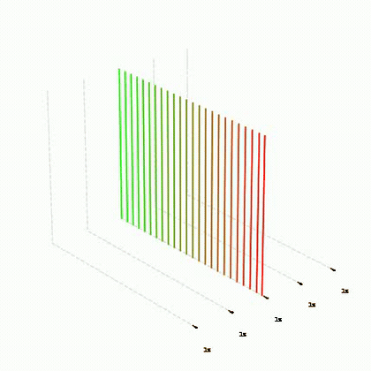

## `addExtend`
最終フレームを`addframe`分複製して延長します（時間レートは0になる）。`addFreeze`とほぼ同等ですが、空間軸のミラーオプションがあります。

### 引数
- `addframe`(int): 延長するフレーム数。
- `flip`(bool, optional, default: `False`): `True`で空間軸を反転した断面で延長する。

### 使用例
```python
bm.addExtend(60)
```

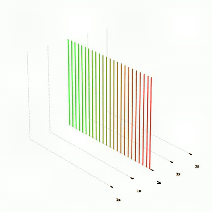

## `addCylinderCut`
XYT時空間キューブを円筒面で切り出し、始点と終点が完全に一致するループ断面を1フレームとして追加します。(空間, 時間)平面上で 空間=sin(θ)、時間=cos(θ) の円（楕円）を描くようにサンプリングします。

### 引数
- `center_time`(float): 円の中心の時間座標（フレーム番号）。
- `center_pos`(float, optional, default: `0.5`): 円の中心の空間位置（0-1）。
- `time_scale`(float, optional, default: `1.0`): 時間方向の倍率。1.0=空間レンジ×`xyt_boxel_scale`の正円相当。0.5=横長楕円、2.0=縦長楕円。
- `phase`(float, optional, default: `0.0`): 開始角度オフセット（ラジアン）。
- `output_width`(int, optional, default: `None`): 出力スリット数。Noneで`int(π×空間全域)`を自動計算。

### 使用例
```python
bm.addCylinderCut(center_time=1800, time_scale=1.0)
bm.transprocess()   # 1フレームの静止画として出力される
```

## `addBoxUnfoldCut`
XYT直方体の4辺を展開した面で切り出し、閉じたループ断面を1フレームとして追加します。「通常フレーム→右端スリットスキャン→反転した通常フレーム→左端スリットスキャン」の順にたどります。

### 引数
- `center_time`(float): 直方体中心の時間座標（フレーム番号）。
- `center_pos`(float, optional, default: `0.5`): 空間中心位置（0-1）。
- `time_scale`(float, optional, default: `1.0`): 時間方向の倍率。1.0=空間辺と時間辺が等価。
- `output_width`(int, optional, default: `None`): 出力スリット数。Noneで展開図の全周長から自動計算。

### 使用例
```python
bm.addBoxUnfoldCut(center_time=1800)
```

## `addTrans`

`addTrans`メソッドは、`wr_array`に新しいトランス軌跡を追加して返すための関数です。このメソッドは、特定のフレーム数にわたって、サイクル的な角度変化を考慮して変換を行います。

### 引数
- `frame_nums`(int): 追加するフレーム数。
- `start_line`(float, optional, default: `0`): 変換の開始ライン。
- `end_line`(float, optional, default: `1`): 変換の終了ライン。
- `speed_round`(bool, optional, default: `True`): 速度が円滑かどうかを指定。
- `zd`(bool, optional, default: `True`): 方向設定。

### 使用例
```python
bm.addTrans(100, start_line=0, end_line=1, speed_round=True, zd=True)
```
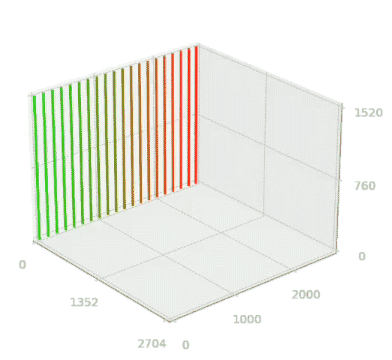
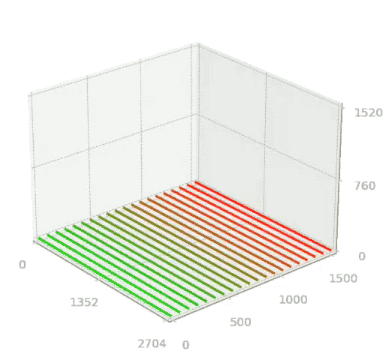

### Sample
[![Waves Etude [TYX-60pps 2009061303]](https://i.vimeocdn.com/video/956287334-20be93368aef7ad17c1bec20c9973f9f66c296056fbe1950d8cfa7200c9a0f11-d_640)](https://vimeo.com/457262317)

[Click to watch on Vimeo](https://vimeo.com/457262317)


## `addBlowupTrans`

`addBlowupTrans`メソッドは、キーフレームを使用して"blowup"の動きを制御するためのメソッドです。提供されたキーフレームを利用して、定義されたフレーム間で特定のモーションパターンを生成します。

### 引数
- `frame_nums`(int): 追加するフレーム数。
- `deg`(int, optional, default:360): スキャン方向の動きの設定`360`で往復する。`180`で片道
- `speed_round`(bool, optional, default: `True`): スキャン方向の推移が滑らかかどうかを指定。
- `connect_round`(int, optional, default: `1`): キーフレーム間の動きを滑らかにするかどうか。
- `timevalues`(list, optional): キーフレームの値のリスト。時間方向のレンジをフレーム数で指定する。
- `timepoints`(list, optional):`frame_nums`に対するキーフレームの時間リスト。0~1の比で指定する。
- `timecenter`(list, optional):キーフレームの時間方向のレンジ推移する際の中心点のリスト。提供されていない場合、各キーフレームに対してデフォルトで0.5となります。

### 使用例
```python
bm.addBlowupTrans(frame_nums=100, deg=360, speed_round=True, connect_round=1,timevalues=[bm.count,bm.scan_nums,1,0], timepoints=[0,0.7,0.95,1], timecenter=[0.5,0.5,0.5,0.5])
```

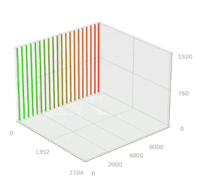
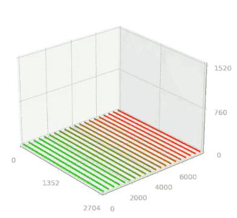


### 応用例
```python
bm.outfps=60
bm.addBlowupTrans(addnum,1080,timevalues=[int(bm.width),int(bm.width)],timepoints=[0,1],timecenter=[0.5,0.5])
bm.applyTimeSlide(14280)
bm.applyTimebySpace(int(6*bm.recfps))#Left to Right TimeGap(sec)
```
<!-- [](https://vimeo.com/873371964) -->

[](https://vimeo.com/873371964)

[Click to watch on Vimeo](https://vimeo.com/873371964)

### Sample
[![Waves Etude[TYX 1.8-30pps 201113]](https://i.vimeocdn.com/video/1232415523-ea74b1b1dc98ff5220a9fb91892c0d6f5808a8cb3a30b91647b0878233c98cdc-d_640)](https://vimeo.com/597510638)

[Click to watch on Vimeo](https://vimeo.com/597510638)

## `addKeepSpeedTrans`
`data`末尾の2〜3フレームから空間・時間それぞれの速度ベクトルと加速度（変化度合い）を推定し、その運動をそのまま維持・外挿しながら新規フレームを追加します。加速度が1なら等速、1未満なら減速収束、1超なら加速します。空間位置が`under_xyp`/`over_xyp`を越えるか`frame_nums`に達すると停止します。

### 引数
- `frame_nums`(int): 追加する最大フレーム数。
- `under_xyp`(float, optional, default: `None`): 空間位置の上限。Noneで`scan_nums`。
- `over_xyp`(float, optional, default: `1`): 空間位置の下限。
- `rendertype`(int, optional, default: `0`): `0`=全スリット平均のベクトルで外挿、`1`=スリットごとに個別のベクトルで外挿。

### 使用例
```python
bm.addTrans(100)
bm.addKeepSpeedTrans(200)   # addTransの末端速度を保って滑走
```


## `addInsertKeepSpeedTrans`
`addKeepSpeedTrans`の発展版。`data`末尾の速度ベクトルと、`after_array`先頭の速度ベクトルの交点を計算し、両者を滑らかに橋渡しするフレームを挿入してから`after_array`を連結します。`after_array`は自動的に時間スライドされます。

### 引数
- `frame_nums`(int): 挿入するフレーム数の目安。
- `under_xyp`(float, optional, default: `None`): 空間位置の上限。Noneで`width-1`。
- `over_xyp`(float, optional, default: `1`): 空間位置の下限。
- `after_array`(ndarray): 接続先の軌道配列。
- `rendertype`(int, optional, default: `0`): `0`=平均ベクトル、`1`=スリットごと。

### 使用例
```python
bm.addInsertKeepSpeedTrans(120, after_array=next_array)
```

## `addWideKeyframeTrans`
`scan_nums`を`wide_scale`倍に拡張した上で、`key_array`で指定した各キーフレーム（空間位置・時間位置）へ`frame_nums`かけて順に遷移していく、ワイド出力用のトランスです。Mid Tideのように入力映像よりも広いサイズで出力する場合に使用します。

### 引数
- `frame_nums`(int): 1キーフレームあたりの遷移フレーム数。
- `key_array`(list): `[(end_line, end_time), ...]` 形式のキーフレームのリスト。end_line=目標の空間位置、end_time=目標の時間位置。
- `wide_scale`(int, optional, default: `3`): 出力幅の倍率。
- `start_frame`(list, optional, default: `[0,0]`): `data`が空の場合の開始位置 `[空間, 時間]`。
- `speed_round`(bool, optional, default: `False`): イーズ移動。

### 使用例
```python
bm.addWideKeyframeTrans(300, key_array=[(1920, 0), (3840, 600)], wide_scale=3)
```

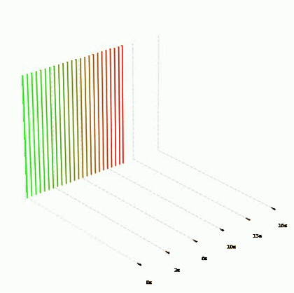

## `addInterpolation`

`interpolation` メソッドは、指定された軌道データをもとにインターポレーションを行い、新たなフレームを生成するためのメソッドです。この関数は、特定のフレーム数にわたり、複雑な変換を加えるためのものです。

### 引数
- `frame_nums`(int): 追加するフレーム数。
- `i_direction`(bool): インターポレーションの方向。
- `z_direction`(bool): Z方向におけるインターポレーションの方向。
- `axis_position`(bool): 回転やインターポレーションの中心となる位置。
- `s_reversal`(bool, optional, default: `False`): 空間次元の反転
- `z_reversal`(bool, optional, default: `False`): 時間次元の反転
- `cycle_degree`(int, optional, default: `90`): 1サイクルあたりの角度。
- `extra_degree`(int, optional, default: `0`): 変換を始める最初の段階での断面の角度の指定。
- `zslide`(int, optional, default: `0`): Z方向のスライド量。
- `speed_round`(bool, optional, default: `True`): 速度が円滑かどうかを指定。
- `rrange`(list of int, optional, default: `[0,1]`): 変換の範囲を指定するリスト。

| 引数名       | i_direction | z_direction | Axis_position | s_reversal | z_reversal |
|------------|-------------------------|-------------|---------------|------------|------------|
| 型          | Bool                    | Bool        | Bool          | Bool       | Bool       |
| 内容        | 遷移の方向              | 時間次元に対しての回転方向 | 回転軸が末端か始端か | 空間方向を反転 | 時間方向を反転 |
| 説明        | <ul><li>False / (TY-X) -> (XY-T)</li><li>True / (XY-T) -> (TY-X)</li></ul>  |  <ul><li>False / 順行</li><li>True / 逆行</li></ul>   | <ul><li>False /始端</li><li>True / 末端</li></ul>     | <ul><li>False / 反転なし</li><li>True/反転する</li></ul>  | <ul><li>False / 反転なし</li><li>True / 反転する</li></ul> |
|            

### 使用例
```python
bm.addInterpolation(100, 0, 0, 0,s_reversal=False,z_reversal=False)
```
_3dPlot.gif)
```python
bm.addInterpolation(100, 0, 1, 1,s_reversal=True,z_reversal=True)
```
_3dPlot.gif)

```python
bm.addInterpolation(100, 0, 0, 0,s_reversal=False,z_reversal=True)
```
_3dPlot.gif)


## `rootingA_interporation`
`addInterpolation`を2回1組として`loop_num`回連結し、通常フレームとスリットスキャン面の間をジグザグに行き来する軌道を作るプリセットです。各セグメントは`FRAME_NUMS/(loop_num*2)`フレームになります。

### 引数
- `FRAME_NUMS`(int): 全体のフレーム数の目安。
- `loop_num`(int, optional, default: `2`): 往復回数。
- `axis_first_p`(int, optional, default: `0`): 最初の軸位置（0/1で左右どちらの端を軸にするか）。
- `speed_round`(bool, optional, default: `True`): イーズ移動。
- `interval_nums`(int, optional, default: `0`): セグメント間に挿入する静止（addExtend）フレーム数。
- `loopinterval_nums`(int, optional, default: `0`): ループ間に挿入する静止フレーム数。

### 使用例
```python
bm.rootingA_interporation(1200, loop_num=2, interval_nums=60)
```

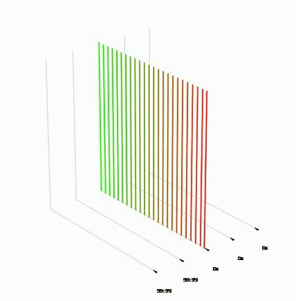

## `rootingA_interporation_single`
rootingAの1ユニット版。前半・後半の2サブセグメントで構成され、`seg_type`(0〜3)で空間の向き・軸位置・時間方向の組み合わせを選びます。

### 引数
- `FRAME_NUMS`(int): ユニット全体のフレーム数。
- `seg_type`(int, optional, default: `0`): `0`=前半順/後半逆(+1)、`1`=前半逆/後半順(-1)、`2`/`3`は軸位置違い。
- `speed_round`(bool, optional, default: `True`): イーズ移動。
- `interval_nums`(int, optional, default: `0`): サブセグメント間の静止フレーム数。
- `panorama_nums`(int, optional, default: `0`): 中間に挿入する`addExtend`（パノラマ静止）フレーム数。
- `flip_axis`(bool, optional, default: `False`): 軸を反転。
- `junction_mode`(int, optional, default: `0`): `1`で接続部にブラーを適用して滑らかにする。
- `blur_rate`(int, optional, default: `90`): junction_mode=1時のブラー強度。
- `Second_FRAME_NUMS`(int, optional): 後半セグメントのフレーム数を個別指定。
- `center_time_frame`(int, optional): 指定すると接続フレームの時間位置をこの値へ`zArange`でスライド。

### 使用例
```python
bm.rootingA_interporation_single(600, seg_type=0, panorama_nums=120, junction_mode=1)
```

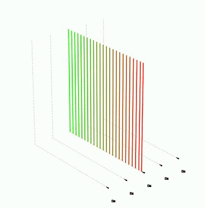

## `rootingA_interporation_trans_single`
`rootingA_interporation_single`のトランス拡張版。中間のパノラマ静止(`panorama_nums`)の代わりに`addTrans`による空間移動を挟みます。

### 引数
`rootingA_interporation_single`と共通の引数に加えて:
- `trans_nums`(int, optional, default: `0`): 中間に挿入するaddTransのフレーム数。
- `trans_end_line`(float, optional, default: `0`): addTransの目標位置(0-1)。
- `time_flip`(bool, optional, default: `False`): 時間方向を反転。

### 使用例
```python
bm.rootingA_interporation_trans_single(600, seg_type=0, trans_nums=150, trans_end_line=1)
```

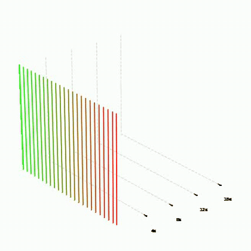

## `rootingA_interporation_RANDOM`
rootingAの各パラメータを範囲指定でランダム化した版です。`seed`を固定すれば再現可能です。

### 引数
- `FRAME_NUMS_range`(tuple|int): セグメントフレーム数の範囲`(min,max)`または固定値。
- `interval_nums_range`(tuple|int, optional, default: `(0,0)`): セグメント間静止の範囲。毎周ランダムに選択。
- `loopinterval_nums_range`(tuple|int, optional, default: `(0,0)`): ループ間静止の範囲。
- `loop_num`(int, optional, default: `2`) / `axis_first_p`(int) / `speed_round`(bool): rootingAと同様。
- `seed`(int, optional): 乱数シード。
- `clamp_even`(bool, optional, default: `False`): 偶数に丸める。
- `randomize_loopinterval_each_loop`(bool, optional, default: `False`): loopintervalも毎周ランダムにする。
- `min_step_frames`(int, optional, default: `1`): 各セグメントの最低フレーム数の保険。

### 使用例
```python
bm.rootingA_interporation_RANDOM((300, 900), interval_nums_range=(0, 120), loop_num=4, seed=42)
```


## `rootingAA_interporation`
rootingAの変形版。空間の始点・終点を同じ位置に維持したまま往復するため、画面上の起点が固定されたループ的な動きになります。引数は`FRAME_NUMS`(int), `loop_num`(int, default 2), `axis_first_p`(int), `speed_round`(bool)。

### 使用例
```python
bm.rootingAA_interporation(1200, loop_num=2)
```


## `rootingB_interporation`
軸を固定(`axis_fix_p`)したまま、ドミノが坂道を転がるように断面が連続的に倒れ込んでいく動きのプリセットです。引数は`FRAME_NUMS`(int), `loop_num`(int, default 1), `axis_fix_p`(int: 0/1)。

### 使用例
```python
bm.rootingB_interporation(800, axis_fix_p=0)
```

## `rooting8_interporation`
連結性のある8パターンの`addInterpolation`を順に実行するプリセットです。各セグメントが`FRAME_NUMS`フレームになるため、全体では`FRAME_NUMS×8`フレームになります。引数は`FRAME_NUMS`(int)のみ。

### 使用例
```python
bm.rooting8_interporation(150)   # 150×8=1200フレーム
```


## `rooting8B_interporation`
`rooting8_interporation`の反転版（s_reversal/z_reversal=1で実行）。同じく引数は`FRAME_NUMS`(int)のみ。

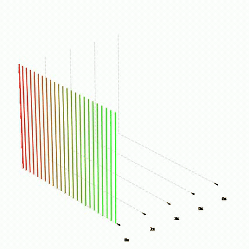

## `rooting4C_interporation`
連結性のある4パターンのプリセット（順方向×2＋軸違い×2）。引数は`FRAME_NUMS`(int)のみ。全体は`FRAME_NUMS×4`フレーム。


## `rooting4D_interporation`
4パターンプリセットのバリエーション（反転を交互に挟む構成）。引数は`FRAME_NUMS`(int)のみ。


## `addCycleTrans`

`addCycleTrans` メソッドは、サイクル的な変換（トランス）をデータに追加するためのものです。特定のフレーム数にわたって、サイクル的な角度変化を考慮して変換を行います。

### 引数
- `frame_nums`(int): 追加するフレーム数。
- `cycle_degree`(int, optional, default: `360`): 1サイクルあたりの角度。
- `zscaling`(bool, optional, default: `False`): Z軸のスケーリングを有効にするかどうか。
- `zslide`(int, optional, default: `0`): 時間位置の初期値。
- `extra_degree`(int, optional, default: `0`): 変換を始める最初の段階での断面の角度の指定。
- `speed_round`(bool, optional, default: `True`): 速度が円滑かどうかを指定。

### 使用例
```python            
bm.addCycleTrans(100, cycle_degree=360, zscaling=True, zslide=10, extra_degree=5, speed_round=False)
```
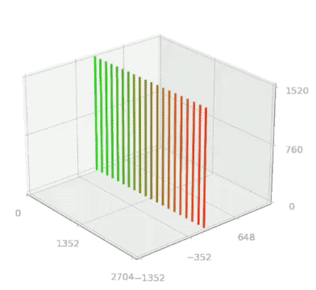

### Sample
[![Waves Etude [central v-axis rotation180 202209041744]](https://i.vimeocdn.com/video/1507673804-9e1d545fc365e48c6cb8d3bf5fdb7772843aaad792731d1537ba639806240d1e-d_640)](https://vimeo.com/749807843)

[Click to watch on Vimeo](https://vimeo.com/749807843)


## `addCustomCycleTrans`

`addCycleTrans` の回転軸の位置を調整することができる。

### 引数
- `frame_nums`(int): 追加するフレーム数。
- `cycle_degree`(int): 1サイクルあたりの角度。
- `start_center`(float, optional, default: `1/2`): 開始の中心軸の位置。(0~1)の範囲でスキャン方向の長さに対しての比率として指定する。縦スリットの場合、0は左端、1は右端になる。
- `end_center`(float, optional, default: `1/2`): 終了の中心軸の位置。
- `zscaling`(bool, optional, default: `False`): Z軸のスケーリングを有効にするかどうか。
- `extra_degree`(int, optional, default: `0`): 変換を始める最初の段階での断面の角度の指定。
- `speed_round`(bool, optional, default: `True`): 速度が円滑かどうかを指定。
- `zslide`(int, optional, default: `0`): 時間位置の初期値。
- `auto_zslide`(bool, optional, default: `True`): Zスライドの自動調整の有効・無効を切り替えるフラグ。
- `zscaling_v`(float, optional, default: `0.9`): Zスケーリングの係数。

### 使用例
```python
bm.addCustomCycleTrans(100, cycle_degree=360, start_center=0.2, end_center=0.7)
```
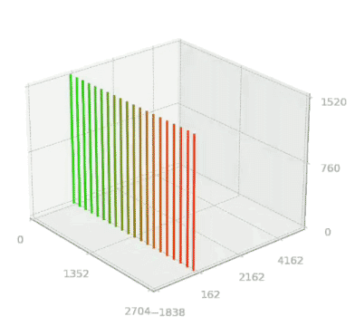

### Sample
[](https://vimeo.com/842051869)

[Click to watch on Vimeo](https://vimeo.com/842051869)


## `addWideCustomCycleTrans`
`addCustomCycleTrans`のワイド出力版。回転の中心軸を漸次的に移動させつつ、中心の外側のエッジスリットに時間差を付けて表示することで、入力映像より広い画面幅で回転断面を展開します。

### 引数
- `frame_nums`(int): 追加するフレーム数。
- `cycle_degree`(int): 回転角度。
- `start_center`(float): 回転中心の開始位置(0-1)。
- `end_center`(float): 回転中心の終了位置(0-1)。
- `maxz_range`(int, optional, default: `None`): 時間方向の最大レンジ。Noneで入力映像の総フレーム数(`count`)。
- `wide_scale`(int, optional, default: `3`): 出力幅の倍率。
- `t_auto_scaling`(bool, optional, default: `False`): 時間スケールの自動調整。
- `extra_degree`(int, optional, default: `0`): 開始角度のオフセット。
- `speed_round`(bool, optional, default: `True`): イーズ回転。

### 使用例
```python
bm.addWideCustomCycleTrans(600, cycle_degree=360, start_center=0.3, end_center=0.7, wide_scale=3)
```

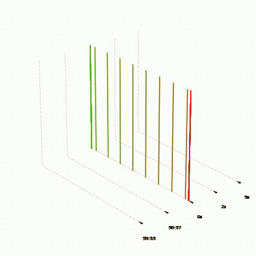

## `addFixWideCycleTrans`
幅固定（`width×wide_scale`）のワイドサイクルトランス。90度オフセットした角度から回転を開始し、断面の全体が常にワイド画面内に収まる構成です。

### 引数
- `frame_nums`(int): 追加するフレーム数。
- `cycle_degree`(int): 回転角度。
- `wide_scale`(int, optional, default: `3`): 出力幅の倍率。
- `t_auto_scaling`(bool, optional, default: `True`): `True`で時間レンジを入力映像全体(`count`)に、`False`で空間サイズ基準にする。
- `extra_degree`(int, optional, default: `0`): 角度オフセット。
- `speed_round`(bool, optional, default: `True`): イーズ回転。

### 使用例
```python
bm.addFixWideCycleTrans(600, cycle_degree=180, wide_scale=3)
```

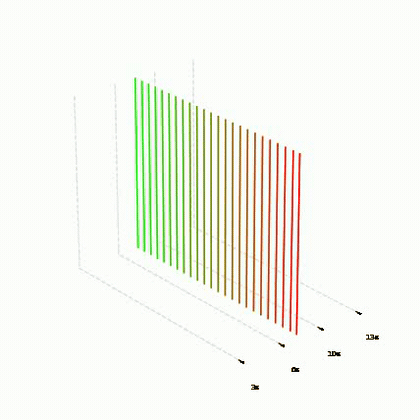

## `addWaveTrans`

`addWaveTrans`メソッドは、動的な波の形状の再生断面を作ります。`flow`の設定を`True`にすることで空間軸も、動かします。

### 引数
- `frame_nums`(int): 追加するフレーム数。
- `cycle_degree`(float): 波の波長。`360`の指定でスキャン方向の長さに対して２hz、180で1hzの波を形成する
- `zdepth`(float):XYTのうちのT方向の波の振幅。
- `flow`(bool, default: `Ture`): 空間次元を動かすかどうか`True`にすることで動かす。
- `zslide`(float, default: `0`): XYTのT方向のシフト。
- `speed_round`(bool, optional, default: `True`): 動的な推移を円滑にするか否か。

### 使用例
```python
bm.addWaveTrans(frame_nums=8000, cycle_degree=90, zdepth=1500, flow=False)
```
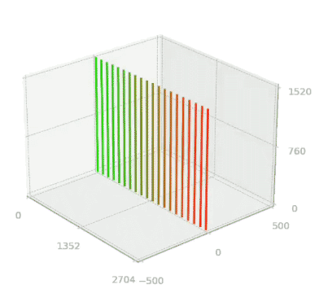
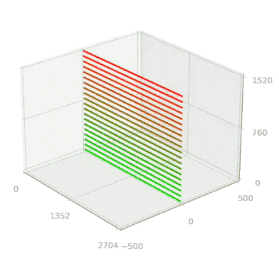

```python
bm.addWaveTrans(frame_nums=8000, cycle_degree=90, zdepth=1500, flow=True)
```
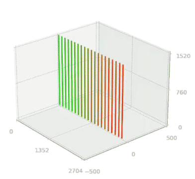
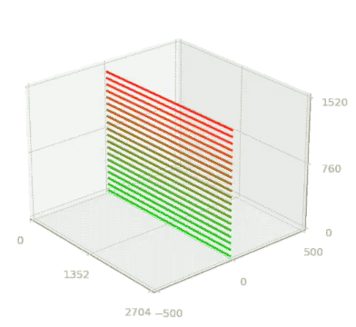

### サンプル
[](https://vimeo.com/663872580)

[Click to watch on Vimeo](https://vimeo.com/663872580)


## `addEventHorizonTrans`
縦・横の空間領域は変更せず（`flow=False`時）、画面の中心と周縁で時間の進行速度が変わる時間歪み断面を作ります。`cycle_degree=180`で中心が進行・周縁が逆行して徐々に戻り、`360`ではさらに逆転を経てノーマルに戻ります。時間振幅は`sin(π・z_osc・i/N)`の包絡で振動します。

### 引数
- `frame_nums`(int): 追加するフレーム数。
- `zdepth`(float): 時間方向の最大振幅（フレーム数）。
- `z_osc`(int, optional, default: `1`): 振幅包絡の振動回数。
- `cycle_degree`(int, optional, default: `180`): 画面内の時間歪みの波長。
- `flow`(bool, optional, default: `False`): `True`で空間も同時に移動させる。
- `zslide`(int, optional, default: `0`): 時間方向のオフセット。

### 使用例
```python
bm.addEventHorizonTrans(300, zdepth=600, cycle_degree=180)
```


## `applyTimeFlowKeepingExtend`
現在の軌道データ（`self.data`）の前後にフレームを継ぎ足して延長するメソッドです。継ぎ足し方に特徴があり、**空間方向（`data[:,:,0]`）は先頭／末尾フレームの位置をそのまま維持（静止）**し、**時間方向（`data[:,:,1]`, z）は境界での変化量（＝時間の流れる速度）を維持したまま**延長します。
addTransやaddCycleTransで作った動きの前後に、「同じ速度で流れ続ける」助走・惰走区間を足すのに使います。`fade=True`にすると、延長区間で速度を`fade_speed`まで滑らかに変化させて落ち着かせられます（イントロ／アウトロ用）。

### 引数
- `frame_nums`(int): 延長するフレーム数。`intro`と`outro`それぞれに適用されるため、両方`True`のときは合計`frame_nums × 2`フレーム増えます。
- `fade`(bool, optional, default: `False`): `True`で延長区間の速度を`fade_speed`へイージングさせる。`False`だと境界の速度を維持したまま等速で延長。
- `intro`(bool, optional, default: `True`): `True`で先頭にプリペンド（前方向へ延長）。
- `outro`(bool, optional, default: `True`): `True`で末尾にアペンド（後方向へ延長）。
- `fade_speed`(float, optional, default: `0`): `fade=True`時の到達速度。**単位は「出力1フレームあたりにzが進む量」（＝再生レート×`recfps/outfps`）**。`0`で完全停止、`recfps/outfps`で等速（再生レート1.0）。
- `fade_type`(str, optional, default: `"inout"`): イージング種別。`"inout"` / `"in"` / `"out"`。※現状アウトロ側は指定に関わらず`inOutQuad`が使われます（イントロ側は指定どおり）。
- `space_apply`(bool, optional, default: `False`): `True`で空間方向も境界の変化量を維持して延長する。`False`（既定）は空間は静止保持。

### 使用例
```python
# addTrans後、前後に「同じ速度で流れ続ける」区間を60フレームずつ追加
bm.addTrans(100)
bm.applyTimeFlowKeepingExtend(60)

# 末尾だけ延長し、そこで滑らかに減速停止させる（アウトロ用）
bm.applyTimeFlowKeepingExtend(90, fade=True, intro=False, outro=True)

# 冒頭だけ停止状態から加速して本編に入る（イントロ用）
bm.applyTimeFlowKeepingExtend(90, fade=True, intro=True, outro=False, fade_type="in")
```

> 特定の時間位置(z)にきっちり着地させたい場合は、累積誤差の出ない座標ベース版 [`applyTimeFlowKeepingExtend_CoodinateBase_Intro`](#applytimeflowkeepingextend_coodinatebase_intro) / [`applyTimeFlowKeepingExtend_CoodinateBase_Outtro`](#applytimeflowkeepingextend_coodinatebase_outtro) を使ってください。


## `applyTimeFlowKeepingExtend_CoodinateBase_Intro`
座標ベースのイントロ延長。先頭のフレームの時間座標が`target_z`から始まるように、`num_frames`分を線形補間でプリペンドします。スリットごとのステップを`(data[0,slit,1] - target_z) / num_frames`で厳密に計算するため、累積誤差なしで狙った時間位置から始められます。

### 引数
- `target_z`(float): 延長後の先頭フレームが参照する時間座標（フレーム番号）。
- `num_frames`(int): 延長フレーム数。

### 使用例
```python
bm.applyTimeFlowKeepingExtend_CoodinateBase_Intro(target_z=0, num_frames=150)
```


## `applyTimeFlowKeepingExtend_CoodinateBase_Outtro`
座標ベースのアウトロ延長。最終フレームの時間座標が`target_z`に着地するように`num_frames`分を線形補間でアペンドします。こちらも累積誤差ゼロを保証します。

### 引数
- `target_z`(float): 延長後の最終フレームが参照する時間座標。
- `num_frames`(int): 延長フレーム数。

### 使用例
```python
bm.applyTimeFlowKeepingExtend_CoodinateBase_Outtro(target_z=bm.count-1, num_frames=150)
```

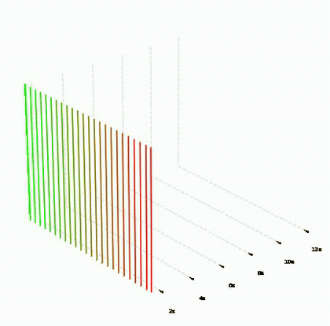

## `applyTimeForward`
配列全体に時間の順方向の流れを付与します。フレームkの時間座標に`slide_time × k`を加算します。

### 引数
- `slide_time`(float, optional, default: `None`): 出力1フレームあたりに進める時間フレーム数。Noneで`outfps/recfps`。等速（再生レート1.0）にしたい場合は`recfps/outfps`を指定します。
- `start_frame`(int, optional, default: `0`): 適用開始フレーム。
- `end_frame`(int, optional, default: `None`): 適用終了フレーム。以降のフレームには終了時点のシフト量が一律に加算されます。

### 使用例
```python
bm.addFlat(300)
bm.applyTimeForward(4)   # recfps=120/outfps=30なら等速の時間の流れ
```

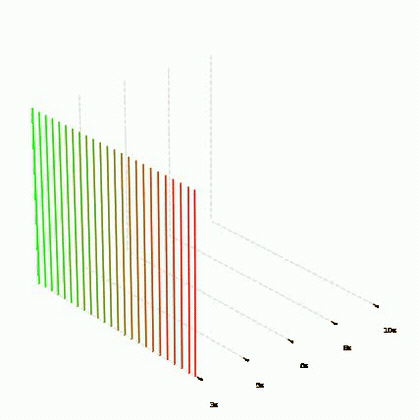

## `applyTimeOblique`
スリットの位置に比例して`0〜maxgap`フレームの時間シフトを加え、断面を時間方向へ斜めに傾けます（画面の端ほど過去/未来を参照する）。

### 引数
- `maxgap`(int): 反対側のエッジに付く最大時間シフト量（フレーム数）。

### 使用例
```python
bm.applyTimeOblique(240)   # 右端が240フレーム未来を参照
```

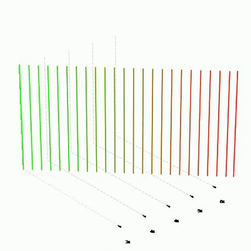

## `applyTimeForwardAutoSlow`
スロー再生の軌道全体の前後に、通常再生速度（レート1）のイントロ・アウトロを追加し、イーズで滑らかに接続します。

### 引数
- `slide_time`(int, optional, default: `1`): スロー部分の時間進行量。
- `defaultAddTime`(int, optional, default: `100`): イントロ/アウトロに追加するフレーム数（最低5秒=150fを確保）。
- `addTimeEasing`(bool, optional, default: `True`): イーズ接続を行うか。
- `easeRatio`(float, optional, default: `0.3`): イーズ区間の比率。

### 使用例
```python
bm.applyTimeForwardAutoSlow(slide_time=1, defaultAddTime=150)
```


## `applyTimeLoop`
軌道全体の時間の流れを「前半順方向→中間逆転→後半順方向」のサインカーブで構成し、先頭と末尾の時間差を打ち消してシームレスループを作ります。`stay_time`の等速区間はギャップ量に応じて自動調整されます。

### 引数
- `slide_time`(float): 順方向部分の時間進行量（出力1フレームあたりのフレーム数）。
- `freq`(int, optional, default: `2`): 周波数。現在2のみ対応。
- `stay_time`(int, optional, default: `30`): 先頭/末尾および中間の等速区間の基本長。
- `intepolation_min`(int, optional, default: `300`): サインカーブ部分の最低長。
- `stay_time_min`(int, optional, default: `30`): 等速区間の最低長。

### 使用例
```python
bm.addFlat(1200)
bm.applyTimeLoop(4)   # ループ可能な 順行→逆行→順行
```


## `applyTimeLoopB`
`applyTimeLoop`のスリット単位版。スリットごとに先頭・末尾の時間ギャップが異なる軌道に対して、スリットごとに等速区間長を調整してループ化します。引数は`applyTimeLoop`と同じ（`stay_time`のデフォルトは90）。

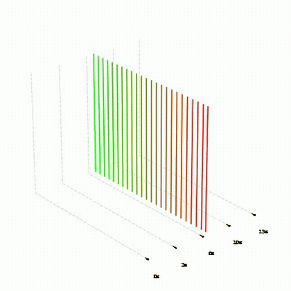

## `applyTimeChoppyLoop`
三角波状の時間オフセットを全体に加算します。時間が行き来する往復運動で、先頭と末尾が揃うためループに使えます。

### 引数
- `slide_time`(float, optional, default: `None`): 振幅スケール。Noneで`outfps/recfps`。
- `frequency`(int, optional, default: `1`): 波の回数。
- `phase_shift`(float, optional, default: `0`): 位相オフセット（π単位）。
- `rise`(float, optional, default: `0.5`): 上昇部分の比率。
- `fall`(float, optional, default: `0.5`): 下降部分の比率。

### 使用例
```python
bm.applyTimeChoppyLoop(frequency=2, rise=0.7, fall=0.3)
```


## `applyTimeChoppyLoopB`
`applyTimeChoppyLoop`の拡張版。サイン波の選択と、三角波の頂点（折り返し）部分のブラーによる滑らか化を追加しています。

### 引数
`applyTimeChoppyLoop`と共通の引数に加えて:
- `wave_type`(str, optional, default: `'triangle'`): `'triangle'` | `'sine'`。
- `blur`(int, optional, default: `0`): 0以外で波形にループブラーを適用し、頂点の折れを滑らかにする。

### 使用例
```python
bm.applyTimeChoppyLoopB(frequency=3, wave_type='triangle', blur=30)
```

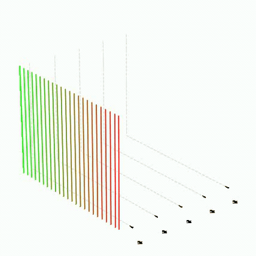

## `applyTimeClip`
指定したスリットの時間軌跡が一定値に固定されるように、全フレームを時間方向へシフトします。そのスリットを基準（不動点）とした相対的な時間構造に変換されます。

### 引数
- `trackslit`(int): 基準にするスリットのインデックス。
- `cliptime`(float, optional, default: `None`): 固定する時間位置。Noneで0。

### 使用例
```python
bm.applyTimeClip(trackslit=960, cliptime=1800)  # 画面中央を1800フレーム目に固定
```


## `applyTimebySpace`
スリットの空間位置に比例して、最大`v`フレームの時間シフトを加えます。画面の左右で参照時間が連続的に変わります。

### 引数
- `v`(float): 最大時間シフト量（フレーム数）。
- `mode`(int, optional, default: `0`): `0`=各スリットの空間座標基準、`1`=`cycle_axis`（CustomCycleTransの回転中心）基準、`2`=フレーム内の空間座標平均基準。

### 使用例
```python
bm.applyTimebySpace(480)
```

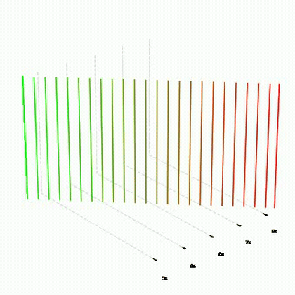

## `applyTimebyKeyframetoSpace`
空間位置→時間シフト量の対応をキーフレームで指定する版です。キーフレーム値は空間全域に等間隔で配置され、スプライン補間されます。

### 引数
- `keyframes`(list): シフト量（フレーム数）の値リスト。例えば`[0, 300, 0]`なら中央だけ300フレームずれる山なりのシフト。
- `mode`(int, optional, default: `0`): `applyTimebySpace`と同じ基準選択。

### 使用例
```python
bm.applyTimebyKeyframetoSpace([0, 300, 0])
```

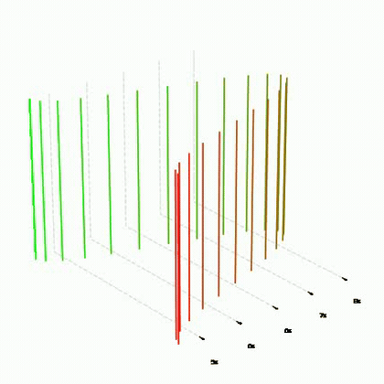

## `applyTimeSlide`
基準フレームの中央スリットの参照時間が`settime`になるよう、全体を時間方向へ平行移動します。

### 引数
- `settime`(int): 目標の時間位置（フレーム番号）。
- `baseframe`(int, optional, default: `0`): 基準フレーム。`-1`で最終フレーム基準。

### 使用例
```python
bm.applyTimeSlide(0)          # 冒頭を入力映像の頭に合わせる
bm.applyTimeSlide(3600, -1)   # 末尾を3600フレーム目に合わせる
```

## `applyInOutGapFix`
先頭フレームと最終フレームの時間差分を全フレームに線形に分配して打ち消します（シームレスループの補助）。引数なし。

### 使用例
```python
bm.applyInOutGapFix()
```

## `applyInFix`
先頭フレームの時間座標を`target_z_array`に一致させます。最終フレームは固定したまま、線形ブレンドで徐々に補正が効くようにします。

### 引数
- `target_z_array`(ndarray): スリットごとの目標時間値（shape=(scan_nums,)）。

### 使用例
```python
bm.applyInFix(first_section[-1,:,1])   # 前のセクションの末尾と揃える
```

## `applyOutFix`
最終フレームの時間座標を`target_z_array`に一致させます。先頭フレームは固定したまま、デフォルトではイーズインアウトで補正します。

### 引数
- `target_z_array`(ndarray): スリットごとの目標時間値。
- `ease`(bool, optional, default: `True`): `True`でイーズ、`False`で線形。

## `applyInPartFix`
`a_frame`の時間が`target_z`になるように、フレーム0〜`b_frame`の範囲だけをイーズで調整する部分修正です。

### 引数
- `target_z`(float): 目標の時間位置。
- `a_frame`(int): 一致させたい基準フレーム。
- `b_frame`(int): ブレンドの終了フレーム（ここまでに補正が0に収束）。

## `applyOutPartFix`
`b_frame`（基準スリット`b_frame_s_point`）の時間が`target_z`になるよう、`a_frame`以降をイーズで調整する部分修正です。

### 引数
- `target_z`(float): 目標の時間位置。
- `a_frame`(int): ブレンド開始フレーム。
- `b_frame`(int): 一致させたい基準フレーム。
- `b_frame_s_point`(int, optional, default: `None`): 基準スリット。Noneで中央スリット。

## `applyOutPartFixB`
`applyOutPartFix`の配列版。スリットごとの目標値`target_z_array`に合わせて`a_frame`以降をイーズ調整します。

### 引数
- `target_z_array`(ndarray): スリットごとの目標時間値。
- `a_frame`(int) / `b_frame`(int): ブレンド範囲。
- `base_z_array`(ndarray, optional, default: `None`): ギャップ計算の基準配列。Noneで`data[b_frame,:,1]`。

## `applySpaceBlur`
空間座標(`data[:,:,0]`)にフレーム方向のボックスブラーをかけ、空間の動きを滑らかにします。

### 引数
- `bl_time`(int): ブラーカーネルのサイズ（フレーム数）。

### 使用例
```python
bm.applySpaceBlur(60)
```

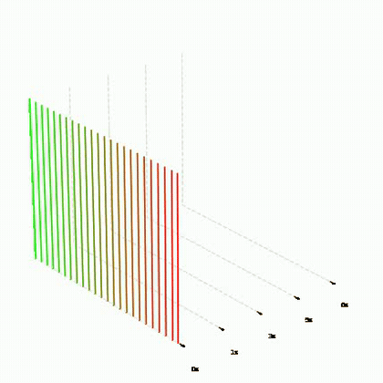

## `applyTimeBlur`
時間座標(`data[:,:,1]`)にフレーム方向のボックスブラーをかけ、時間の動きを滑らかにします。エッジ処理には内部で`timeFlowKeepingExtend`によるパディングを使用しているため、端の速度が乱れません。

### 引数
- `bl_time`(int): ブラーカーネルのサイズ（フレーム数）。

### 使用例
```python
bm.applyTimeBlur(60)
```

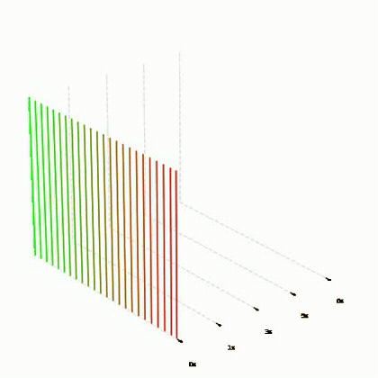

## `applyCustomeBlur`
指定したフレーム範囲だけに重み付き平均ブラーを適用します。接続部など局所的な折れ目を滑らかにするのに使います。

### 引数
- `s_frame`(int): 適用開始フレーム。
- `e_frame`(int): 適用終了フレーム。
- `bl_time`(int): ブラーカーネルのサイズ。
- `dim_num`(int, optional, default: `1`): `1`=時間座標、`0`=空間座標。

### 使用例
```python
bm.applyCustomeBlur(s_frame=280, e_frame=420, bl_time=60)
```


## `applyLoopBlur`
`data`を3連結してブラーをかけ、そのまま長さ3倍のデータにします。ループの境界をまたいだ連続的なブラーが得られます（必要に応じて`arrayExtract`で中央を切り出して使用）。

### 引数
- `sblur`(int): 空間ブラーのカーネルサイズ。0で無効。
- `tblur`(int): 時間ブラーのカーネルサイズ。0で無効。

### 使用例
```python
n = bm.data.shape[0]
bm.applyLoopBlur(0, 100)
bm.arrayExtract(n, n*2)   # 中央部を取り出してループ用データに
```

## `applyConnectLoopBlur`
ループの接続部（先頭と末尾の前後`connect_frame`）だけにブラーを適用します。データ長は変わりません。

### 引数
- `sblur`(int) / `tblur`(int): 空間/時間ブラーのカーネルサイズ。
- `connect_frame`(int, optional, default: `100`): 接続部の適用範囲（フレーム数）。

## `applyPointBlur`
指定フレームを中心とした範囲だけにブラーを適用します。

### 引数
- `point_frame`(int): 中心フレーム。
- `sblur`(int) / `tblur`(int): 空間/時間ブラーのカーネルサイズ。
- `range_frame`(int, optional, default: `100`): 適用範囲（中心から前後）。

## `applySpaceFlip`
空間座標を左右（横スリット時は上下）反転します。引数なし。

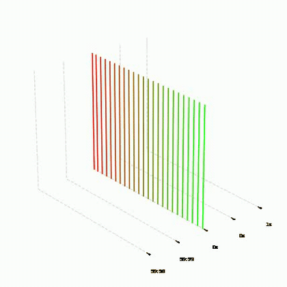

## `applySpaceFlat`
空間座標を初期状態の連番（0〜scan_nums-1）にリセットします。空間の歪みを取り除き、通常フレームの並びに戻します。引数なし。

### 使用例
```python
bm.addCycleTrans(300)     # 空間も回転する
bm.applySpaceFlat()       # 空間は固定し、時間の歪みだけを残す
```

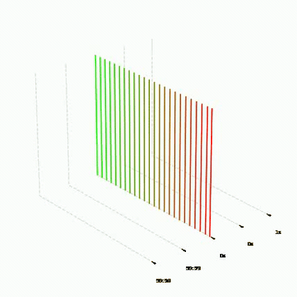

## `zCenterArange`
時間座標のmin/maxの中央が入力映像の中央（`count/2`、または指定値）に来るよう全体をシフトします。NaN安全。

### 引数
- `center_time_frame`(int, optional, default: `None`): カスタム中心。Noneで`count/2`。

### 使用例
```python
bm.addCycleTrans(300, zscale=2)
bm.zCenterArange()   # 入力映像の中央を軸に収める
```

## `zArange`
指定フレームの時間座標（スリット平均）が目標時間に来るよう全体をスライドします。`zCenterArange`がデータ全体のmin/max中央基準なのに対し、こちらは特定フレームを基準にできます。

### 引数
- `target_frame`(int): 基準にする`data`内のフレームインデックス。
- `center_time_frame`(float, optional, default: `None`): 目標の時間座標。Noneで`count/2`。

### 使用例
```python
bm.zArange(0, 1800)   # 先頭フレームを1800フレーム目基準に
```

## `zStartArange`
時間座標の最小値が0になるよう全体をシフトします。引数なし。

## `zPointCheck`
時間座標が有効範囲（0〜`count`）に収まっているかチェックし、はみ出している場合は自動調整します。シフトで収まる場合はシフト、収まらない場合は時間方向のスケーリングで収めます。レンダリング前の安全確認に使用します。

### 引数
- `subtract_count`(int, optional, default: `0`): 上限側のマージン（`count - subtract_count`を上限とする）。

### 使用例
```python
bm.zPointCheck()
bm.transprocess()
```

## `zPointCheckandReflect`
範囲外の時間座標を境界で反射（リフレクト）させて折り返す版です。シフトやスケールで全体を動かしたくない場合に使用します。

### 引数
- `subtract_count`(int, optional, default: `0`): 上限側のマージン。

## `spline_interpolate`
キーフレーム値列（空間全域に等間隔配置）をスプライン/線形/ベジェで補間し、任意の位置`x`での値を返す汎用ヘルパです。`applyTimebyKeyframetoSpace`の内部で使用されますが、単独でも利用できます。

### 引数
- `x`(ndarray): 補間値を求める位置（スリット座標）。
- `keyframes`(list): 値のリスト。`scan_nums`全域に等間隔配置される。
- `method`(str, optional, default: `'spline'`): `'spline'` | `'linear'` | `'bezier'`。

## `dataCheck`
`data`のshapeと空間/時間座標のmin-maxをコンソールに出力します。引数なし。

### 使用例
```python
bm.dataCheck()
# data.shape = (300, 1920, 2)
# Reference_Space min-max = 0.0 1919.0
# Reference_Time  min-max = 840.0 2760.0
```

## `info_setting`
`data`を`thread_num`本のスリットに間引き、音声/CSV出力用の派生マップ（`sc_resetPositionMap`=時間位置、`sc_rateMap`=再生レート、`sc_inPanMap`=空間位置、`sc_now_depth`=フレーム内時間幅など）を計算します。`scd_out`/`maneuver_CSV_out`から自動で呼ばれますが、単独でも使用できます。

### 引数
- `thread_num`(int, optional, default: `20`): 間引き後のスリット本数。
- `raw`(bool, optional, default: `False`): `True`で間引きせず全スリットを使用。

## `maneuver_CSV_out`
軌道データをAfter Effects等で読み込めるヘッダ付きCSVとして出力します。各boolフラグで出力するマップを選択します。

### 引数
- `thread_num`(int, optional): スリット間引き数。
- `time_map`(bool, default: `True`): 時間位置マップ(ResetP)を出力。
- `space_map`(bool, default: `True`): 空間位置マップ(inPanMap)を出力。
- `time_rate_map`(bool, default: `True`): 再生レートマップを出力。
- `now_depth_map`(bool, default: `False`): フレーム内時間幅を出力。
- `space_rate_map`(bool, default: `False`): 空間方向レートを出力。
- `movement_rate_map`(bool, default: `False`): 総合移動量レートを出力。

### 使用例
```python
bm.maneuver_CSV_out(20)
```

## `data_save`
軌道データ`data`をnpyファイルとして保存します。後日`datapath`引数や`np.load`で再利用できます。

### 引数
- `attr`(str, optional, default: `None`): ファイル名に付けるサフィックス。
- `sep`(int, optional, default: `0`): 0以外でフレーム方向に`sep`分割して保存。

### 使用例
```python
bm.data_save()
# 別セッションで:
# bm = imgtrans.drawManeuver("video.mp4", 1, datapath="saved_data.npy")
```

## `split_3_npySave`
`data`を空間方向にLeft/Center/Rightの3分割してnpy保存します（ワイド出力の分割レンダリング用）。連結済みnpyも出力します。引数なし。

## `split_3_npysavereturn`
`split_3_npySave`と同じ処理を行い、保存したファイルパスの配列を返します。引数なし。

## `vsizeReturn`
クラス変数`img_size_type`の設定に応じた出力画像サイズ`(width, height)`を返します。引数なし。

## `maneuver_2dplot`
軌道データの2Dプロット（時間位置・レートなどのグラフ）をPNG出力します。`auto_visualize_out=True`の場合は各変換の後に自動実行されます。`video_out=True`でシークバー付きのプロット動画も出力できます。

### 主な引数
- `thread_num`(int, optional): プロットするスリット本数。
- `axnum`(int, optional, default: `3`): 描画するグラフの数(0-7)。
- `colormode`(str, optional, default: `'black'`): 配色。
- `s_frame`/`e_frame`(int, optional): 描画するフレーム範囲。
- `video_out`(bool, optional, default: `False`): 現在フレームを示すシークバー付き動画を出力。
- `video_alpha`(bool, optional, default: `False`): 動画を透過(ProRes4444)で出力。
- `individual_output`(bool, optional, default: `False`): グラフを個別ファイルに分けて出力。

### 使用例
```python
bm.maneuver_2dplot(50)                      # 50スリットでプロット
bm.maneuver_2dplot(video_out=True)          # シークバー動画付き
```

## `maneuver_3dplot`
軌道データをXYT時空間キューブ内の3D断面としてプロットし、回転アニメーション（連番画像+動画）を出力します。

### 主な引数
- `thread_num`(int, optional): プロットするスリット本数。
- `out_framenums`(int, default: `50`): 出力フレーム数。
- `out_fps`(int, default: `25`): 出力fps。
- `colormode`(str, default: `'white'`): `'white'` | `'black'`など背景配色。
- `aspect_ratio`(tuple, default: `(1,1,1)`): XYZのアスペクト比。
- `elev`/`azim`(float, default: `25`/`-40`): カメラの仰角/方位角。
- `zRangeFix`(bool, default: `False`): 時間軸の範囲を入力映像全体に固定。
- `lineplot`(bool, default: `True`): 断面ラインの描画。
- `vectorplot`(bool, default: `False`): 移動ベクトルの描画。`vector_def_frame`(基準フレーム間隔), `velocity`(速度スケール), `vector_color_amp`(色の強調)と併用。
- `only_seq_img`(bool, default: `False`): 動画を作らず連番のみ出力。

### 使用例
```python
bm.maneuver_3dplot(out_framenums=100, colormode='black')
```

## `maneuver_3dplot_midtide`
Mid Tide作品用スタイルの3Dプロット。ワイド軌道向けの構図・配色プリセット版です。引数は`maneuver_3dplot`の主要部分と共通（`thread_num`, `zRangeFix`, `out_framenums`, `out_fps`, `colormode`, `aspect_ratio`, `elev`, `azim`, `dpi`）。

## `maneuver_imgplot`
軌道データを16bit PNGのマップ画像として出力します。空間マップ・時間マップ・レートマップを選択でき、ファイル名に正規化パラメータが埋め込まれるため、[`img_to_maneuver`](#img_to_maneuver)で軌道データへ逆変換できます（画像編集ソフトでマップを加工→再読込のワークフローが可能）。

### 引数
- `plot_mode`(str, optional, default: `"all"`): `"space"` | `"time"` | `"rate"` またはその組み合わせ。`"all"`で3種すべて。
- `colormode`(str, optional, default: `'black'`): プレビュー配色。
- `nticks_x`/`nticks_y`(int, optional, default: `4`): 目盛り数。
- `save_png`(bool, optional, default: `True`): 16bit PNGマップの保存。
- `time_axis`(str, optional, default: `'auto'`): 時間軸の表記。`'auto'` | `'frame'` | `'sec'`。

### 使用例
```python
bm.maneuver_imgplot(plot_mode="all")
```

## `img_to_maneuver`
`maneuver_imgplot`が出力した空間・時間の16bit PNGマップから`data`を復元します。正規化パラメータはファイル名から自動抽出されます（手動指定も可能）。

### 引数
- `space_img_path`(str): 空間マップPNGのパス。
- `time_img_path`(str): 時間マップPNGのパス。
- `space_set`(float, optional): 空間の正規化レンジを手動指定。
- `vrange`(tuple, optional): 時間の正規化レンジ`(vmin, vmax)`を手動指定。

### 使用例
```python
bm.img_to_maneuver("xxx_space_1920.png", "xxx_time_840-2760.png")
bm.transprocess()
```

## `img_to_maneuver_rate_based`
レートマップ画像（再生速度の変化率）を時間方向に積分して`data`を復元します。レートを直接ペイントして軌道を設計するワークフロー用です。

### 引数
- `time_rate_path`(str): レートマップPNGのパス。
- `space_img_path`(str, optional): 空間マップ。Noneで連番を自動生成。
- `space_set`(float, optional): 空間正規化レンジ。
- `start_time`(float, optional, default: `0.0`): 積分の開始時間。
- `rate_range`(float, optional): レートの正規化レンジ。Noneでファイル名から抽出。
- `rate_baseline`(float, optional) / `rate_startpoint`(float, optional): レート基準値の調整。

## `movement_intensity_analyze`
入力映像のフレーム間差分から動き強度を計測し、時系列グラフをPNG出力します。動きに応じた再生速度の設計材料に使います。引数なし。

### 使用例
```python
bm.movement_intensity_analyze()   # xxx_graph.png が出力される
```

## `transprocess`
映像のレンダリングを行います。

### 引数
- `separate_num` (int, optional, default: `1`): レンダリングを何分割で行うかの指定。
- `sep_start_num` (int, optional, default: `0`): 分割レンダリング時に、どの分割から開始するかの指定。
- `sep_end_num` (int or None, optional, default: `None`): 分割レンダリング時に、どの分割まで行うかの指定。
- `out_type` (int, optional, default: `1`): 出力コーデック/フォーマットをクラス定数で選択（`0`=`OUT_STILL`, `1`=`OUT_H264`, `2`=`OUT_H265`, … `7`=`OUT_H265_HW`）。[`out_type` 一覧](#out_type-一覧)を参照。`0` は静止画連番を書き出し、それ以外は動画エンコーダを選択します。
- `XY_TransOut` (bool, optional, default: `False`): Trueの場合、出力映像を90度回転して保存。
- `render_mode` (int, doptional, default: `0`): レンダリングモード。`0`は全軌道データのフレームを統合して出力。`1`は`sep_start_num` から `sep_end_num` までの範囲だけを出力。`2`の場合は動画の書き出しをしない。npyのrawdataの保存のみの場合に使用する。`3`の場合は、`sep_start_num`と`sep_end_num` で指定した部分のtmpから動画の書き出しのみ行う。
- `seqrender` (bool, optional, default: `False`):一度入力の映像データをnpyシーケンスに変換する。（大量のデータを必要とするので注意）> 廃止2025年10月
- `title_atr` (str,optional,default: `None`):出力する映像ファイル名に文字列を追加。
- `tmp_type_para`(int, optional, default : `False`) : 一時保管データ（Numpy配列）をフレーム毎に保存するか、一定のフレーム数分を束ねたデータとして保存するか。
- `del_data`(int, optional, default : `True`) :  レンダリングの始まる前に、メモリ容量の多い`data`を消すかどうか。消した場合、この関数の処理後に、`animationout`を実行しようとするとエラーになるので注意。
- `auto_memory_clear=False`(int, optional, default : `False`) :
- `memory_report`(int, optional, default : `False`) :
- `tmp_save` (int, optional, default : `False`) : 映像レンダリングの後に、一時保管データ（Numpy配列）を消すかどうか
- `tmp_para_images` (bool, optional, default: False): 分割ごとに一時的に画像ファイルを保存するか。"img/"　内への保存。
- `render_clip_start` (int, optional, default : `0`) :レンダリングの範囲の指定。単位はフレーム
- `render_clip_end` (int, optional, default : `None`) : レンダリングの範囲の指定。単位はフレーム


### 使用例
```python
# インスタンスを作成
bm = imgtrans.drawManeuver("mov/samplevideo.mp4",sd=1)

#軌道データの書き込み
bm.addTrans(100)
bm.applyTimeForward(1)

# レンダリング
bm.transprocess()
```

## `new_transprocess`
HDR対応、FFmpeg/PyAVパイプラインを備えた主要な映像レンダリングメソッド。多くの場合、`transprocess`の代わりに使用します。

### 引数
- `separate_num` (int, optional, デフォルト: `None`): 分割レンダリングの分割数。Noneの場合、使用可能メモリから自動計算。
- `sep_start_num` (int, optional, デフォルト: `0`): 分割レンダリングの開始分割インデックス。
- `sep_end_num` (int or None, optional, デフォルト: `None`): 終了分割インデックス。
- `out_type` (int, optional, デフォルト: `1`): 出力形式。下記のテーブルを参照。
- `xy_trans_out` (bool, optional, デフォルト: `False`): Trueの場合、出力を90度回転。
- `render_mode` (int, optional, デフォルト: `0`): `0`=フルレンダリング、`1`=指定範囲のみ、`2`=npy生データのみ（映像なし）、`3`=既存tmpからの映像出力のみ。
- `title_atr` (str, optional, デフォルト: `None`): 出力ファイル名に文字列を追加。
- `del_data` (bool, optional, デフォルト: `True`): レンダリング前に`self.data`を削除してメモリを解放。Trueの場合、`animationout`は実行不可。
- `render_clip_start` (int, optional, デフォルト: `0`): 部分レンダリングの開始フレーム。
- `render_clip_end` (int or None, optional, デフォルト: `None`): 部分レンダリングの終了フレーム。
- `slit_step` (int, optional, デフォルト: `1`): スリットレングス方向のピクセル間引き。`2`=1/2、`3`=1/3、`4`=1/4。0以下は1として扱う。
- `scan_step` (int, optional, デフォルト: `1`): スキャンナムズ方向の間引き。`self.data`は非破壊。0以下は1として扱う。

### 使用例
```python
# 標準レンダリング
bm.new_transprocess()

# HDR H.265出力
bm.new_transprocess(out_type=bm.OUT_H265)

# ProRes 422 HQ出力
bm.new_transprocess(out_type=bm.OUT_PRORES_422)

# 縮小プレビュー（面積1/4）
bm.new_transprocess(slit_step=2, scan_step=2)

# 部分レンダリング（フレーム100〜500）
bm.new_transprocess(render_clip_start=100, render_clip_end=500)
```

### `out_type` 一覧

| 値 | 定数 | コーデック | ピクセルフォーマット | 色空間 | コンテナ | 備考 |
|---|---|---|---|---|---|---|
| `0` | `OUT_STILL` | — | — | — | 連番画像 | 静止画出力（jpg/bmp） |
| `1` | `OUT_H264` | libx264 | yuv420p (8bit) | SDR BT.709 | .mp4 | デフォルト。最大 4096×2160 |
| `2` | `OUT_H265` | libx265 | yuv420p10le (10bit) | HDR10 PQ BT.2020 | .mp4 | 最大 8192×4320 |
| `3` | `OUT_PRORES_422` | prores_ks | yuv422p10le (10bit) | HDR BT.2020 | .mov | ProRes 422 HQ。解像度制限なし |
| `4` | `OUT_PRORES_4444` | prores_ks | yuv444p10le (10bit) | HDR BT.2020 | .mov | ProRes 4444。解像度制限なし |
| `5` | `OUT_H265_SDR` | libx265 | yuv422p10le (10bit) | SDR BT.709 | .mp4 | SDRカラータグ付きH.265 |
| `6` | `OUT_PRORES_422_SDR` | prores_ks | yuv422p10le (10bit) | SDR BT.709 | .mov | SDRカラータグ付きProRes 422 HQ |
| `7` | `OUT_H265_HW` | hevc_videotoolbox | p010le (10bit) | HDR10 PQ/HLG BT.2020 | .mp4 | macOS VideoToolbox ハードウェアエンコード。ソフトウェア libx265 より高速 |

> **解像度制限**: H.264は最大4096×2160、H.265は最大8192×4320。これらを超える解像度（パノラマレンダリング等）にはProRes（`OUT_PRORES_422` または `OUT_PRORES_422_SDR`）を使用してください。

> **`rendered_npys_to_mov`**: 分割レンダリングされたnpyファイルを結合するスタンドアロン関数も、上記すべての`out_type`に対応しています。`out_type=None`（デフォルト）で従来のcv2 mp4v出力。
> ```python
> import imgtrans
> imgtrans.rendered_npys_to_mov(
>     out_dir='path/to/output',          # 出力パス（拡張子なし）
>     npys_path='path/to/tmp',           # sep-*.npyファイルがあるフォルダ
>     out_fps=60,
>     sep_start=1, sep_end=6,
>     out_type=imgtrans.drawManeuver.OUT_PRORES_422_SDR
> )
> ```

## `pretransprocess`
`data`を`outnums`フレームに間引いた低解像度・低fps（10fps）のプレビュー動画を高速に書き出します。本番レンダリング前の軌道確認用です。時間座標が範囲外の場合はエラーメッセージを出して中断します。

### 引数
- `outnums`(int, optional, default: `100`): 出力フレーム数（dataを等間隔に間引く）。
- `xy_trans_out`(bool, optional, default: `False`): 出力を90度回転。

### 使用例
```python
bm.addCycleTrans(1200)
bm.pretransprocess(100)   # まず100フレームのプレビューで確認
```

## `overlay_tc_rate`
レンダリング済み映像（`out_videopath`）にタイムコードと再生レートをオーバーレイして再書き出しします。画面を横方向に`divisions`等分し、各区画の中心スリットのTC・レートを表示します。レートの色: 黄(+1)、青(-1)、灰(0)。タイムコードは`{sec}sec---{frac}f`形式。

### 引数
- `output_suffix`(str, optional, default: `None`): 出力ファイル名サフィックス。Noneで`"_tc"`（text_only時は`"_tc_textonly"`）。
- `divisions`(int, optional, default: `5`): プローブポイント（表示区画）の数。
- `hdr`(bool, optional, default: `None`): Noneで入力から自動判定。True=H.265 10bit HDR、False=H.264 8bit SDR。
- `text_nits`(int, optional, default: `203`): HDR時の文字の明るさ（nit）。
- `text_only`(bool, optional, default: `False`): `True`で映像を捨てテキストのみを透過ProRes 4444で出力（AE合成用）。
- `font_scale`(float, optional) / `thickness`(int, optional): Noneで解像度に応じ自動。
- `font_scale_mult`(float, optional, default: `1.0`): 自動算出値への倍率。

### 使用例
```python
bm.transprocess()
bm.overlay_tc_rate(divisions=5)
```

## `animationout`
 `animationout`関数は、出力した映像データを参照して、3Dグラフ上に画像のピクセルカラーをプロットし、結果をアニメーションとして出力します。時空間キューブ上での時空間操作に基づく再生断面の軌道を可視化させます。 'maveuver_2dplot','maveuver_3dplot'とは違いピクセルの色をマッピングすることでより入力の映像データとの対応を直感的に理解しやすいビジュアライズです。  
 そのため、映像のレンダリングを行った後にしか実行できません。もし、既に書き出しの映像データが存在する場合は、インスタンス変数'out_videopath'にて情報を呼び出す必要があります。
 
 ```python
 bm.out_videopath = "mov/sample.mp4"
 bm.animationout()
 ```

 ### 引数
- `outFrame_nums` (`int`, default: `100`): 出力するフレーム数。
- `drawLineNum` (`int`, default: `250`): 描画するラインの数。
- `dpi` (`int`, default: `200`): 出力画像のDPI。
- `out_fps` (`int`, default: `10`): 出力動画のフレームレート。

### 使用例
_CustomeBlur300_CustomeBlur300_TimeLoop_timeSlide_zCenterArranged_img_3d-pixelMap.gif)

## `animationout_custome`
`animationout`のカスタマイズ版。カメラアングル・アスペクト比・配色・ベクトル表示などを細かく指定できます。

### 引数
- `zRangeFix`(bool, optional, default: `False`): 時間軸の範囲を入力映像全体に固定。
- `out_framenums`(int, default: `100`) / `drawLineNum`(int, default: `250`) / `dpi`(int, default: `200`) / `out_fps`(int, default: `10`): `animationout`と同様。
- `aspect_ratio`(tuple, optional, default: `(16, 50, 9)`): XYZのアスペクト比。
- `elev`(float, default: `25`) / `azim`(float, default: `-40`): カメラの仰角/方位角。
- `colormode`(str, optional, default: `'white'`): 背景配色。
- `transparent`(bool, optional, default: `False`): 背景透過で出力。
- `gridplot`(bool, optional, default: `True`): グリッド描画。
- `vectorplot`(bool, optional, default: `False`): 移動ベクトル描画。`vector_def_frame`(int, default: `120`), `velocity`(float, default: `10`), `vector_color_amp`(float, default: `1.0`)と併用。
- `s_frame`(int, optional, default: `0`): 開始フレーム。

### 使用例
```python
bm.out_videopath = "rendered.mp4"
bm.animationout_custome(elev=30, azim=-60, colormode='black')
```

## スタンドアロン関数

クラスに属さないモジュールレベルの関数です。`import imgtrans` してそのまま呼び出せます。

### `export_segments`
ソース映像をA群（順再生）・B群（水平反転＋逆再生）のセグメントに分割して書き出します。フレーム番号とタイムコードのオーバーレイ描画に対応し、ハイスピード収録映像の実時間速度補正（`recfps`/`out_fps`の比で間引き）も行います。

- `video_path`(str): ソース映像パス。
- `out_dir`(str): 出力ディレクトリ（A/, B/サブフォルダを作成）。
- `segment_sec`(float, default: `10`): 1セグメントのソース秒数。
- `segment_count`(int, optional): セグメント数。Noneで映像全体。
- `out_fps`(float, default: `60`): 出力fps。
- `with_frame_num`(bool, default: `True`): フレーム番号を描画。
- `recfps`(float, default: `480`): 実収録fps。
- `export_only`(str, default: `"both"`): `"A"` | `"B"` | `"both"`。

```python
imgtrans.export_segments("src.mp4", "segments/", segment_sec=10, recfps=480)
```

### `rendered_npys_to_mov`
分割レンダリングされたnpyデータを1本の動画へ変換する統合関数です。sep-*.npyフォルダ、単一npy、メモリ上の配列、1フレーム1npyフォルダ（`per_frame=True`）のいずれにも対応し、全`out_type`フォーマットで出力できます。

- `out_dir`(str): 出力先ディレクトリ。
- `npys_path`(str, optional): npyフォルダまたはファイル。
- `out_fps`(int, default: `30`) / `out_type`(int, optional): 出力設定。
- `sep_start`(int, default: `0`) / `sep_end`(int, optional): 結合するsep範囲。
- `images`(ndarray, optional): メモリ上の配列を直接渡す場合。
- `per_frame`(bool, default: `False`): 1フレーム1npy形式。
- `separate_out`(bool, default: `False`): sepごとに個別動画として出力。

```python
imgtrans.rendered_npys_to_mov("out/", npys_path="tmp/", sep_start=1, sep_end=6)
```

### `rearrange_wide_video`
横長のワイドパノラマ動画（W×H）を中央で分割し上下2段（W//2×2H）に再配置します。`roll_offset`で横方向の循環シフトも指定できます。入力は動画ファイルまたはsep-*.npyフォルダ。

- `output_path`(str): 出力パス。
- `input_path`(str, optional) / `npys_path`(str, optional): 入力（どちらか一方）。
- `roll_offset`(int, default: `0`): 横方向の循環シフト量（ピクセル）。
- `sep_start`/`sep_end`(int, optional): npy入力時の範囲。
- `out_fps`(int, default: `30`) / `out_type`(int, optional): 出力設定。

### `rendered_mov_to_seq`
レンダリング済み動画からフレームを静止画として切り出します（ffmpegベース・HDR色空間対応）。

- `video_path`(str): 入力動画。
- `divide_num`(int, optional): 均等分割数。
- `img_format`(str, default: `'jpg'`): `'ultrahdr'`(Gain Map HDR JPEG) | `'png'`(16bit) | `'jpg'` | `'avif'`(10bit) | `'npy'`。
- `frame_array`(array, optional): 書き出すフレーム番号を直接指定。
- `color_mode`(str, default: `'source'`): `'source'`(色メタデータ保持) | `'sdr'`(BT.709へトーンマップ) | `'hlg'`。

```python
imgtrans.rendered_mov_to_seq("out.mp4", divide_num=10, img_format='png')
```

### `convert_npy_to_jpg`
単一のnpyファイル（保存されたフレーム配列）をJPEG画像に変換します。引数: `npy_file_path`(str), `output_folder`(str)。

### `custom_blur`
配列の指定フレーム範囲・指定次元に重み付き平均ブラーを適用して返します。`applyCustomeBlur`の内部実装です。引数: `data`(ndarray), `s_frame`(int), `e_frame`(int), `bl_time`(int), `dim_num`(int, default: `1`)。

### `custom_onedimention_blur`
1次元配列（時間軌跡など）の指定範囲への重み付き平均ブラー。引数: `time_array`(ndarray), `s_frame`(int), `e_frame`(int), `bl_time`(int)。

### `double_first_dimension_with_interpolation`
3D配列の第1次元（フレーム軸）を、既存フレーム間に線形補間フレームを挿入して2倍に拡張します。軌道データのフレームレート倍化に使用できます。引数: `arr`(ndarray), `next_first_array`(ndarray, optional: ループ用に次の先頭フレームを指定)。

```python
bm.data = imgtrans.double_first_dimension_with_interpolation(bm.data)
```

## 最近のアップデート (2026)

### レンダリング縮小オプション (`new_transprocess`)
レンダリング時に解像度を縮小する2つの新パラメータを追加。軌道データ（`self.data`）は非破壊で、プレビューや軽量出力に利用できます。
- `slit_step` (int, デフォルト: `1`): スリットレングス方向のピクセル間引き。`2` = 1/2, `3` = 1/3, `4` = 1/4サイズ。0以下は1として扱われます。
- `scan_step` (int, デフォルト: `1`): スキャンナムズ方向の間引き。`2` = 1/2, `3` = 1/3, `4` = 1/4。`self.data`は変更されません。

```python
bm.new_transprocess()                          # 等倍出力
bm.new_transprocess(slit_step=2)               # スリットレングス半分（例: 2160→1080）
bm.new_transprocess(scan_step=2)               # スキャンナムズ半分
bm.new_transprocess(slit_step=2, scan_step=2)  # 両方半分（面積1/4）
```

### シークバー動画出力 (`maneuver_2dplot`)
`maneuver_2dplot` にシークバー付きアニメーション動画の出力機能を追加。
- `video_out` (bool, デフォルト: `False`): Trueで、点線のシークバーとタイムコード表示付きの動画を出力。
- `video_alpha` (bool, デフォルト: `False`): Trueで、MP4の代わりにアルファチャンネル付きProRes 4444 MOVを出力。

```python
bm.maneuver_2dplot(video_out=True)                     # 白背景MP4
bm.maneuver_2dplot(video_out=True, video_alpha=True)   # ProRes 4444（透過）
```

### 空間拡張の時間オフセット (`wide_expandB`)
- `z_offset` (int, デフォルト: `0`): 空間拡張時に、ステップごとの時間オフセットを付加。右側は`+z_offset`（未来方向）、左側は`-z_offset`（過去方向）。実際の時間差がゼロでも拡張領域に時間的なグラデーションを持たせることができます。

```python
bm.wide_expandB(add_size=3840, z_offset=1)
```

### ジャンクションモードとブラーレート (`rootingA_interporation_single`, `rootingA_interporation_trans_single`)
- `junction_mode` (int, デフォルト: `0`): 時間方向の反転点（ジャンクション）の配置を選択。
  - `0`: デフォルト — パノラマ/インターバル終端 + シフト
  - `1`: 前半補間の終端
  - `2`: パノラマ/トランスセクションの中間点
- `blur_rate` (int, デフォルト: `90`): ジャンクション周辺のブラー範囲をセグメントフレーム数に対するパーセンテージで制御。ブラーはセグメント単位で適用され、累積されません。

```python
bm.rootingA_interporation_single(Fnum, seg_type=0, junction_mode=2, blur_rate=90)
bm.rootingA_interporation_trans_single(Fnum, seg_type=0, junction_mode=2, blur_rate=90, time_flip=False)
```

### 頭尾タイムコード整合 (`applyInOutGapFix`)
シームレスループ作成のための補助関数。最初と最終フレームの時間値の差分を計算し、全フレームを線形に調整して一致させます。

### バグ修正: `applyCustomeBlur` 負インデックス
`applyCustomeBlur` で `s_frame=0` の場合、numpyの負インデックスにより最初の約60フレームにNaN値が発生するバグを修正。平均スライスの下限を0にクランプしました。

### HDR カラープロファイル対応（画像出力）

画像ファイルへのレンダリング時（`out_type=0`）、入力映像のカラープロファイルが出力画像に自動的に埋め込まれるようになりました。
HDRコンテンツ（PQ / HLG）では、正しいプロファイルがないとmacOS PreviewなどのビューアがPQエンコードされたピクセル値をsRGBとして解釈し、色が正しく表示されません。

**対応フォーマットと方式:**

| フォーマット | HDRプロファイル | 方式 |
|------------|--------------|------|
| PNG | 完全対応 (BT.2100 PQ / HLG) | 保存後にcICPチャンクを注入 |
| TIFF | プライマリーのみ (BT.2020) | `sips --embedProfile` でシステムICCを埋め込み |
| その他 | なし | 標準の `cv2.imwrite` |

- PQ (SMPTE ST 2084) ソースの場合、**PNGが推奨**です。cICPチャンクにより完全なBT.2100 PQプロファイルが埋め込まれ、macOS Previewが「Rec. ITU-R BT.2100 PQ」として正しく認識します。
- TIFFの場合、macOSの`sips`コマンドでBT.2020 ICCプロファイル（`ITU-2020.icc`）が埋め込まれます。色域（プライマリー）は正しいですが、TRCはPQではなくガンマベースになります。
- 入力映像の `color_primaries`、`color_transfer`、`colorspace` は初期化時に `ffprobe` で自動検出されます。

**設定:**
```python
bm.imgtype = ".png"   # HDR推奨（デフォルト）
bm.imgtype = ".tif"   # TIFF出力（HDR時はBT.2020プライマリーのみ）
```

プロファイルの埋め込みは内部メソッド `_save_image_with_profile()` により自動的に行われるため、ユーザー側での追加操作は不要です。cICPチャンクはITU-T H.273のコードポイントを使用し、ffprobeの値からマッピングされます（例: `bt2020` → 9, `smpte2084` → 16, `arib-std-b67` → 18）。

### レンダリング済み映像からの静止画書き出し (`rendered_mov_to_seq`)

レンダリング時に直接PNG/TIFF/JPEGを書き出す `out_type=0` のパスとは別に、スタンドアロン関数 `rendered_mov_to_seq` はレンダリング済みの動画からフレームを連番画像として抽出できます。`img_format` で複数のHDR対応フォーマットを選択できます:

| `img_format` | フォーマット | 備考 |
|---|---|---|
| `'ultrahdr'` | **Ultra HDR JPEG**（ゲインマップHDR） | iOS 18+ / Android 14+ / Instagram 対応。`ultrahdr_app`（ISO 21496）で生成後、Adobe `hdrgm` 互換形式へ変換。`ultrahdr_app` バイナリが必要。 |
| `'png'` | 16bit PNG | HDR色域をそのまま保持。最も安全。 |
| `'jpg'` | 8bit JPEG | SDR / Ultra HDR（デフォルト）。 |
| `'avif'` | 10bit AVIF | HDR対応、ブラウザ互換◎。 |
| `'npy'` | NumPy配列 | cv2フォールバック。 |

`color_mode` は色変換を制御します: `'source'` は入力の色空間メタデータを保持（デフォルト）、`'sdr'` は互換性最大化のためBT.709 SDRへトーンマップ、`'hlg'` はPQ→HLG変換を適用（`zscale`/libzimg が必要。無い場合は `source` にフォールバック）。

```python
import imgtrans
imgtrans.rendered_mov_to_seq('/path/to/rendered.mov', img_format='ultrahdr')
```

### タイムコード・レートオーバーレイ (`overlay_tc_rate`)

レンダリング済み映像にタイムコードと再生レート情報を重ねて描画するデバッグ用機能です。

- `divisions` (int, デフォルト: `5`): フレーム幅を等分割するプローブポイント数。各ポイントでそのスリットのタイムコードと瞬時再生レートを表示します。
- タイムコードは `recfps` 基準で `{秒}sec---{端数}f` 形式（例: 480fpsで182412フレーム → `380sec---12f`）。
- レートのテキスト色で再生方向を表示: 順再生（+1）は黄色、逆再生（-1）は青、0付近は無彩色。
- テキストは各プローブスリットのピクセル位置に中央揃えで配置されます。

```python
bm.new_transprocess(del_data=False)
bm.overlay_tc_rate(divisions=5)
```

### セグメント書き出し (`export_segments`)

ソース映像からA/B群セグメントをフレーム番号付きで書き出すスタンドアロン関数です（クラスメソッドではありません）。シェルスクリプト `separate.bash` の代替として使用できます。

- ソース映像を読み込み、実時間速度補正（`recfps / out_fps` フレーム間引き）を適用して書き出します:
  - **A群**: 順再生（等倍速）
  - **B群**: 水平反転 + 逆再生（等倍速）
- フレーム番号は `recfps` 基準で `{秒}s{端数}f` 形式で各フレーム中央に描画されます。
- 出力形式: ProRes 422 `.mov`

```python
import imgtrans

imgtrans.export_segments(
    video_path='/path/to/source.mov',
    out_dir='/path/to/output',
    segment_sec=10,       # セグメントあたりの実時間（秒）
    segment_count=44,     # セグメント数
    out_fps=60,           # 出力フレームレート
    recfps=480,           # 録画時のフレームレート
    with_frame_num=True,  # フレーム番号を描画
    export_only="both"    # "both", "A", "B" から選択
)
```

## コントリビュート
このプロジェクトへのコントリビュートを歓迎します。
質問やフィードバックがあれば、ryu.furusawa(a)gmail.comまでお気軽にお問い合わせください。

## ライセンス
This project is licensed under the MIT License, see the LICENSE.txt file for details

