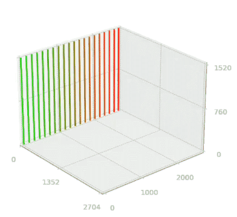
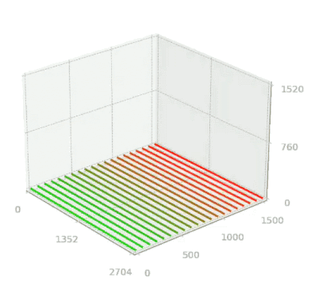

# imgtrans

映像データの時間と空間を操作するためのプログラミングツールです。
drawManeuverクラスをメインとしたpythonライブラリです。  

## 目次

- [プロジェクトの概要](#プロジェクトの概要)
    <!-- - [1. 軌道のデザイン](#1-軌道のデザイン)  
    - [2. 映像のレンダリング](#2-映像のレンダリング) -->
- [背景](#背景)
- [インストール方法](#インストール方法)
- [使い方の流れ](#使い方の流れ)
  - [1. ライブラリのインポート](#1-ライブラリのインポート)
  - [2. drawManeuverクラスの初期化](#2-drawmaneuverクラスの初期化)
    - [スリットの方向](#スリットの方向)
  - [3. 軌道のデザイン](#3-軌道のデザイン)
    -　[1. 主な時空間統合的な動きを加える関数](#1-主な時空間統合的な動きを加える関数)
    -　[2. 主な時間の流れを適応させる関数](#2-主な時間の流れを適応させる関数)
    - [実際の組み合わせの例](#実際の組み合わせの例)
    - [実際の組み合わせの例](#実際の組み合わせの例)
    - [軌道データの保存と読み込み](#軌道データの保存と読み込み)
  - [4. ヴィジュアライズ](#4-ヴィジュアライズ)
    - [スリットの色](#スリットの色)
    - [2dプロット](#2dプロット)
    - [3dプロット](#3dプロット)
  - [5. レンダリング](#5-レンダリング)
    - [`data`の構造](#dataの構造)
    - [映像のレンダリング](#映像のレンダリング)
    - [音声のレンダリング](#音声のレンダリング)
        - [4つの軌道データのCSV](#4つの軌道データのCSV)
        - [4つのscdファイル](#4つのscdファイル)
        - [scdファイルの実行](#scdファイルの実行)
    - [音声と映像の結合](#音声と映像の結合)
- [drawManeuver クラス](#drawmaneuver-クラス)
  - [クラス変数](#クラス変数)
  - [初期化](#初期化)
  - [全クラスメソッドのリスト](#全クラスメソッドのリスト)
    - [addTrans](#addtrans)
    - [addblowuptrans](#addblowuptrans)
    - [addInterpolation](#addinterpolation)
    - [addCycleTrans](#addcycletrans)
    - [addcustomCycleTrans](#addcustomcycletrans)
    - [transprocess](#transprocess)
    - [animationout](#animationout)
    - [コントリビュート](#コントリビュート)
    - [ライセンス](#ライセンス)

## プロジェクトの概要
映像の時間次元を三次元の奥行き軸として解釈することにより、映像データはボクセルで構成されるキューブとなります。  
この映像データキューブには、空間全体にわたる色情報が蓄積され、さまざまな角度や方向からカットしても、色の配列を持つイメージとして取り出すことができる可塑性があります。  
そして映像データキューブの断面の振る舞いを操作することで、キャプチャされた時間と空間とは異なる、新たな時間と空間に秩序だてられた映像を作り出せます。  
さらにこのツールを扱うことで時間空間に規定される“動き“に関する新たな洞察を得たり、時空間の知覚や認識について考えるきっかけとなることでしょう
<div style="text-align:center;">

</div><br>

## 背景
本ツールは2020年より映像作家の古澤龍の作品制作と同時並行的に開発が進められてきたものです。
<ul><li><a href="https://ryufurusawa.com/post/711685011289554944/mid-tide-ryu-furusawa-multi-channel-video">Mid Tide,2023 </a></li>
<li><a href="https://ryufurusawa.com/post/661228499174113280/wavesetude">Waves Etude,2020-2022</a></li>
</ul>

## インストール方法
このライブラリをインストールする前に、以下の外部ライブラリをインストールしてください
```bash
pip install opencv-python numpy psutil easing-functions matplotlib librosa
```
このライブラリをインストールする
```bash
pip install git+https://github.com/ryufurusawa/imgtrans.git
```

## 使い方の流れ
### 1. ライブラリのインポート
まず、モジュールをインポートします。
```python
import imgtrans
```

### 2. drawManeuverクラスの初期化
入力のビデオパスと、計算の基準となるスリットの方向を指定してdrawManeuverクラスのインスタンスを作成します。
```python
#入力映像のパス
videopath= '/Users/Movies/20230917_RFS3108_mod-HD720p.mov'

#drawManeuverクラスのインスタンスを作成する。
#２つ目の変数はスリットが縦か横かを指定する。0=横スリット、1=縦スリットを示す。
your_maneuver=imgtrans.drawManeuver(videopath,1)
```
#### スリットの方向  
本ツールでは、スリットの方向を縦スリットと横スリットに限定し、最初に指定します。  
スリットの方向の違いによって、今後の軌道の操作による結果は大きく変わります。


### 3. 軌道のデザイン
いくつかのクラスメソッドを組み合わせて再生断面の軌道をデザインします。  
クラスメソッドは**1. 時空間統合的な動きを加える関数**と**2. 時間の流れを適応させる関数**の二つに大きく分けられます。  
これらを実行することで、インスタンス変数の`data`に軌道データが格納されます。 
各関数は、内部でインスタンス変数の`data`に新たな配列を加えたり、全体のデータへなんらかの数値を掛け合わせたり、といった処理を行っています。
ここで編集される軌道データの内実は、出力映像が入力映像のどこのスリット（空間位置、時間位置）と対応しているか、座標変換として記述されています。  
詳しくは、[`data`の構造](#dataの構造)をご確認ください。

#### 1. 主な時空間統合的な動きを加える関数
- [`addTrans`](#addtransselfframe_numsend_line1start_line0speed_roundtrue): 空間次元と時間次元のシンプルな置き換え。
- [`addBlowupTrans`](#addblowuptransselfframe_numsdegspeed_roundtrueconnect_round1): addTransを継承しつつ時間次元のスケールの拡大縮小の操作
- [`addInterpolation`](#addinterpolationselfframe_numsinterporation_directionz_directionaxis_positionreversal0cycle_degree90extra_degree0zslide0speed_roundtruerrange01): 時空間次元の遷移
- [`addCycleTrans`](#addcycletransselfframe_numscycle_degree360zscalingfalsezslide0extra_degree0speed_roundtrue): 画面の中心線を軸に、再生断面を回転させていく。
- [`addWaveTrans`](#addwavetransselfframe_numscycle_degreezdepthflow1zslide0speed_roundtrue): 動的な波の形状による再生断面を作成。
- [`addEventHorizonTrans`](#addeventhorizontransselfframe_numszdepthz_osc1cycle_degree180flowfalsezslide0): 画面の中心と周辺で時間の進行速度が変わる。


#### 2. 主な時間の流れを適応させる関数
- [`applyTimeForward`](#applytimeforwardselfslide_timenone): 配列全体に時間の順方向の流れを付与
- [`applyTimeOblique`](#applytimeobliqueselfmaxgap): 時間のずれをスリットのごとに一定数づつ時間をずらす
- [`applyTimeForwordAutoSlow`](#applytimeforwordautoslowselfslide_timeint1defaultaddtimeint100addtimeeasingbooltrueeaseratiofloat03): 再生レート１からスロー再生になり最後に再生レート１に戻る
- [`applyTimeLoop`](#applytimeloopselfslide_timefreq2stay_time0): シームレスなループ構造を付与。
- [`applyTimeClip`](#applytimeclipselftrackslitintcliptimenone): 指定したスリットの時間の流れを指定した時間に固定する。
- [`applyTimeBlur`](#applytimeblurselfbl_time): 時間的なぼかしを適用


#### 実際の組み合わせの例
```python
# 軌道デザイン
bm.rootingA_interporation(270)
bm.applyTimeLoop(1)
```


#### 軌道データの保存と読み込み
別のソフトウェアで編集したり、レンダリング自体は後に行う場合や、同じ軌道データを用いて複数の映像データをレンダリングする場合などに、軌道データのみを保存、読み込みする場合があります。

##### 軌道データの保存
書き出し用ディレクトリ内に保存されます。
```python
your_maneuver.data_save()
```
##### 軌道データの読み込み
初期化する場合。
```python
import numpy as np
your_maneuver=imgtrans.drawManeuver(videopath="path/to/video.mp4", sd=1,datapath="path/to/data.npy" )
#軌道データを確認する
print(your_maneuver.data.shape)
```
`data`だけ置き換えする場合。
```python
import numpy as np
your_maneuver.data=np.read("path/to/data.npy" )
```
いずれも、読み込ませる映像データのサイズやフレーム数で示せる座標の範囲内に治っている必要があります。例えば、入力映像の解像度がフルハイビジョン(1920x1080)
であるのに、参照する縦スリットの横位置が2000であった場合、エラーとなります。


### 4. ヴィジュアライズ
この機能は、インスタンス変数の`data`を視覚的に表現し、理解しやすくするためのものです。
`data`には出力映像の解像度分のスリットの動きが記述されてています。例えば4k解像度の縦スリットの場合は3840本の数になりますが、グラフでは20本に間引いてい表現しています。
2Dプロットと3Dプロットの２つの方法でデータを可視化できます。  
3Dグラフでは、軌道の全体的な動きを直感的に把握することができます。一方、時間の流れの詳細は2Dグラフを見ることでより明確に理解することができます。  
この2つの方法を組み合わせることで、たとえば画面の左側では時間が逆行し、右側では時間が順行するといった、時間の動きの細かな設計も行うことができます。  
ヴィジュアライズのイメージデータは、入力映像と同じパスに生成された書き出し用ディレクトリ内に保存されます。

#### スリットの色
映像の空間方向が反転する場合もあり、そのような空間次元の方向を明示する意味で、ヴィジュアライズのスリットの描画は緑-赤のグラデーションにより表現されます。
1. 縦スリットの場合は、緑が左端(0px)、赤が右端(4kの場合3839px)の出力位置に対応します。
1. 横スリットの場合は、緑が上端(0px)、赤が下端(4kの場合2159px)の出力位置に対応します。


#### 2dプロット
2次元の軌道グラフは、軌道デザインに関する操作が行われるたびに逐次書き出されます。  
このグラフは、出力映像の時間を横軸として、以下の3つの要素を一つの図として表示します。
1. 空間方向動き
2. 時間方向の動き
3. 時間方向の動きの再生レート

```python
your_maneuver.maneuver_2dplot()
```
デフォルト設定では、スリットは20本で生成されます。maneuver_2dplotメソッドの第一引数thread_numを変更することで、表示するスリットの本数を調整できます。
```python
# 50本のスリットを描画
your_maneuver.maneuver_2dplot(50)
```

軌道デザインのコードとその軌道データの2Dプロット。  
```python
#1 時空間統合的な動きのデザインのモジュールを連結していく。
#ノーマルな状態を100フレーム分追加する
your_maneuver.addFlat(100)
#ノーマルな状態から映像フレームの左端を軸に90度回転させます。
your_maneuver.addInterpolation(100,0,1)
#100フレーム分、時間と空間を交換した軌道を加えます。
your_maneuver.addTrans(100)

#2 時間の振る舞いに関するモジュールを組み合わせる。
#軌道全体を時間方向への１フレームづつ送ります。
your_maneuver.applyTimeForward(1)
#軌道全体を時間方向の動きに対してブラーを加え滑らかに変化させる。
your_maneuver.applyTimeblur(50)

#2Dプロット出力
your_maneuver.maneuver_2dplot()
```

+Freeze30+Transposition300+CycleTrans_addExtend_TimeForward1_TimeBlur30_TimeBlur100_SpaceBlur100_20thread.png)

逐次書き出しが不要の場合は、クラス変数の設定を変更してください。　　
```python
your_maneuver.auto_visualize_out = False
```
#### 3Dプロット
三次元グラフへの軌道プロットアニメーションを出力する場合は、明示的に書く必要があります。
```python
your_maneuver.maneuver_3dplot()
```

+Freeze30+Transposition300+CycleTrans_addExtend_TimeForward1_TimeBlur30_TimeBlur100_SpaceBlur100_3dPlot.gif)
### 5. レンダリング
入力の映像データを、インスタンス変数に`data`をもとに、時空間を組み直し、映像のレンダリングを行います。

#### `data`の構造
インスタンス変数`data`には軌道データが格納されています。その`data`の構造について解説します。  
本モジュールでは、スリットの方向を最初に横か、縦かを定義し、映像データへのアクセスをピクセル単位ではなくスリット単位としています。  
こうすることで、各映像データの最小単位であるスリットへのアクセスは二次元の座標（一次元位置（縦スリットであれば横）、時間）を指定することでアクセス可能となります。
`data`に保存される軌道データとは出力映像を構成する各スリットが入力映像を構成するスリットのどの座標（一次元位置、時間位置）から持ってこられたものかを示す、座標変換のマップです。
そのため、各ピクセルの色彩のデータは保存されていません。あくまで座標変換の対応が記述されているだけです。
データは、出力映像のフレーム数と、出力映像を構成するスリット数、この2次元の各データに2つのチャンネルを持たせた三次元のNUMPY配列として保存されています。
<!-- 1. 出力する映像のスリット位置
2. 参照される入力映像のスリット位置
3. 入力映像の時間位置 -->
1. 参照される入力映像のスリット位置
2. 入力映像の時間位置

以下のコードは、`data`を調べるいくつかのサンプルです。
```python
print("出力する映像のフレーム数",your_maneuver.data.shape[0])
print("スキャンする数、縦スリットの場合、出力する映像の横幅のピクセル数",your_maneuver.data.shape[1])
print("出力映像の最初のフレームの右端のスリットが、入力映像のどの時間から参照されたか？",your_maneuver.data[0,-1,1])
print("入力映像から参照する時間位置の最大値",np.max(your_maneuver.data[:,:,1]))

#一つ目のスリットの出力位置の推移を描画する。
plt.plot(your_maneuver.data[:,0,0])
#一つ目のスリットの入力の時間位置の推移を描画する。
plt.plot(your_maneuver.data[:,0,2])
```
#### 映像のレンダリング
レンダリング映像データは、入力映像と同じパスに生成された書き出し用のディレクトリ内に保存されます。
```python
your_maneuver.transprocess()
```
高解像度かつ、長めの映像の書き出しを行う場合には、分割して書き出すことで対応できます。端末のスペックに応じて設定して下さい。
中間ファイルはtmpディレクトリを一時的に作成して、そこにnumpyの配列データ（二次元イメージデータ）として保存します。
```python
your_maneuver.transprocess(10)#10回に分けて書き出す。
```
途中からの書き出しなど、分割したレンダリングの手法もオプションとして設置できます。  
書き出し用のディレクトリ内にtmpディレクトリがあり、そこに中間データが保存されている必要があります。もし無いと最終的にデータ統合する段階でエラーとなります。
以下の例では10段階の５段階目からレンダリングを行っています。
```python
your_maneuver.transprocess(10,sep_start_num=5,sep_end_num=10)
```
out_type変数にて指定することで静止画像の連番として書き出すことも可能です。

```python
your_maneuver.transprocess(out_type=0) #0=still, 1=video, 2=both 
```
詳細は [`transprocess`](#transprocessメソッド)こちらを参照ください。

#### 音声のレンダリング
音声処理自体は、SuperColliderで行います。  
まず、SuperColliderで読み込ませるコードをクラスメソッドの`scd_out`から出力します。  
`scd_out`では、インスタンス変数の`data`で記述されたスリットの動きのデータから、音声出力するために、スリットの本数を間引いた上で出力します。   
音声ファイル名はインスタンス変数`sc_FNAME`にて指定できます。デフォルトでは、[入力映像のファイル名.aiff] としています。入力映像と同じディレクトリに保存されていることを確認して下さい。  

'scd_out'の第一引数にて、同時発話数を指定可能です。デフォルトでは、7つとなっています。  
あまり数を増やしすぎると、わずかな時間差により周波数の打ち消しが発生し、音量が極端に下がったりします。軌道の編集内容や、素材となる音の音響的な特徴を元に適切な数を指定してください。

```python
bm.sc_FNAME="GX010230-t-AIFF.aiff"
bm.scd_out(7)
```
上記を実行すると、４つのCSVdataと、４種のSuperColliderのプログラム.scdファイルが出力されます。

##### 4つの軌道データのCSV
1. *_7threads.csv : スリットの時間位置。
1. *_Rate_7threads.csv : スリットの再生レート
1. *_inPanMap_7threads.csv : スリットの空間位置
1. *_nowDepth_7threads.csv : 一枚のフレーム内における時間のずれ幅

##### 4つのscdファイル
1. *_SC_Play-7voices.scd : マルチ再生、再生レートに準じてピッチが変化する
1. *_SC_Grain-7voices.scd : グラニュラーシンセシスを用いたマルチ再生。再生レートに関係なくピッチは変化しない。
1. *_SC_Rev_Play-7voices.scd : マルチ再生。時間のずれ幅に応じてリバーブの適応。
1. *_SC_Rev_Grain-7voices.scd : グラニュラーシンセシスを用いたマルチ再生に加え、時間のずれ幅に応じてリバーブを加える。

サンプルの映像ファイルを確認して、その効果と特徴を参考にしてください。

##### scdファイルの実行
scdファイルのうち、いずれかをSuperColliderに読み込ませます。　　
いずれも、リアルタイムに音響処理を実行し、それを仮想サーバーにてレコーディングし音声ファイルとして保存させます。
保存される音声ファイルは映像レンダリングデータと同じディレクトリに保存されます。  
音声データやCSVデータの読み込みに時間がかかるため、一括の実行を避け、2つの工程に分けています。  
`()`で括られている内容を、順に実行しください。


 
###### 1. AudioのSettingとデータの読み込み
AudioのSetting、`SynthDef`によるシンセの定義、音声データの読み込み、CSVdataの読み込みを行います。  
オーディオのアウトプットデバイスの設定は各自の環境に合せ書き換えてください。  
デフォルトでは以下のようになっています。

```supercollier
Server.default.options.outDevice_("MacBook Proのス");
```
以下を実行することで、指定可能なデバイスリストがコンソールwindowに出力されます。
```supercollier
ServerOptions.devices; 
```
###### 2. `Synth`の再生とRecording
定義した `Synth`の再生をループ処理によりリアルタイムに再生を行い、Recordingを行います。  
Recordingと同時にUnix commandによりレンダリング映像ファイルをQuickTimePlayerにて再生させます。
やや時間のギャップは入りますが、映像と音声を擬似的に同期した状態で再生できます。
QuickTimePlayerのあるmacのみ実行可能ですので、それ以外の環境においてはこの部分をコメントアウトして対応してください。
```unixcmd
"open -a 'QuickTime Player' '/Users/Movies/sample-raw-mov/sample_Vslit.mp4' ".unixCmd;
```
#### 音声と映像の結合
特にプログラムを用意していません。
映像編集ソフトにて、ビデオと音声を時間同期させた上で、再書き出しを行ってください。

## drawManeuver クラス

このクラスはImgtransライブラリのメインとなるものです。

### クラス変数:
- `imgtype`: レンダリングにおける静止画像のフォーマット（デフォルトは ".jpg"）
- `img_size_type`: 出力イメージのサイズの設定。入力の映像の高さをh,幅をwとすると、`0`:h,w `1`:w,w*2 `2`:総フレーム数分 `3`: square （デフォルトは `0`）
- `outfps`: 出力のフレームレート（デフォルトは 30）
- `auto_visualize_out`: 自動可視化の設定（デフォルトは True）
- `default_debugmode`: デフォルトのデバッグモード設定（デフォルトは False）
- `audio_form_out`: オーディオ形式出力の設定（デフォルトはFalse）
- `embedHistory_intoName`: 名前への履歴埋め込みの設定（デフォルトは True）
<!-- - `progressbarsize`: プログレスバーサイズ（デフォルトは 50） -->
<!-- - `sepVideoOut`: セパレート出力設定 -->

### 初期化
初期化は、ビデオのパス、スキャン方向、データ、およびフォルダ名の属性を引数として受け取る。このメソッドは、下記のインスタンス変数を初期化し、ビデオパスと同じレベルに出力用のディレクトリを作成し、そのディレクトリに移動する。最終的に出力されるあらゆるファイルはこのディレクトリ内に保存されます。

#### 引数
- `videopath` (str): ビデオファイルへのパス。
- `sd` (bool): スリットの方向。`True`で縦スリット`False`で横スリット
- `datapath` (str, optional): 以前に保存していた軌道データを引き継ぐ場合に使用するオプション。Numpyの多次元配列として保存されたnpyデータのパス。
- `foldername_attr` (str, optional): オプションとして出力用のディレクトリの名称に、指定した名称を付け加えます。

#### インスタンス変数
1. **data**: 最小単位をスリットとする再生断面の軌道データ。デフォルトは空のリスト。
1. **width**: ビデオの幅。`videopath` より読み込んだビデオ情報を反映する。
1. **height**: ビデオの高さ。
7. **count**: ビデオの総フレーム数。
8. **recfps**: ビデオのfps（フレームレート）。出力のフレームレートは[クラス変数](#クラス変数)にて設定する。
10. **scan_direction**: スリットの向きとスキャン方向の定義。初期化メソッドの引数`sd`がそのまま適応される。
11. **scan_nums**: スキャンする数。4k解像度で縦スリットの場合は3840
12. **slit_length**: 1スリットの画素数。4k解像度で縦スリットの場合は2160
15. **out_name_attr**:初期化メソッドの引数`foldername_attr` がそのまま適応される。
1. **out_videopath**: 出力したビデオのパスを保持する。初期値は空。[animationout](#animationoutメソッド)にて呼び出す。
18. **sc_FNAME**: 入力のヴィデオのファイル名に ".AIFF" を追加したものを自動で受け取るように初期設定されています。音声処理をするためのsuper collider用のコードを出力する際に使用します。
13. **sc_resetPositionMap**, **sc_rateMap**, **sc_inPanMap**, **sc_now_depth**: 軌道配列を音声処理用にスリットの分割数を落とし最適化した配列
<!-- 1. **cap**: OpenCVのVideoCaptureオブジェクト。入力ビデオの情報を持つ。
16. **log**: ログのカウンタ。デフォルトは0。マニューバーの編集工程のログを取っています。
17. **infolog**: インフォログのカウンタ。デフォルトは0。
1. **ORG_NAME**: 入力ビデオパスから取得したオリジナルの名前。
2. **ORG_PATH**: 入力ビデオパスから取得したオリジナルのパス。
3. **ORG_FNAME**: 入力ビデオパスから取得したオリジナルのファイル名。
14. **sd_attr**: スキャン方向が0の場合は"Hslit"、それ以外の場合は"Vslit"。出力ファイルの名称に適応する。 -->

#### example
```python
your_maneuver=imgtrans.drawManeuver(videopath="path/to/video.mp4", sd=1)
```
以前に保存していた軌道データを引き継ぐ場合は以下の例を参照ください。
```python
import numpy as np
your_maneuver=imgtrans.drawManeuver(videopath="path/to/video.mp4", sd=1,datapath="path/to/data.npy" )
#軌道データを確認する
print(your_maneuver.data.shape)
```

### 全クラスメソッドのリスト:
- [`__init__`](#__init__): ビデオパスを受け取り初期化する。
- [`append`](#append): 別で作成していた軌道データをインスタンス変数としてもつ軌道データの後ろに追加する。
- [`prepend`](#prepend): 別で作成していた軌道データを、インスタンス変数としてもつ軌道データの先頭にmaneuverを追加する。
- 軌道デザインに関わるクラス
    - 時空間統合的な動きを加える関数
        - [`addFlat`](#addFlat): フラットな配列を追加。
        - [`addFreeze`](#addFreeze): 時間軸、空間軸、ともに最終列の配列を”frame_nums”で指定されたフレーム数分生成して加える。
        - [`addSlicePlane`](#addSlicePlane): 指定した空間位置で、時間軸方向に沿って切り出した断面フレームを指定したフレーム数追加。
        - Transposition 空間次元と時間次元の置き換え
            - [`addTrans`](#addTrans): 空間次元と時間次元のシンプルな置き換え。縦スリットの場合はX軸とT軸が置換。横スリットの場合はY軸とT軸が置換。
            - [`addKeepSpeedTrans`](#addKeepSpeedTrans): 既存のフレームデータの速度を維持した状態で、新しいフレームを生成し追加する。特定の空間領域に達するまで繰り返されます。
            - [`insertKeepSpeedTrans`](#insertKeepSpeedTrans): `addKeepSpeedTrans`の発展版で、`self.data`に対して、`after_array`で受け取った配列の間を滑らかに補う。
            - [`addWideKeyframeTrans`](#addWideKeyframeTrans): `addKeyframeTrans`の発展版。`midtide`のように、インプット画像よりもサイズを大きくして出力させる場合に使用する。
            - [`addBlowupTrans`](#addBlowupTrans): blowupの動きをキーフレームにより詳細に制御するメソッド。このメソッドは、時間軸の解像度を徐々に変化させる試みがなされており、基本的にはXYT Transと同様の動きを持っています。時間軸のキーフレームに関する詳細な制御を行うためのキーパラメータは、`timevalues`と`timepoints`です。
       - 時空間次元の遷移
            - [`addInterpolation`](#addInterpolation): 与えられたパラメータをもとに補間を行い、結果をデータに追加する。
            - [`rootingA_interporation`](#rootingA_interporation): 複数のaddInterpolationを組み合わせる。ジグザグとした動き。
            - [`rootingB_interporation`](#rootingB_interporation): 複数のaddInterpolationを組み合わせる。ドミノが坂道を転がっていくような動き。
            - [`addCycleTrans`](#addCycleTrans): XYTの置換を補完的に遷移させる。画面の中心線を軸に、再生断面を回転させていく。
            - [`addCustomCycleTrans`](#addCustomCycleTrans): addCycleTransの回転の中心軸を動かすことができる。
        - 波打つ再生断面
            - [`addWaveTrans`](#addWaveTrans): 時間と空間のピクセルのマトリクスに対して、動的な波の形状による再生断面を作成。空間軸を固定するかの切り替えも可能。
            - [`addEventHorizonTrans`](#addEventHorizonTrans): 空間領域は変更なし。画面の中心と周辺で時間の進行速度が変わる。前進、後退するカメラによりキャプチャされる映像のオプティカルフローをキャンセルする。

    - 時間に特化した軌道操作
        - [`applyTimeForward`](#applyTimeForward): 配列全体に時間の順方向の流れ（単位はslide_time）を付与
        - [`applyTimeOblique`](#applyTimeOblique): 時間の斜め効果を適用
        - [`applyTimeForwordAutoSlow`](#applyTimeForwordAutoSlow): 基本、現在がスロー再生状態の場合に使用する。イントロ、アウトロに通常の再生速度の映像を加え、その間をイーズ処理することで滑らかに接続させる。
        - [`applyTimeFlowKeepingExtend`](#applyTimeFlowKeepingExtend): 与えた軌道配列に、延長させたフレームをプリペンド、アペンドする。XYフレームそれぞれ最終フレームと最初のフレームと同じデータで延長させる。Z(アウト時間）に関しては最終の変化量を維持して延長させる。`fade`引数をTrueでスピード０に落ち着かせる。
        - [`applyTimeLoop`](#applyTimeLoop): 与えた軌道配列全体の時間を前半、順方向、後半、逆転して、最後にまた順方向へながれ、最初と終わりの時間差がない。そのままループ再生すればシームレスなループが作られる。デフォルト周波数２hzでしか現在対応できていない。
        - [`applyTimeClip`](#applyTimeClip): 指定したスリットの時間の流れを指定した時間に固定する。
        - [`applyTimeSlide`](#applyTimeSlide): 一番初めのフレームの中心のスリットの参照時間を、指定した時間にセットする。それに合わせて全体に対してスライドさせて調節する。
        - [`applyInOutGapFix`](#applyInOutGapFix): シームレスループ作成のための補助的な関数。最初と最終フレームの差分を計算し、必要に応じてフレームの調整を行う。
        - [`applyTimebySpace`](#applytimebyspace):スリットの空間位置に応じて、最大`v`で指定したフレーム数分、時間方向へずらす。
        - [`applySpaceBlur`](#applySpaceBlur): 空間的なぼかしを適用
        - [`applyTimeBlur`](#applyTimeBlur): 時間的なぼかしを適用
        - [`applyCustomeBlur`](#applyCustomeBlur): カスタム範囲のブラーを適用
    - その他の軌道操作
        - [`addFreeze`](#addFreeze): 時間軸、空間軸、ともに最終列の配列を”frame_nums”で指定されたフレーム数分生成して加える。
        - [`preExtend`](#preExtend): 与えた軌道配列の１フレーム目を手前に延長させる。
        - [`addExtend`](#addExtend): 与えた軌道配列の最終フレームを延長させる。Zのレートは0になる。
        - [`zCenterArrange`](#zCenterArrange): 軌道配列と入力映像のフレーム数を照らし合わせ、入力映像の時間的な意味での中心

- マニューバーの情報出力に関するメソッド
    - [`dataCheck`](#dataCheck):`data`の情報をコンソールに出力する。
    - [`info_setting`](#info_setting): データをスレッド数に応じて設定し、再生レートやパンを計算します。
    - [`maneuver_CSV_out`](#maneuver_CSV_out): CSVファイルに軌道配列データを出力する。軌道の可視化を外部のソフトウェア（エクセルなど）にて作成する場合に使用する。
    - [`scd_out`](#scd_out): supercolliderに読み込ませるサウンドプロセスコードを出力し、関連するデータをCSVで保存します。
    - [`data_save`](#data_save): 軌道データをnumpyのファイルとして保存します。
    - [`split_3_npysavereturn`](#split_3_npysavereturn): 軌道データのアウトイメージの横幅が入力の３倍サイズを指定した場合に使用。Left, center, Rightとして3分割して保存。3分割されたNPYファイルのパスを配列で返す。
- マニューバーの可視化ファイルの出力に関する
    - [`maneuver_2dplot`](#maneuver_2dplot): 2Dプロットを作成して、それに関連するデータを画像として保存します。
    - [`maneuver_3dplot`](#maneuver_3dplot): 3Dプロットを生成し、その画像や動画を保存する。
- 映像renderingに関するメソッド
    - [`transprocess`](#transprocess): 映像をトランスプロセスします。このメソッドは映像のレンダリングを行い、セパレートレンダリングや他のオプションをサポートしています。
    - [`transprocess_typeB`](#transprocess_typeB): 映像のレンダリングを行う。セパレートプロセスをアウトプットの時間次元ではなく、インプットの時間次元を分割させて処理します。時間軸方向に極端に幅を広くとるようなマニューバーが組み込まれている場合はこのメソッドを使うことで、レンダリング速度が上がります。
    - [`pretransprocess`](#pretransprocess): フレーム数を間引いて、高速でビデオレンダリングする。主にプレビュー用。
    - [`animationout`](#animationout): 出力した映像データを参照して、3Dグラフ上に画像のピクセルカラーをプロットし、結果をアニメーションとして出力する。そのため、映像のレンダリングを行った後にしか実行できません。

## `addTrans`

`addTrans`メソッドは、`wr_array`に新しいトランス軌跡を追加して返すための関数です。このメソッドは、特定のフレーム数にわたって、サイクル的な角度変化を考慮して変換を行います。

### 引数
- `frame_nums`(int): 追加するフレーム数。
- `end_line`(float, optional, default: `1`): 変換の終了ライン。
- `start_line`(float, optional, default: `0`): 変換の開始ライン。
- `speed_round`(bool, optional, default: `True`): 速度が円滑かどうかを指定。
- `zd`(bool, optional, default: `True`): 方向設定。

### 使用例
```python
your_object.addTrans(100, end_line=1, start_line=0, speed_round=True, zd=True)
```



## `addBlowupTrans`

`addBlowupTrans`メソッドは、キーフレームを使用して"blowup"の動きを制御するためのメソッドです。提供されたキーフレームを利用して、定義されたフレーム間で特定のモーションパターンを生成します。

### 引数
- `frame_nums`(int): 追加するフレーム数。
- `deg`(int, optional, default:360): スキャン方向の動きの設定`360`で往復する。`180`で片道
- `speed_round`(bool, optional, default: `True`): スキャン方向の推移が滑らかかどうかを指定。
- `connect_round`(int, optional, default: `1`): キーフレーム間の動きを滑らかにするかどうか。
- `timevalues`(list, optional): キーフレームの値のリスト。時間方向のレンジをフレーム数で指定する。
- `timepoints`(list, optional):`frame_nums`に対するキーフレームの時間リスト。0~1の比で指定する。
- `timecenter`(list, optional):キーフレームの時間方向のレンジ推移する際の中心点のリスト。提供されていない場合、各キーフレームに対してデフォルトで0.5となります。

### 使用例
```python
your_object.addBlowupTrans(frame_nums=100, deg=360, speed_round=True, connect_round=1,timevalues=[your_object.count,your_object.scan_nums,1,0], timepoints=[0,0.7,0.95,1], timecenter=[0.5,0.5,0.5,0.5])
```


## `addInterpolation`

`interpolation` メソッドは、指定された軌道データをもとにインターポレーションを行い、新たなフレームを生成するためのメソッドです。この関数は、特定のフレーム数にわたり、複雑な変換を加えるためのものです。

### 引数
- `frame_nums`(int): 追加するフレーム数。
- `interporation_direction`(int): インターポレーションの方向。
- `z_direction`(int): Z方向におけるインターポレーションの方向。
- `axis_position`(int): 回転やインターポレーションの中心となる位置。
- `reversal`(int, optional, default: `0`): 動きの反転を制御する。
- `cycle_degree`(int, optional, default: `90`): 1サイクルあたりの角度。
- `extra_degree`(int, optional, default: `0`): 変換を始める最初の段階での断面の角度の指定。
- `zslide`(int, optional, default: `0`): Z方向のスライド量。
- `speed_round`(bool, optional, default: `True`): 速度が円滑かどうかを指定。
- `rrange`(list of int, optional, default: `[0,1]`): 変換の範囲を指定するリスト。

### 使用例
```python
your_object.addInterpolation(100, 0, 0, 0,reversal=False)
```
_3dPlot.gif)
```python
your_object.addInterpolation(100, 0, 1, 1,reversal=True)
```
_3dPlot.gif)


## `addCycleTrans`

`addCycleTrans` メソッドは、サイクル的な変換（トランス）をデータに追加するためのものです。特定のフレーム数にわたって、サイクル的な角度変化を考慮して変換を行います。

### 引数
- `frame_nums`(int): 追加するフレーム数。
- `cycle_degree`(int, optional, default: `360`): 1サイクルあたりの角度。
- `zscaling`(bool, optional, default: `False`): Z軸のスケーリングを有効にするかどうか。
- `zslide`(int, optional, default: `0`): 時間位置の初期値。
- `extra_degree`(int, optional, default: `0`): 変換を始める最初の段階での断面の角度の指定。
- `speed_round`(bool, optional, default: `True`): 速度が円滑かどうかを指定。

### 使用例
```python            
your_object.addCycleTrans(100, cycle_degree=360, zscaling=True, zslide=10, extra_degree=5, speed_round=False)
```


## `addCustomCycleTrans`

`addCustomCycleTrans` このクラス関数は、`addCycleTrans`での中心軸を自由に動かすことができます。
`start_center`引数で指定した位置から`end_center`で指定した位置までリニアに変化させます。

### 引数
- `frame_nums`(int): 追加するフレーム数。
- `cycle_degree`(int): 1サイクルあたりの角度。
- `start_center`(float, optional, default: `1/2`): 開始の中心軸の位置。(0~1)の範囲でスキャン方向の長さに対しての比率として指定する。縦スリットの場合、0は左端、1は右端になる。
- `end_center`(float, optional, default: `1/2`): 終了の中心軸の位置。
- `zscaling`(bool, optional, default: `False`): Z軸のスケーリングを有効にするかどうか。
- `extra_degree`(int, optional, default: `0`): 変換を始める最初の段階での断面の角度の指定。
- `speed_round`(bool, optional, default: `True`): 速度が円滑かどうかを指定。
- `zslide`(int, optional, default: `0`): 時間位置の初期値。
- `auto_zslide`(bool, optional, default: `True`): Zスライドの自動調整の有効・無効を切り替えるフラグ。
- `zscaling_v`(float, optional, default: `0.9`): Zスケーリングの係数。

### 使用例
```python
your_object.addCustomCycleTrans(100, cycle_degree=360, start_center=0.2, end_center=0.7)
```


## `transprocess`
このメソッドは映像のレンダリングを行います。

### 引数
- `separate_num` (int, optional, default: `1`): レンダリングを何分割で行うかの指定。
- `sep_start_num` (int, optional, default: `0`): 分割レンダリング時に、どの分割から開始するかの指定。
- `sep_end_num` (int or None, optional, default: `None`): 分割レンダリング時に、どの分割まで行うかの指定。
- `out_type` (int, optional, default: `1`): 出力形式の指定。`1`は映像、`0`は静止画、`2`は映像と静止画両方。
- `XY_TransOut` (bool, optional, default: `False`): Trueの場合、出力映像を90度回転して保存。
- `render_mode` (int, doptional, default: `0`): レンダリングモード。`0`は全軌道データのフレームを統合して出力。`1`は`sep_start_num` から `sep_end_num` までの範囲だけを出力。

### 使用例
```python
# インスタンスを作成
your_maneuver = imgtrans.drawManeuver("mov/samplevideo.mp4",sd=1)

#軌道データの書き込み
your_maneuver.addTrans(100)
your_maneuver.applyTimeForward(1)

# レンダリング
your_maneuver.transprocess()
```

## `animationout`
 `animationout`関数は、出力した映像データを参照して、3Dグラフ上に画像のピクセルカラーをプロットし、結果をアニメーションとして出力します。時空間キューブ上での時空間操作に基づく再生断面の軌道を可視化させます。 'maveuver_2dplot','maveuver_3dplot'とは違いピクセルの色をマッピングすることでより入力の映像データとの対応を直感的に理解しやすいビジュアライズです。  
 そのため、映像のレンダリングを行った後にしか実行できません。もし、既に書き出しの映像データが存在する場合は、インスタンス変数'out_videopath'にて情報を呼び出す必要があります。
 
 ```python
 your_maneuver.out_videopath = "mov/sample.mp4"
 your_maneucer.animationout()
 ```

 ### 引数
- `outFrame_nums` (`int`, default: `100`): 出力するフレーム数。
- `drawLineNum` (`int`, default: `250`): 描画するラインの数。
- `dpi` (`int`, default: `200`): 出力画像のDPI。
- `out_fps` (`int`, default: `10`): 出力動画のフレームレート。

### 使用例
_CustomeBlur300_CustomeBlur300_TimeLoop_timeSlide_zCenterArranged_img_3d-pixelMap.gif)

## コントリビュート
このプロジェクトへのコントリビュートを歓迎します。  
質問やフィードバックがあれば、ryu.furusawa(a)gmail.comまでお気軽にお問い合わせください。

## ライセンス
This project is licensed under the MIT License, see the LICENSE.txt file for details


